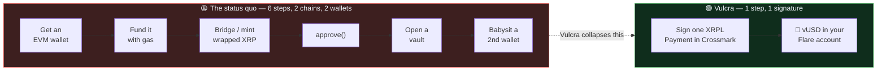
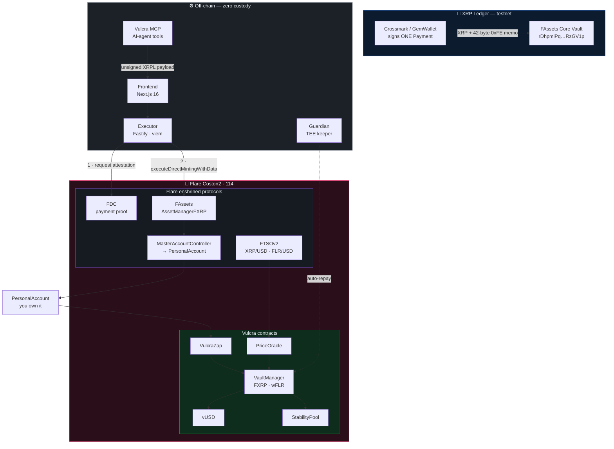
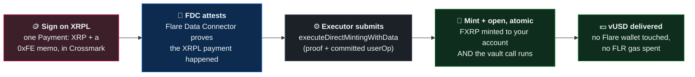
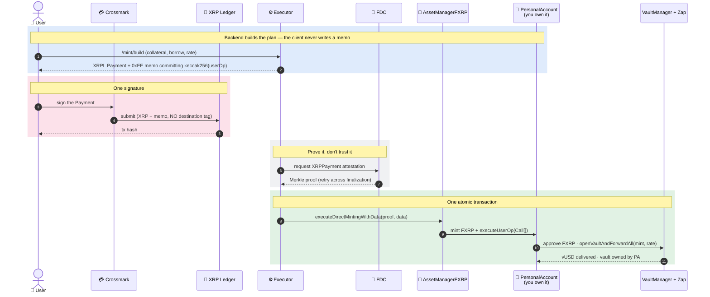
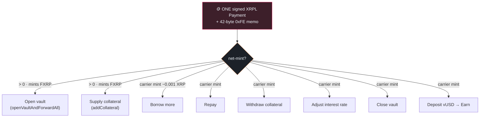
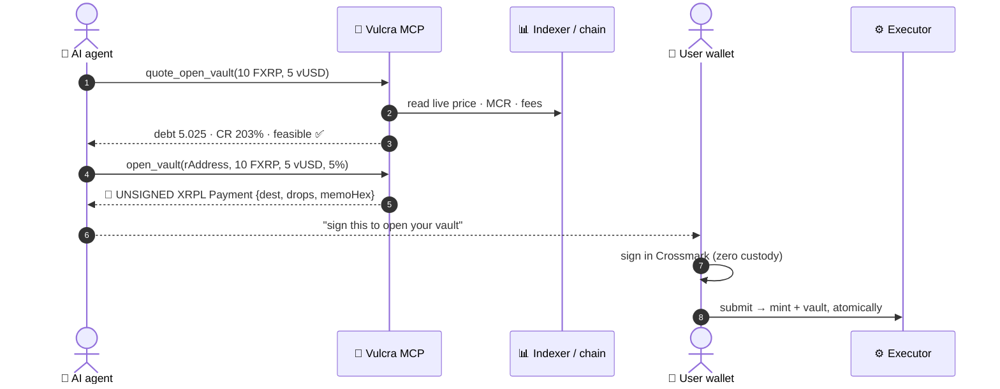
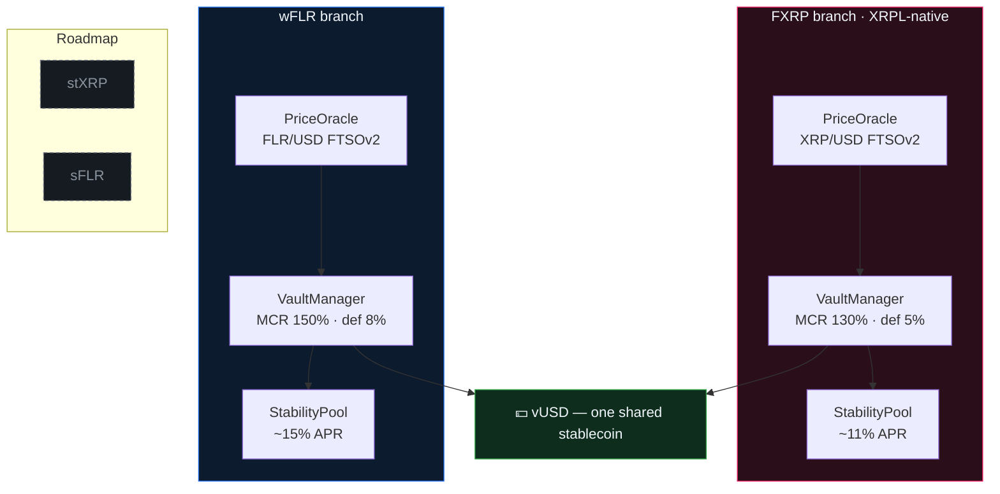
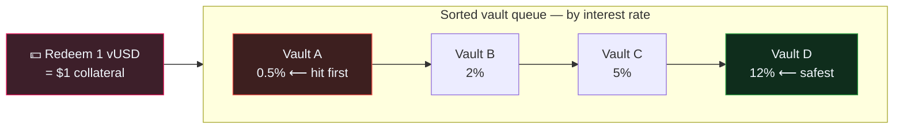
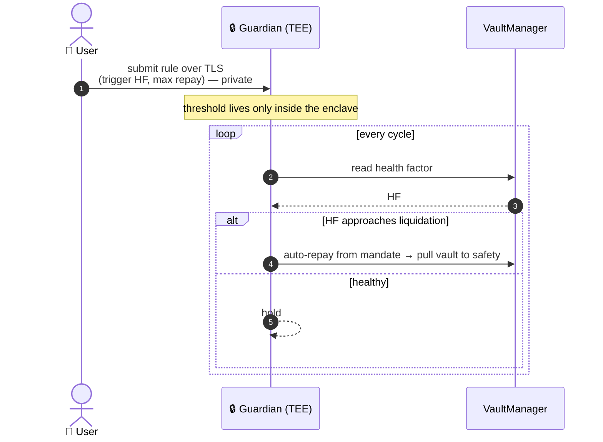

<div align="center">

# Vulcra

### Bring XRP straight from the XRP Ledger and borrow a stablecoin on Flare — in one signed payment, with no Flare wallet and no FLR gas.

**A multi-collateral CDP stablecoin on [Flare](https://flare.network) Coston2 testnet (114).**
Supply XRP from the XRP Ledger as collateral — it becomes **FXRP** on Flare via FAssets — and borrow
**vUSD** cross-chain. Liquity-V2 mechanics: you set your own interest rate, and redemptions hit the
lowest rate first. Every vault action rides **one XRPL Payment**, and an **AI agent can drive the whole
CDP from an XRP wallet only** through the Vulcra MCP server.

<br/>

[](https://coston2-explorer.flare.network)
[](https://coston2-explorer.flare.network/address/0x93e572cDbfb62557E041B53490e5208C147b5388)
[](https://coston2-explorer.flare.network/address/0x333FDCf66792122e80654E197Eb6Fa3705f1B6D8)
[](https://dev.flare.network)
[](#-the-ai-agent--drive-a-cdp-from-an-xrp-wallet-mcp)

**[Explorer](https://coston2-explorer.flare.network)** ·
**[VaultManager (FXRP)](https://coston2-explorer.flare.network/address/0x93e572cDbfb62557E041B53490e5208C147b5388)** ·
**[vUSD](https://coston2-explorer.flare.network/address/0x333FDCf66792122e80654E197Eb6Fa3705f1B6D8)** ·
**[Repo](https://github.com/Lexirieru/vulcra)** ·
**[Flare docs](https://dev.flare.network)**

</div>

---

## The problem

XRP is one of the largest crypto communities, and it **cannot use its own asset as CDP collateral
without leaving its own chain**. To borrow against XRP today you must: acquire an EVM wallet, fund it
with gas, bridge or manually mint a wrapped representation, approve it, open a vault, and then babysit
a second wallet on a second chain.

**The asset is ready. The user experience is the barrier.** An XRP holder who just wants a dollar loan
against their XRP has to become an EVM power user first.



---

## What Vulcra does

Vulcra is a **multi-collateral CDP** issuing a single stablecoin, **vUSD**, isolated per collateral —
each market has its own risk curve, oracle, and stability pool, sharing only vUSD. It runs the
**Liquity V2** model: borrowers **set their own annual interest rate**, and redemptions are ordered
**by rate, lowest first** — so a higher rate buys you a place further back in the redemption queue.

On top of that sits the part that makes Vulcra different: an **XRPL-native** path. You never touch a
Flare wallet.

> **Sign one Payment in Crossmark. Your XRP leaves the XRP Ledger, becomes FXRP on Flare, opens a
> vault, and delivers vUSD — atomically, in a single transaction.**

The whole thing rides Flare's **0xFE direct-minting custom instruction** through **Flare Smart
Accounts**. The user's XRPL key controls a `PersonalAccount` on Flare; the memo on the XRPL Payment
commits a `PackedUserOperation`; the executor proves the payment happened with the **Flare Data
Connector (FDC)** and calls `AssetManagerFXRP.executeDirectMintingWithData(...)`, which mints the FXRP
**and** runs the committed calls from the PersonalAccount **in one atomic on-chain step**.

| | |
|---|---|
| 🪙 **XRPL-native, one payment** | Supply → mint FXRP → open vault → deliver vUSD, all from a single signed XRPL Payment. No Flare wallet, no FLR gas, no manual FXRP handling. |
| 🤖 **An AI agent can run it** | The Vulcra **MCP server** lets an AI agent manage the CDP from an XRP wallet only — every write comes back as an **unsigned** XRPL Payment the user signs. Zero-custody. |
| 🔗 **Real Flare rails, no mocks** | Prices from **FTSOv2** (block-latency), XRPL payment proof from the **FDC**, XRP↔FXRP through **FAssets**, accounts through **MasterAccountController / PersonalAccount**. |
| 📈 **Liquity V2 CDP** | User-set interest rates, by-rate redemption (lowest first), per-collateral `minDebt`, and a per-branch **Stability Pool** streaming vUSD rewards. |
| 🧩 **One mechanism, whole lifecycle** | The same 0xFE path does open / supply / borrow-more / repay / withdraw / adjust-rate / close. |
| 🛡️ **Confidential Guardian (FCC)** | An opt-in keeper in a **Trusted Execution Environment** that watches your health and can auto-repay before liquidation — thresholds never exposed on-chain. |

---

## 🗺️ Architecture at a glance

Three planes: the **XRP Ledger** (where the user signs), an **off-chain, zero-custody** layer
(frontend, executor, MCP agent, TEE keeper), and **Flare Coston2** (Flare's enshrined protocols +
Vulcra's own contracts). Nothing between them ever custodies user funds.



---

## 🟢 Live on Flare Coston2 — verify it yourself

Every core contract is deployed and live on Coston2. Every claim below links to the explorer. The full
authoritative list lives in [`smartcontract/deployments/coston2.json`](smartcontract/deployments/coston2.json).

### Core contracts (UUPS · AccessControl)

| Contract | Address |
|---|---|
| **vUSD** — the shared stablecoin | [`0x333FDCf6…05f1B6D8`](https://coston2-explorer.flare.network/address/0x333FDCf66792122e80654E197Eb6Fa3705f1B6D8) |
| **VaultManager — FXRP** | [`0x93e572cD…b5388`](https://coston2-explorer.flare.network/address/0x93e572cDbfb62557E041B53490e5208C147b5388) |
| **VaultManager — wFLR** | [`0x1F079F20…0b3b8`](https://coston2-explorer.flare.network/address/0x1F079F205ca2857a3A199937Ace956ed51B0b3b8) |
| **VulcraZap** — atomic open + forward (`openVaultAndForwardAll`) | [`0xCe4f886e…B59dfE`](https://coston2-explorer.flare.network/address/0xCe4f886e67dE51418751314eEb19aC2D75B59dfE) |
| **StabilityPool** implementation | [`0xAfC0d664…A0172f7`](https://coston2-explorer.flare.network/address/0xAfC0d66405CB687c9208534f2c086d402A0172f7) |

### Markets (collateral → vUSD)

| Market | Collateral (dec) | VaultManager | Stability Pool | Price oracle |
|---|---|---|---|---|
| **FXRP** *(XRPL-native)* | [`0x0b6A3645…273dc7`](https://coston2-explorer.flare.network/address/0x0b6A3645c240605887a5532109323A3E12273dc7) · 6 | [`0x93e572cD…b5388`](https://coston2-explorer.flare.network/address/0x93e572cDbfb62557E041B53490e5208C147b5388) | [`0xfA2dCc4B…D851E4`](https://coston2-explorer.flare.network/address/0xfA2dCc4B93909ACc1dd6b2e92178D04cD1D851E4) | [`0x63Bf4a9d…29f953B`](https://coston2-explorer.flare.network/address/0x63Bf4a9d716Ce16C0E091EF9C3281f44829f953B) |
| **wFLR** | [`0xC67DCE33…Ce9273`](https://coston2-explorer.flare.network/address/0xC67DCE33D7A8efA5FfEB961899C73fe01bCe9273) · 18 | [`0x1F079F20…0b3b8`](https://coston2-explorer.flare.network/address/0x1F079F205ca2857a3A199937Ace956ed51B0b3b8) | [`0xB963D913…557e07`](https://coston2-explorer.flare.network/address/0xB963D913CFb4688634184aB7b22e554B34557e07) | [`0x914cd350…4453Df`](https://coston2-explorer.flare.network/address/0x914cd3509727afeED74267FDF5c9E7f1fB4453Df) |

### Flare system contracts we build on (not ours)

| | Address |
|---|---|
| **FlareContractRegistry** (the only hardcoded address) | [`0xaD67FE66…0F6019`](https://coston2-explorer.flare.network/address/0xaD67FE66660Fb8dFE9d6b1b4240d8650e30F6019) |
| **AssetManagerFXRP** (FAssets · direct minting) | [`0xc1Ca88b9…f4fbDFA`](https://coston2-explorer.flare.network/address/0xc1Ca88b937d0b528842F95d5731ffB586f4fbDFA) |
| **MasterAccountController** (Smart Accounts diamond) | [`0x434936d4…5F0AD37c`](https://coston2-explorer.flare.network/address/0x434936d47503353f06750Db1A444DBDC5F0AD37c) |
| **FAssets Core Vault** (XRPL direct-minting destination) | `rDhpmiPq4BVBDWMVdSrmkgt8thKyRzGV1p` |

### Receipts, not screenshots

The **XRPL-native lifecycle is driven end-to-end** — build → sign an XRPL Payment → FDC attestation →
`executeDirectMintingWithData` → executed — through the real path. Each row is one on-chain transaction
on Coston2. The first three were re-verified with the **current** code (the `balanceOf`-at-execution
Zap + carrier mint) after the FAssets v1.3 redeploy.

| Action | 0xFE op | Proof (Coston2) |
|---|---|---|
| 🪙 **Open a vault from XRP** | net-mint > 0 · mints FXRP | [tx `0xc6f4b988…`](https://coston2-explorer.flare.network/tx/0xc6f4b9881aed9c287df83de2ca3f317d9d48f20a298e9ab09f461eee6fb8e391) — 0.08 FXRP collateral · 0.05025 vUSD · 5%/yr |
| ➕ **Supply collateral** (addCollateral) | net-mint > 0 · mints FXRP | [tx `0xdaa9e47b…`](https://coston2-explorer.flare.network/tx/0xdaa9e47b560f5def105d6afdc1088514e1386539d83106ec6e6e16e1733c6869) — collateral 0.08 → 0.13 FXRP |
| 🎚️ **Adjust interest rate** | carrier mint (~0.001 XRP) | [tx `0x1315b6e3…`](https://coston2-explorer.flare.network/tx/0x1315b6e3920fd147f339f028fa6fd5e4b41f4b042783da342dee2a8c43e5396e) — rate 5% → 6% |
| 💵 **Borrow more** (mintMore) | carrier mint | [tx `0xa421c201…`](https://coston2-explorer.flare.network/tx/0xa421c201afe20300a2d0185dec598946e598b350b0fabf0cd9c059e709efc29c) — debt +1 vUSD |
| 📤 **Withdraw collateral** | carrier mint | [tx `0x2db173ad…`](https://coston2-explorer.flare.network/tx/0x2db173ad5206842b330322e805d99c6817ea5cdf9dffcff6f3e0db89a9997bdd) — collateral 22 → 21 FXRP |
| 🔒 **Close vault** | carrier mint | [tx `0x596d0cd9…`](https://coston2-explorer.flare.network/tx/0x596d0cd913f199ccd4878a420e09add0870b59f02ef160eff9122c97dc096263) — repaid in full, collateral returned |

Every transaction above is `status: success` on Coston2 — click any of them.

---

## How it works

You sign one Payment. Flare does the rest, atomically.



The same story, call by call:



---

## 🧩 The 0xFE mechanism — one primitive, the whole lifecycle

The key insight: **0xFE is a general arbitrary-call instruction, not just a mint.** A **42-byte** XRPL
memo carries an opcode, a wallet id, an executor fee, and the **hash** of a `PackedUserOperation`. When
the executor settles the direct mint, FAssets mints the net FXRP **and** the PersonalAccount runs the
committed `Call[]` atomically — the same trust boundary as the mint itself.

```
        ┌──────┬──────────┬────────────────────┬──────────────────────────────────────┐
 memo → │ 0xFE │ walletId │  executorFeeUBA    │        keccak256(PackedUserOperation) │
        │ 1 B  │   1 B    │       8 B (BE)     │                    32 B               │
        └──────┴──────────┴────────────────────┴──────────────────────────────────────┘
 the full PackedUserOperation (the Call[] batch) is delivered off-chain as `_data`;
 the contract re-hashes `_data` and requires it equals the 32-byte tail → tamper-proof.
```

That means **no smart-contract changes are needed to manage a vault from the XRP Ledger** — every
action is just a different `Call[]` behind the same signed payment:



**Why "carrier mint"?** A true fee-only (net-mint = 0) payment can't run the instruction on-chain, so
memo-only ops ride a **minimal carrier mint** (the dust FXRP lands on your PersonalAccount). One
mechanism for the whole lifecycle instead of a second code path — matching Flare's own `0xE0/0xE1`
recovery flows.

**Why `…AndForwardAll`?** The 0xFE memo commits `keccak256(userOp)` *before* the mint happens, so any
collateral amount baked into the calldata is only a *prediction* of the net minted (after `feeBIPS`,
AMG rounding, and the executor fee). The Zap instead reads `FXRP.balanceOf(msg.sender)` **at execution
time** and sweeps it — so fee/rounding changes can never strand a mint.

---

## 🤖 The AI agent — drive a CDP from an XRP wallet (MCP)

Vulcra ships a **Model Context Protocol server** (`backend/apps/mcp`) that exposes the entire CDP as
agent tools. An AI agent holding only an XRP address can read markets, quote positions, and produce
**unsigned** XRPL Payments the user signs in their own wallet. **The server never holds or requests a
key** — the 42-byte memo commits `keccak256(userOp)`, so the executor can only run the exact op the
user signed.



**12 tools** — `get_branches`, `get_vault`, `get_vault_health`, `get_at_risk_vaults`,
`get_earn_position`, `quote_open_vault`, `quote_max_borrow`, `open_vault`, `adjust_vault`,
`close_vault`, `earn_deposit`, `earn_withdraw`. Every write returns
`{ unsignedXrplPayment, summary, memoUserOpHash, packedUserOpHex }`. It is the first DeFi CDP an AI
agent can manage **natively and safely** from an XRP wallet.

```bash
claude mcp add vulcra -- tsx backend/apps/mcp/src/index.ts
```

---

## 📈 Multi-collateral & Liquity-V2 mechanics

Each collateral is its own `VaultManager` + `PriceOracle` + `StabilityPool`, sharing only vUSD. Adding
a market never puts existing markets at risk.



**Redemption by rate — the peg floor.** Anyone can always redeem 1 vUSD for $1 of collateral; the
vaults paying the **lowest** interest rate are redeemed first. A higher rate costs more to carry but
pushes you further back in the queue. Redemption is **not** liquidation — your debt shrinks and you
keep the rest.



Read anything off the chain:

```bash
cast call 0x93e572cDbfb62557E041B53490e5208C147b5388 \
  "getVault(address)(uint256,uint256,bool)" <yourPersonalAccount> \
  --rpc-url https://coston2-api.flare.network/ext/C/rpc
```

---

## 💰 Earn — per-branch Stability Pools

Each branch routes its `interestReceiver` to a dedicated **vUSD Stability Pool** (UUPS proxy, shared
implementation). Depositors earn a **rate-based vUSD reward stream**, and the pool is the first line of
defense in liquidations. Seeded live on Coston2:

| Pool | Deposit | Reward | Duration | APR at seed |
|---|---|---|---|---|
| **FXRP** | 3,200,000 vUSD | 58,000 vUSD | 60 days | ~11.02% |
| **wFLR** | 850,000 vUSD | 21,000 vUSD | 60 days | ~15.02% |

Both proxies were **upgraded live** via `upgradeToAndCall` as an on-chain UUPS rehearsal. And because
of the 0xFE primitive, **"borrow → earn" is one XRPL payment**: borrow vUSD and deposit it to the pool
in a single signature.

---

## 🛡️ Guardian — confidential, opt-in liquidation protection (FCC)

The Guardian is an opt-in keeper that runs inside a **Trusted Execution Environment** on Flare
Confidential Compute (`backend/tee-extension`, built on Flare's `fce-extension-scaffold`). Rule
parameters (trigger health ratio, max repay) are submitted **once over TLS to the TEE**, never read
from a public on-chain source — so your protection thresholds aren't front-runnable.



Judged in `SIMULATED_TEE` mode (deterministic, reproducible build); production mode runs a measured
GCP Confidential Space attestation. The extension targets the current `FlareTeeManager`
(`0x1a9C4A…`).

---

## 🔐 Robustness & Flare-standard alignment

Vulcra's core integration is **byte-for-byte aligned** with Flare Foundation's own reference repos
(audited against `flare-smart-accounts`, `fassets`, `flare-foundry-starter` / `flare-viem-starter`,
and `fce-extension-scaffold`):

| Layer | What we verified |
|---|---|
| **Smart Accounts (0xFE)** | 42-byte memo, 9-field `PackedUserOperation` (single-tuple), `executeUserOp(Call[])`, `getNonce`, `handleMintedFAssets` flow — all match the reference. |
| **FAssets direct-minting** | `executeDirectMintingWithData` + `IXRPPayment.Proof` sourced from the official periphery package (no hand-rolled tuple). Fee model matches `DirectMintingFacet`. |
| **FDC** | `XRPPayment` attestation type, `proofOwner` = executor EOA, protocol id read **live** from `FdcVerification.fdcProtocolId()` (fallback 200). |
| **Amount safety** | Zap reads `balanceOf` at execution; net-0 ops ride a minimal carrier mint (0.2 XRP floor from `minFee + executorFee`). |

Direct-minting caps on Coston2 testXRP are **100,000 XRP/hr, 500,000/day** with an uncapped
`mintingCap` — the `0.1 XRP` figures are the mint/executor **fees**, never a throughput limit.

---

## ⏱️ Try it yourself — start to finish

Everything runs against **Flare Coston2** (`https://coston2-api.flare.network/ext/C/rpc`). You need an
XRPL **testnet** wallet ([faucet](https://xrpl.org/xrp-testnet-faucet.html)) and Crossmark.

| | | |
|---|---|---|
| **1** | **Open the app** | `/borrow/xrp` — connect Crossmark on the XRP Ledger testnet. |
| **2** | **Supply XRP, set your rate** | Choose collateral, borrow amount, and your own interest rate. |
| **3** | **Sign one Payment** | Crossmark shows XRP + the 0xFE memo — sign it. Nothing is ever custodied. |
| **4** | **Watch it settle** | The mint tracker walks `Received → Attesting (FDC) → Executing → vUSD delivered`. |
| **5** | **Manage from XRPL** | Supply / borrow-more / repay / withdraw / adjust-rate / close — each one more signed Payment, same panel. |

```bash
git clone --recursive https://github.com/Lexirieru/vulcra
cd vulcra

# 1) Contracts are already live on Coston2 (addresses above). To rebuild/test:
cd smartcontract && forge build && forge test        # 174 passing

# 2) Backend executor (needs a funded key + FDC/FTSO env in backend/.env)
cd ../backend && npm install && npm -w apps/executor start     # :8787

# 3) Frontend
cd ../frontend && npm install && npm run dev                   # :3000 → /borrow/xrp

# 4) (optional) register the MCP so an AI agent can drive the CDP
claude mcp add vulcra -- tsx backend/apps/mcp/src/index.ts
```

---

## 📦 Repository layout

A monorepo. Each part is independently runnable.

| Path | What's inside | Verify it |
|---|---|---|
| **`smartcontract/`** | Solidity + Foundry. `VaultManager`, `VulcraZap`, `PriceOracle`, `StabilityPool` (UUPS), per-user vault accounting, by-rate redemption, deploy/upgrade scripts. | `forge test` — **174 passing** |
| **`backend/`** | Node + `tsx` workspace. `apps/executor` (Fastify: build / submit / status, FDC attestation, `executeDirectMintingWithData`), `apps/mcp` (AI-agent MCP), `apps/indexer` (at-risk vaults), `packages/userop` (0xFE memo + `PackedUserOperation`), `packages/chain-client`, `packages/interfaces`, `tee-extension` (Guardian). | `npm test` — userop 20 · executor 56 · indexer 38 |
| **`frontend/`** | Next.js 16 app. Borrow (EVM FXRP/wFLR + XRPL-native XRP), manage panels, Earn, Redeem, live FTSO prices, mint tracker. | `npm run build` · Playwright 23 |
| **`landingpage/`** | Marketing / landing experience (Next 15 · GSAP). | its own dev server |
| **`docs/`** | Build plans + the end-to-end diagnosis fact chain. | — |

---

## ⚖️ Risk parameters

Live values — don't take our word for it, read them off the chain:

| Parameter | FXRP | wFLR | Source |
|---|---|---|---|
| Min collateral ratio (MCR) | **130%** | **150%** | `VaultManager` params |
| Max LTV | **≈ 76.9%** | **≈ 66.7%** | derived from MCR |
| Interest rate (user-set) | **0.5% – 250%**, default **5%** | **0.5% – 250%**, default **8%** | `VaultManager` (`minBps 50 · maxBps 25000`) |
| Redemption order | **by interest rate — lowest first** | — | sorted vault list |
| Prices | **FTSOv2 block-latency**; stale prices don't settle | — | [`PriceOracle`](https://coston2-explorer.flare.network/address/0x63Bf4a9d716Ce16C0E091EF9C3281f44829f953B) |
| Direct-minting caps (Coston2 testXRP) | 100k XRP/hr · 500k/day · uncapped `mintingCap` | — | FAssets `f-testxrp.json` |

```bash
cast call <pool> "router()(address)"     --rpc-url https://coston2-api.flare.network/ext/C/rpc
cast call 0x93e572cDbfb62557E041B53490e5208C147b5388 "mcrBps()(uint256)" \
  --rpc-url https://coston2-api.flare.network/ext/C/rpc     # 13000 = 130%
```

---

## 🔒 Security & limitations

We would rather you read this than discover it.

- **Zero custody.** No component holds user funds. Vault ownership is the **PersonalAccount** derived
  from the XRPL key; the executor only pays gas and can only run the exact `Call[]` the user's 42-byte
  memo committed (`keccak256(userOp)` is re-checked on-chain).
- **The MCP server never holds a key.** Every agent write is an *unsigned* XRPL Payment the user signs.
- **Confidential Guardian.** Thresholds live only inside the TEE; judged in simulated mode.
- **Testnet demo.** vUSD is a test stablecoin; markets use Flare-issued test assets on Coston2 (114).
- **Not a solvency guarantee.** In an extreme single-block crash the Guardian may not prevent
  liquidation — it reduces *avoidable, slow-drift* liquidations, it does not promise to eliminate them.

---

## 🛠️ Tech stack

Everything targets **Flare Coston2 (114)**.

### ⛓️ `smartcontract` — Solidity

| Layer | What we use |
|---|---|
| Language / toolchain | **Solidity 0.8.28** · **Foundry** (`forge` · `cast` · `anvil`), `via_ir`, evm `cancun` |
| Libraries | **OpenZeppelin** (v5) — UUPS proxies + AccessControl · `forge-std` · **`@flarenetwork/flare-periphery-contracts`** (official interfaces) |
| Flare integration | **FTSOv2** feeds · **FAssets** (`AssetManagerFXRP`) · **Smart Accounts** · all resolved through **FlareContractRegistry** — no hardcoded system addresses except the registry |
| Tests | `forge test` — **174 passing** (unit + a live FTSOv2 fork test) |

### ⚙️ `backend` — executor, MCP & keepers

| Package | Stack |
|---|---|
| **`apps/executor`** | **Fastify** HTTP API · **viem** · builds the 0xFE plan, drives **FDC** attestation (retry on indexing lag + finality), submits `executeDirectMintingWithData` with tx-revert retry |
| **`apps/mcp`** | **Model Context Protocol** server — 12 zero-custody agent tools returning unsigned XRPL payloads |
| **`apps/indexer`** | at-risk-vault indexer powering `/vaults/at-risk` (liquidations) |
| **`packages/userop`** | 0xFE memo encoding · `PackedUserOperation` build/hash · vault call batches (open / add / withdraw / mint-more / repay / adjust-rate / close / SP-deposit) |
| **`packages/chain-client`** | Flare contract resolution (registry → AssetManager, MasterAccountController, FdcVerification, FXRP token) |
| **`packages/interfaces`** | shared ABIs (VaultManager, Zap, ERC-20, PersonalAccount) |
| **`tee-extension`** | Guardian confidential keeper (Go · Flare `fce-extension-scaffold`) |
| Runtime | **Node ≥ 22** · **`tsx`** (run TS directly, no build step) · npm workspaces · **vitest** |

### 🖥️ `frontend` — the app

| Layer | What we use |
|---|---|
| Framework | **Next.js 16** (App Router) · **React 19** · **TypeScript** (single light theme) |
| Web3 (EVM) | **wagmi 3** + **viem 2** + **Reown AppKit** (WalletConnect) — Coston2 only |
| Web3 (XRPL) | **Crossmark** + **GemWallet** — sign the raw Payment in-browser, 0xFE memo preserved verbatim, no server key |
| Data | **TanStack Query 5** · live **FTSOv2** prices · ABIs from the contracts |
| UI | **Tailwind CSS** · hand-rolled component kit · `lucide-react` · framer-motion / GSAP · verified headless + Playwright (23 passing) |

### 🌐 `landingpage`

**Next 15** · **GSAP 3** scroll-driven motion.

---

## 👤 Builder

Built solo — protocol, executor, MCP agent, TEE Guardian, frontend, and landing page.

| | Role | GitHub |
|---|---|---|
| **Axel** | Solo builder — full-stack + smart contracts | [@Lexirieru](https://github.com/Lexirieru) |

---

<div align="center">
<br/>

**Built for the Flare Summer Signal hackathon** · FAssets · XRPL-native DeFi · Confidential Compute

[Explorer](https://coston2-explorer.flare.network) ·
[VaultManager](https://coston2-explorer.flare.network/address/0x93e572cDbfb62557E041B53490e5208C147b5388) ·
[Repo](https://github.com/Lexirieru/vulcra) ·
[Flare docs](https://dev.flare.network)

<sub>Testnet demo on Coston2 (114). vUSD is a test stablecoin; markets use Flare-issued test assets.</sub>

</div>
