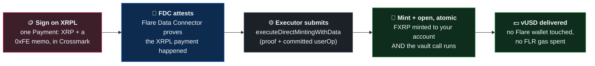
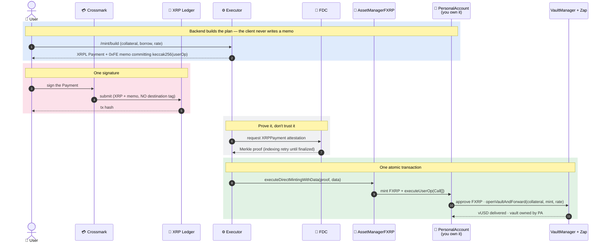

<div align="center">

# Vulcra

### Bring XRP straight from the XRP Ledger, borrow a stablecoin on Flare — in one payment, with no Flare wallet and no FLR gas.

**A multi-collateral CDP stablecoin on [Flare](https://flare.network) Coston2 testnet (114).**
Supply XRP from the XRP Ledger as collateral — it becomes FXRP on Flare via FAssets — and borrow
**vUSD** cross-chain. Liquity-V2 mechanics: you set your own interest rate, and redemptions hit the
lowest rate first. Every vault action rides **one XRPL payment**, signed in Crossmark.

<br/>

[](https://coston2-explorer.flare.network)
[](https://coston2-explorer.flare.network/address/0x93e572cDbfb62557E041B53490e5208C147b5388)
[](https://coston2-explorer.flare.network/address/0x333FDCf66792122e80654E197Eb6Fa3705f1B6D8)
[](https://dev.flare.network)

**[Explorer](https://coston2-explorer.flare.network)** ·
**[VaultManager (FXRP)](https://coston2-explorer.flare.network/address/0x93e572cDbfb62557E041B53490e5208C147b5388)** ·
**[vUSD](https://coston2-explorer.flare.network/address/0x333FDCf66792122e80654E197Eb6Fa3705f1B6D8)** ·
**[Repo](https://github.com/Lexirieru/vulcra)** ·
**[Flare docs](https://dev.flare.network)**

</div>

---

## The problem

XRP is one of the largest crypto communities, and it cannot use its own asset as CDP collateral
without leaving its own chain. To borrow against XRP today you must: acquire an EVM wallet, fund it
with gas, bridge or manually mint a wrapped representation, approve it, open a vault, and then babysit
a second wallet on a second chain.

**The asset is ready. The user experience is the barrier.** An XRP holder who just wants a dollar loan
against their XRP has to become an EVM power user first.

---

## What Vulcra does

Vulcra is a **multi-collateral CDP** issuing a single stablecoin, **vUSD**, isolated per collateral —
each market has its own risk curve, oracle, and stability pool, sharing only vUSD. It runs the
**Liquity V2** model: borrowers **set their own annual interest rate**, and redemptions are ordered
**by rate, lowest first** — so a higher rate buys you a place further back in the redemption queue.

On top of that sits the part that makes Vulcra different: an **XRPL-native** path. You never touch a
Flare wallet.

> **Sign one Payment in Crossmark. Your XRP leaves the XRP Ledger, becomes FXRP on Flare, opens a
> vault, and delivers vUSD — atomically, in a single transaction.**

The whole thing rides Flare's **0xFE direct-minting custom instruction** through **Flare Smart
Accounts**. The user's XRPL key controls a `PersonalAccount` on Flare; the memo on the XRPL payment
commits a signed `PackedUserOperation`; the executor proves the payment happened with the **Flare Data
Connector (FDC)** and calls `AssetManagerFXRP.executeDirectMintingWithData(...)`, which mints the FXRP
**and** runs the committed calls from the PersonalAccount **in one atomic on-chain step**.

| | |
|---|---|
| 🪙 **XRPL-native, one payment** | Supply → mint FXRP → open vault → deliver vUSD, all from a single signed XRPL Payment. No Flare wallet, no FLR gas, no manual FXRP handling. |
| 🔗 **Real Flare rails, no mocks** | Prices from **FTSOv2** (block-latency feeds), XRPL payment proof from the **FDC**, XRP↔FXRP through **FAssets**, accounts through **MasterAccountController / PersonalAccount**. |
| 📈 **Liquity V2 CDP** | User-set interest rates, by-rate redemption (lowest first), per-collateral `minDebt`, and a per-branch **Stability Pool** that streams vUSD rewards. |
| 🧩 **One mechanism, whole lifecycle** | The same 0xFE path does open / supply / borrow-more / repay / withdraw / adjust-rate / close — net-mint > 0 mints FXRP, net-mint 0 is a fees-only "memo-only" action. |
| 🛡️ **TEE Guardian** | An opt-in confidential keeper (runs in a Trusted Execution Environment) that watches your health and can auto-repay before liquidation. |

---

## 🟢 Live on Flare Coston2 — verify it yourself

Every core contract is deployed and live on Coston2. Every claim below links to the explorer.

### Core contracts (UUPS · AccessControl)

| Contract | Address |
|---|---|
| **vUSD** — the shared stablecoin | [`0x333FDCf6…05f1B6D8`](https://coston2-explorer.flare.network/address/0x333FDCf66792122e80654E197Eb6Fa3705f1B6D8) |
| **VaultManager — FXRP** | [`0x93e572cD…b5388`](https://coston2-explorer.flare.network/address/0x93e572cDbfb62557E041B53490e5208C147b5388) |
| **VaultManager — wFLR** | [`0x1F079F20…0b3b8`](https://coston2-explorer.flare.network/address/0x1F079F205ca2857a3A199937Ace956ed51B0b3b8) |
| **VulcraZap** — atomic open+forward | [`0xCe4f886e…B59dfE`](https://coston2-explorer.flare.network/address/0xCe4f886e67dE51418751314eEb19aC2D75B59dfE) |
| **StabilityPool implementation** | [`0xAfC0d664…A0172f7`](https://coston2-explorer.flare.network/address/0xAfC0d66405CB687c9208534f2c086d402A0172f7) |

### Markets (collateral → vUSD)

| Market | Collateral (dec) | VaultManager | Stability Pool | Price oracle |
|---|---|---|---|---|
| **FXRP** *(XRPL-native)* | [`0x0b6A3645…273dc7`](https://coston2-explorer.flare.network/address/0x0b6A3645c240605887a5532109323A3E12273dc7) · 6 | [`0x93e572cD…b5388`](https://coston2-explorer.flare.network/address/0x93e572cDbfb62557E041B53490e5208C147b5388) | [`0xfA2dCc4B…D851E4`](https://coston2-explorer.flare.network/address/0xfA2dCc4B93909ACc1dd6b2e92178D04cD1D851E4) | [`0x63Bf4a9d…29f953B`](https://coston2-explorer.flare.network/address/0x63Bf4a9d716Ce16C0E091EF9C3281f44829f953B) |
| **wFLR** | [`0xC67DCE33…Ce9273`](https://coston2-explorer.flare.network/address/0xC67DCE33D7A8efA5FfEB961899C73fe01bCe9273) · 18 | [`0x1F079F20…0b3b8`](https://coston2-explorer.flare.network/address/0x1F079F205ca2857a3A199937Ace956ed51B0b3b8) | [`0xB963D913…557e07`](https://coston2-explorer.flare.network/address/0xB963D913CFb4688634184aB7b22e554B34557e07) | [`0x914cd350…4453Df`](https://coston2-explorer.flare.network/address/0x914cd3509727afeED74267FDF5c9E7f1fB4453Df) |

### Flare system contracts we build on (not ours)

| | Address |
|---|---|
| **FlareContractRegistry** | [`0xaD67FE66…0F6019`](https://coston2-explorer.flare.network/address/0xaD67FE66660Fb8dFE9d6b1b4240d8650e30F6019) |
| **AssetManagerFXRP** (FAssets) | [`0xc1Ca88b9…f4fbDFA`](https://coston2-explorer.flare.network/address/0xc1Ca88b937d0b528842F95d5731ffB586f4fbDFA) |
| **FAssets Core Vault** (XRPL direct-minting address) | `rDhpmiPq4BVBDWMVdSrmkgt8thKyRzGV1p` |

### Receipts, not screenshots

The **entire XRPL-native lifecycle** has been driven end-to-end — build → sign an XRPL Payment →
FDC attestation → `executeDirectMintingWithData` → executed — through the real frontend path. Each row
is one on-chain transaction on Coston2.

| Action | net-mint | Proof (Coston2) |
|---|---|---|
| 🪙 **Supply collateral** (addCollateral) | > 0 · mints FXRP | [tx `0xb84d84c4…`](https://coston2-explorer.flare.network/tx/0xb84d84c4f2e3df00216c21ef7d254d0e70ad3cb16eca5940bf2aea449f9c8d9f) — collateral 10 → 30 FXRP |
| 💵 **Borrow more** (mintMore) | 0 · fees only | [tx `0xa421c201…`](https://coston2-explorer.flare.network/tx/0xa421c201afe20300a2d0185dec598946e598b350b0fabf0cd9c059e709efc29c) — debt +1 vUSD |
| 📤 **Withdraw collateral** | 0 · fees only | [tx `0x2db173ad…`](https://coston2-explorer.flare.network/tx/0x2db173ad5206842b330322e805d99c6817ea5cdf9dffcff6f3e0db89a9997bdd) — collateral 22 → 21 FXRP |
| 🎚️ **Adjust interest rate** | 0 · fees only | [tx `0xe21fdabb…`](https://coston2-explorer.flare.network/tx/0xe21fdabb2d7a17028180a06f65ccf00daa2eacb4f52a017fca5a807b428b8b2f) — rate 5% → 7% |
| 🔒 **Close vault** | 0 · fees only | [tx `0x596d0cd9…`](https://coston2-explorer.flare.network/tx/0x596d0cd913f199ccd4878a420e09add0870b59f02ef160eff9122c97dc096263) — repaid in full, collateral returned |

Repay and open follow the identical path (net-0 and net > 0 respectively). Every transaction above is
`status: success` on Coston2 — click any of them.

---

## How it works

You sign one Payment. Flare does the rest, atomically.



The same story, call by call:



---

## 🧩 The 0xFE mechanism — one primitive, the whole lifecycle

The key insight: **0xFE is a general arbitrary-call instruction, not just a mint.** The 42-byte memo
carries an opcode, a wallet id, an executor fee, and the hash of a `PackedUserOperation`. When the
executor settles the direct mint, FAssets mints the net FXRP **and** the PersonalAccount runs the
committed `Call[]` atomically — the same trust boundary as the mint itself.

That means **no smart-contract changes are needed to manage a vault from the XRP Ledger**:

- **net-mint > 0** — the XRPL payment carries collateral, FXRP is minted, and the calls open a vault or
  add collateral. *(Supply / Open.)*
- **net-mint = 0** — the XRPL payment is **fees-only** ("memo-only"): no FXRP is minted, but the
  committed calls still run from the PersonalAccount. *(Borrow-more, Repay, Withdraw, Adjust-rate,
  Close.)*

So the frontend exposes the **exact same manage panel** as the EVM branches — Deposit / Withdraw /
Borrow / Repay / Interest / Close — and every tab is just a different `Call[]` behind the same signed
XRPL payment.

---

## 📈 Multi-collateral & Liquity-V2 mechanics

- **Isolated markets.** Each collateral is its own `VaultManager` + `PriceOracle` + `StabilityPool`,
  sharing only vUSD. Adding a market does not put existing markets at risk.
- **You set your rate.** Borrowers choose an annual interest rate (bounds per market, e.g. FXRP
  0.5%–250%, default 5%). Interest accrues on-chain and grows the debt.
- **Redemption by rate, lowest first.** Anyone can redeem 1 vUSD for $1 of collateral; the vaults
  paying the **lowest** interest rate are redeemed first. A higher rate costs more to carry but pushes
  you back in the queue. Redemption is not liquidation — your debt shrinks and you keep the rest.
- **Per-market `minDebt`.** Lowered on-chain on testnet for faucet-limited testing (any amount within
  LTV is allowed).

Live vaults on Coston2 run **MCR 130%** (≈ 76.9% max LTV). Read anything off the chain:

```bash
cast call 0x93e572cDbfb62557E041B53490e5208C147b5388 \
  "getVault(address)(uint256,uint256,bool)" <yourPersonalAccount> \
  --rpc-url https://coston2-api.flare.network/ext/C/rpc
```

---

## 💰 Earn — per-branch Stability Pools

Each collateral branch routes its `interestReceiver` to a dedicated **vUSD Stability Pool** (UUPS
proxy, shared implementation). Depositors earn a **rate-based vUSD reward stream**; the pool is the
first line of defense in liquidations. Seeded live on Coston2:

| Pool | Deposit | Reward | Duration | APR at seed |
|---|---|---|---|---|
| **FXRP** | 3,200,000 vUSD | 58,000 vUSD | 60 days | ~11.02% |
| **wFLR** | 850,000 vUSD | 21,000 vUSD | 60 days | ~15.02% |

Both proxies were **upgraded live** via `upgradeToAndCall` as an on-chain UUPS rehearsal.

---

## 🛡️ Guardian — confidential, opt-in liquidation protection

The Guardian is an opt-in keeper that runs inside a **Trusted Execution Environment**
(`backend/tee-extension`). Rule parameters (trigger health ratio, max repay) are submitted **once over
TLS to the TEE**, never read from a public on-chain source, so your protection thresholds aren't
front-runnable. When your position approaches the liquidation threshold, the Guardian auto-repays from
its mandate to pull the vault back to safety — you keep your position instead of paying a liquidation
penalty.

---

## ⏱️ Run it yourself

Everything runs against **Flare Coston2** (`https://coston2-api.flare.network/ext/C/rpc`). You need an
XRPL **testnet** wallet ([faucet](https://xrpl.org/xrp-testnet-faucet.html)) and Crossmark.

```bash
git clone --recursive https://github.com/Lexirieru/vulcra
cd vulcra

# 1) Contracts are already live on Coston2 (addresses above). To rebuild/test:
cd smartcontract && forge build && forge test

# 2) Backend executor (needs a funded key + FDC/FTSO env in backend/.env)
cd ../backend && npm install && npm -w apps/executor start     # :8787

# 3) Frontend
cd ../frontend && npm install && npm run dev                   # :3000 → /borrow/xrp
```

Then open **`/borrow/xrp`**, connect Crossmark, supply XRP, and borrow vUSD — watch the mint tracker
walk `Received → Attesting (FDC) → Executing → vUSD delivered`.

---

## 📦 Repository layout

A monorepo. Each part is independently runnable.

| Path | What's inside |
|---|---|
| **`smartcontract/`** | Solidity + Foundry. `VaultManager`, `VulcraZap`, `PriceOracle`, `StabilityPool` (UUPS), per-user vault accounting, by-rate redemption, `DeployVulcra` scripts. `forge test`. |
| **`backend/`** | Node + `tsx` workspace. `apps/executor` (Fastify: build / submit / status, FDC attestation, `executeDirectMintingWithData`), `packages/userop` (0xFE memo + PackedUserOperation), `packages/chain-client`, `packages/interfaces`, `tee-extension` (Guardian TEE). |
| **`frontend/`** | Next.js 16 app. Borrow (EVM FXRP/wFLR + XRPL-native XRP), manage panels, Earn, live FTSO prices, mint tracker. |
| **`landingpage/`** | Marketing / landing experience (Next 15 · GSAP). |
| **`docs/`** | Build plans. |

---

## ⚖️ Risk parameters

Live values on the FXRP market — don't take our word for it, read them off the chain:

| Parameter | Value | Source |
|---|---|---|
| Min collateral ratio (MCR) | **130%** | `VaultManager` params |
| Max LTV | **≈ 76.9%** | derived from MCR |
| Interest rate | **user-set, 0.5% – 250%** (default 5% FXRP / 8% wFLR) | `VaultManager` |
| Redemption order | **by interest rate — lowest first** | sorted vault list |
| Min debt | lowered on-chain for testnet | `VaultManager` params |
| Prices | **FTSOv2 block-latency feeds** via `PriceOracle`; stale prices don't settle | [`PriceOracle`](https://coston2-explorer.flare.network/address/0x63Bf4a9d716Ce16C0E091EF9C3281f44829f953B) |

---

## 🛠️ Tech stack

Everything targets **Flare Coston2 (114)**.

### ⛓️ `smartcontract` — Solidity

| Layer | What we use |
|---|---|
| Language / toolchain | **Solidity** · **Foundry** (`forge` · `cast` · `anvil`) |
| Libraries | **OpenZeppelin** — UUPS proxies + AccessControl · `forge-std` |
| Flare integration | **FTSOv2** feeds · **FAssets** (`AssetManagerFXRP`) · resolved through **FlareContractRegistry** — no hardcoded system addresses except the registry |
| Tests | `forge test` (unit + wiring) |

### ⚙️ `backend` — executor & keepers

| Package | Stack |
|---|---|
| **`apps/executor`** | **Fastify** HTTP API · **viem** · **dotenv** · builds the 0xFE plan, drives **FDC** attestation (retry on indexing lag), submits `executeDirectMintingWithData` |
| **`packages/userop`** | 0xFE memo encoding · `PackedUserOperation` build/hash · vault call batches (open / add / withdraw / mint-more / repay / adjust-rate / close) |
| **`packages/chain-client`** | Flare contract resolution (registry → AssetManager, MasterAccountController, FXRP token) |
| **`packages/interfaces`** | shared ABIs (VaultManager, Zap, ERC-20, PersonalAccount) |
| **`tee-extension`** | Guardian confidential keeper (TEE) |
| Runtime | **Node ≥ 22** · **`tsx`** (run TS directly, no build step) · npm workspaces |

### 🖥️ `frontend` — the app

| Layer | What we use |
|---|---|
| Framework | **Next.js 16** (App Router) · **React 19** · **TypeScript** |
| Web3 (EVM) | **wagmi 3** + **viem 2** + **Reown AppKit** (WalletConnect) — Coston2 only |
| Web3 (XRPL) | **Crossmark** + **GemWallet** — sign the raw Payment in-browser, 0xFE memo preserved verbatim, no server key |
| Data | **TanStack Query 5** · live **FTSOv2** prices · ABIs from the contracts |
| UI | **Tailwind CSS** · hand-rolled component kit · `lucide-react` · framer-motion / GSAP for motion |

### 🌐 `landingpage`

**Next 15** · **GSAP 3** scroll-driven motion.

---

## 👥 Team

| | Role | GitHub |
|---|---|---|
| **Ghoza** | Architect Engineer | [@ghozzza](https://github.com/ghozzza) |
| **Axel** | Integration Engineer | [@Lexirieru](https://github.com/Lexirieru) |
| **Wildan** | Backend Engineer | [@ahmadstiff](https://github.com/ahmadstiff) |
| **Ahmad** | Frontend Engineer | [@wildanre](https://github.com/wildanre) |

---

<div align="center">
<br/>

**Built for the Flare Summer Signal hackathon** · FAssets · XRPL-native DeFi

[Explorer](https://coston2-explorer.flare.network) ·
[VaultManager](https://coston2-explorer.flare.network/address/0x93e572cDbfb62557E041B53490e5208C147b5388) ·
[Repo](https://github.com/Lexirieru/vulcra) ·
[Flare docs](https://dev.flare.network)

<sub>Testnet demo on Coston2 (114). vUSD is a test stablecoin; markets use Flare-issued test assets.</sub>

</div>
