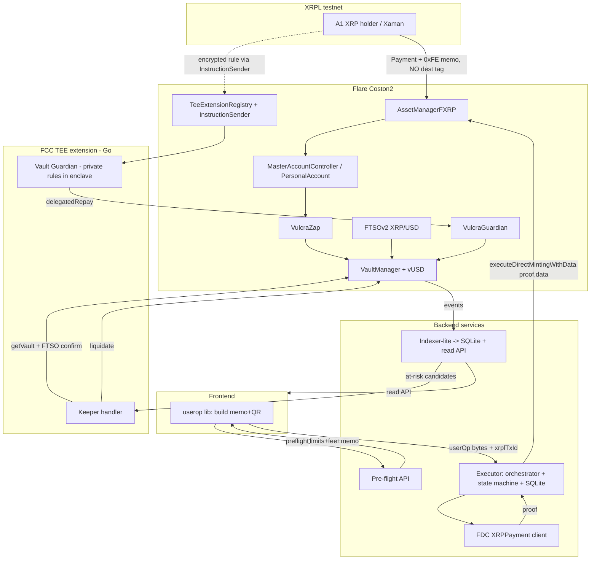

# Vulcra Backend — Plan

> **Product Contract preservation:** The master plan (`docs/plans/2026-07-20-001-feat-vulcra-cdp-flare-plan.md`) is **unchanged**. This is a new, backend-scoped implementation plan derived from it, written alongside sibling scoped plans (frontend, smartcontract) so each subtree can be built in parallel. Where this plan drafts contract interfaces, the **smartcontract plan holds final authority**; interfaces here are backend's working assumptions.

---

## Goal Capsule

- **Objective:** Build the Vulcra backend — the deterministic (no-LLM) services that turn an XRPL payment into an on-chain vUSD mint, feed vault state to the frontend, and run the confidential liquidation keeper + Vault Guardian inside a Flare Confidential Compute TEE. Covers master requirements **R10–R16** (backend side), plus the backend obligations implied by R3/R4/R5/R7/R8.
- **Two services, two languages:** an **executor + indexer** service in Node/TypeScript (viem), and a **TEE extension** in Go (`fce-extension-scaffold` pattern). One deterministic codebase serving Bounty 1 (interoperable asset product) and Bounty 2 (confidential compute).
- **No mocks against Flare.** FDC attestations, FAssets direct minting, FTSOv2 reads, MasterAccountController lookups, and the FCC proxy all run against **real Coston2** infrastructure. `SIMULATED_TEE=true` is the only accepted simulation, and only for TEE attestation during development.
- **Open blockers:** None. Cross-team forks (Guardian funding model, final protocol params, contract ABIs) are captured as explicit assumptions / open questions and do not block backend structure.

---

## Problem Frame

XRP holders have no native smart contracts and, on Flare, no CDP to forge dollars against FXRP. The **frontend cannot do this alone**: minting vUSD from a single XRPL Payment requires an off-chain actor that (a) obtains an FDC attestation of the XRPL payment, (b) submits the atomic `executeDirectMintingWithData` call on Flare, and (c) survives rate-limit delays and stuck-mint recovery — none of which a browser can safely own (it holds no funded Flare key, cannot poll finalization for minutes, and must not be trusted with recovery). Separately, liquidation and Vault-Guardian protection must run somewhere **continuously and confidentially**; on-chain stop-loss intents are front-runnable, and a plain public keeper is a weak Bounty-2 story. The backend is that trusted, always-on, attestable actor.

Key hard constraints inherited from Flare (verified against the installed Flare skills; re-verify live docs at build time — DevHub is mid-update):

- **XRPL payments to a smart account MUST NOT carry a destination tag** (a tag reroutes the direct mint to the tag holder). Memo-only.
- **Sub-minimum or wrong-recipient payments are irrecoverable by design.** Pre-flight must block them *before* the user sends XRP (master AE2).
- **Rate limits delay, never reject.** A delayed mint re-executes with the *same* FDC proof once `executionAllowedAt` passes — it is not a failure (master AE1).
- **The `0xFE` atomic flow is all-or-nothing.** If any inner call reverts, no FXRP is minted and the XRP sits at the Core Vault until a `0xE0` recovery finalizes it (master AE4).
- **TEE trust = attested code hash.** The Guardian's confidentiality claim rests on a reproducible build whose measured code hash is whitelisted on-chain (master R16).

---

## Product Contract (carried from origin)

Backend-owning requirements (see origin for full text):

- **R10** — Atomic single-XRPL-Payment mint via the `0xFE` custom instruction; revert ⇒ no FXRP minted.
- **R11** — Executor: intake `PackedUserOperation`, obtain FDC `XRPPayment` attestation, call direct-minting execution, retry the same proof on rate-limit delay at `executionAllowedAt`, support `0xE0`/`0xE1` recovery.
- **R12** — Pre-flight: hourly/daily/large-mint limits, minimum fee, address validation, before any XRP is sent.
- **R13** — Executor exposes the state the frontend needs to build the payment (personal account, nonce, memo) and to track mint status end to end.
- **R14** — Liquidation keeper as an FCC TEE extension; reads vault state (indexer) + price (FTSO); `SIMULATED_TEE` against live Coston2 acceptable in dev.
- **R15** — Vault Guardian: private protection rules stored and evaluated **only inside the TEE**, not observable on-chain before execution.
- **R16** — Confidential story is verifiable: reproducible build + code-hash attestation evidence for the Bounty 2 submission.

Backend obligations implied by core-CDP requirements (authority = smartcontract plan): **R3** decimal normalization (FXRP 6 / feed dynamic / vUSD 18) and FTSO staleness; **R4** liquidation entry point consumed by the keeper; **R5** redemption ordering (lowest-CR-first) that the indexer must surface; **R7** parameters read at runtime, never hardcoded; **R8** every Flare system address resolved via `FlareContractRegistry`.

**Actors** (from origin): A1 XRP holder, A2 EVM user, A3 keeper (our TEE + external), **A4 executor service (this plan)**, A5 admin.

**Acceptance Examples honored here:** AE1 (delayed-not-failed retry), AE2 (block sub-minimum before XRP sent), AE3 (private auto-repay trigger without on-chain rule exposure), AE4 (revert ⇒ no mint ⇒ `0xE0` recovery).

---

## Planning Contract

### Key Technical Decisions

**KTD1 — Monorepo: npm workspaces (TS) + a sibling Go module.** `backend/` is an npm-workspaces root holding shared packages (`chain-client`, `userop`, `interfaces`) and apps (`executor`, `indexer`); the TEE extension is a separate Go module (`backend/tee-extension`) tracking the upstream `fce-extension-scaffold` layout. Rationale: the executor/indexer share chain + userop code and a single `viem`/`@flarenetwork/flare-wagmi-periphery-package` toolchain (consistent with the existing frontend TS5 scaffold); the TEE keeper must be Go for **bit-for-bit reproducible builds** (R16) — Python/TS reach only best-effort cross-machine determinism per the FCC skill. Two languages is a deliberate, requirement-driven split, not accidental sprawl.

**KTD2 — Executor is stateful with SQLite-backed durability.** The mint lifecycle spans minutes and survives process restarts (attestation finalization ~90–180s; large-mint delays up to 1h on Coston2). A persisted state machine (see High-Level Technical Design) lets a delayed or stuck mint resume with the *same* FDC proof rather than restart. Rationale: AE1 requires retrying the identical proof at `executionAllowedAt`; in-memory-only would lose the proof on restart and risk a duplicate-nonce resend (an explicit revert cause in the smart-accounts skill).

**KTD3 — UserOp builder is a shared library, not an executor-only concern.** `packages/userop` builds the `PackedUserOperation`, the `userOpHash`, and the 42-byte `0xFE` memo. Both the frontend (to render the QR / Xaman deep link with the memo prebuilt) and the executor (to verify `keccak256(_data) == memo hash` before submitting) import it. Rationale: the hash committed on XRPL and the bytes delivered off-chain must be produced by one canonical encoder, or they will diverge and every mint reverts with `CustomInstructionHashMismatch`.

**KTD4 — `0xFE` (hash-commit) over `0xFF` (inline).** The memo commits only `keccak256(abi.encode(userOp))` (42 bytes, constant); the executor supplies the full `PackedUserOperation` bytes in `_data` to `executeDirectMintingWithData`. Rationale: keeps the XRPL memo constant regardless of batch size, keeps call payloads off the public XRPL ledger, and matches our operator model. `0xFF` (inline, ~1024-byte cap, any indexer relays) is the fallback if operating an executor proves infeasible at a gate.

**KTD5 — Keeper authoritative reads are on-chain; the indexer is for candidate discovery.** Master R14 says the keeper reads "vault state via the FCC indexer DB." We resolve this as: the **Flare Coston2 indexer DB** (the same DB the ext-proxy already connects to) and our **indexer-lite** are used to *enumerate candidate at-risk vaults cheaply*; the keeper then **confirms CR from on-chain `getVault` + live FTSO price inside the enclave** before liquidating. Rationale: indexers lag and can be stale at exactly the moment a vault crosses MCR; liquidation must act on authoritative state. This keeps the Bounty-2 confidential logic honest without coupling correctness to an indexer's freshness.

**KTD6 — Guardian privacy via ECIES + on-chain commitment (fce-weather-insurance pattern).** A protection rule is ABI-encoded, ECIES-encrypted to the extension's public key, and sent as a `GUARDIAN/REGISTER` instruction. The TEE decrypts inside the enclave, holds the rule keyed by a `termsCommitment`, and only the commitment lives on-chain. Evaluation and the trigger threshold never surface on-chain before execution (R15, AE3). Rationale: this is the exact shape of the `buyPolicyPrivate` → in-enclave threshold → settle flow the FCC skill documents as reproducible and attestable.

**KTD7 — Guardian funding = allowance-based `delegatedRepay`, gated to the TEE wallet (default; see Open Questions).** On trigger, the TEE-managed keeper/Guardian wallet calls `VulcraGuardian.delegatedRepay(vaultId, amount)`, which pulls vUSD from the user's wallet via a pre-granted ERC-20 allowance and repays the vault. Rationale for the default: lighter UX, no locked capital, and a clean confidential story (only the registered TEE address can call it). **Trade-off & fallback captured in Open Questions** — escrow guarantees funds even if the user's wallet is empty/offline; the final choice is shared with the smartcontract worker.

**KTD8 — Every Flare address resolved at runtime via `FlareContractRegistry` (R8).** `chain-client` exposes typed resolvers for `AssetManagerFXRP` (→ `fAsset()` for FXRP), `FtsoV2`, `MasterAccountController`, and (once deployed) `VaultManager`/`VulcraZap`/`VulcraGuardian`. The only constant is the registry address `0xaD67FE66660Fb8dFE9d6b1b4240d8650e30F6019` (double-checked at build against the DevHub registry guide). Nothing else is hardcoded.

**KTD9 — Secrets only via env; never in repo or this plan.** The FCC indexer DB credentials (from the Flare admin), the executor Flare private key, the service XRPL wallet seed, and the verifier API key are read from a gitignored `.env.local.coston2` / `.env` and referenced only by variable name. `config/proxy/*.toml` (which carries DB creds) is gitignored; only its `.example` is committed.

### Assumptions

- **A-BE1 — Contract ABIs.** `IVaultManager` (`openVault`, `adjustVault`, `closeVault`, `liquidate`, `redeem`, `getVault` + events), `IVulcraZap` (the userOp target that opens a vault + mints vUSD from freshly minted FXRP), and `IVulcraGuardian` (`delegatedRepay`, `registerCommitment`) are drafted here (U2) as backend's working contract, subject to the smartcontract plan's final say. Backend integrates against a versioned ABI artifact so a change there is a dependency bump, not a rewrite.
- **A-BE2 — Zap orchestration.** `executeUserOp(Call[])` runs from the personal account; the calls are `FXRP.approve(VulcraZap, collateral)` then `VulcraZap.zapMint(collateral, debt, destination)`. The vault is opened with **owner = personal account** so the XRPL user can later adjust/repay/close via further userOps. `destination` (where vUSD lands) is a userOp parameter; default = the personal account.
- **A-BE3 — msg.value = 0.** FXRP is an ERC-20; the zap needs no native FLR, so `executeDirectMintingWithData` is called with `msg.value = 0`. The executor EOA pays only gas.
- **A-BE4 — Recovery is service-initiated for the demo.** When a mint reverts, the executor's **service XRPL wallet** sends the `0xE0` recovery payment (a tiny positive-net-mint payment) on the user's behalf; recovered FXRP mints to the user's personal account. A user-guided recovery (frontend prompts the user to send it) is the fallback. Both are documented; the demo uses service-initiated.
- **A-BE5 — Coston2 params (from the FAssets skill, re-read at build):** min fee 0.1 testXRP, fee 0.25%, executor fee 0.1 testXRP, others-can-execute-after 2h, hourly 100k / daily 500k / large-mint threshold 100k testXRP, large-mint delay 1h. Treated as runtime-read, not compiled-in.
- **A-BE6 — FCC infra:** ext-proxy external port `6674`, tee-proxy `https://tee-proxy-coston2-1.flare.rocks`, Coston2 indexer DB host/port/name from the FCC skill, credentials injected via env. Go extension for reproducibility.

### Requirements Traceability

| Requirement | Units |
|---|---|
| R10 (atomic 0xFE mint) | U4 (memo/userOp), U7 (submit), U8 (recovery) |
| R11 (executor pipeline) | U5, U6, U7, U8, U9 |
| R12 (pre-flight) | U5 |
| R13 (frontend state + tracking) | U4, U9 |
| R14 (TEE keeper) | U11, U12 |
| R15 (private Guardian rules) | U13 |
| R16 (attestation evidence) | U14 |
| R3 (decimals/FTSO) | U3 |
| R4/R5 (liquidation/redemption targeting) | U10, U12 |
| R8 (registry resolution) | U3 |
| Interface drafts (A-BE1) | U2 |

---

## High-Level Technical Design

### Component & data-flow overview



### Mint lifecycle — state machine (executor, KTD2)

```mermaid
stateDiagram-v2
  [*] --> INTAKE: POST /mint/submit (userOp bytes + xrplTxId)
  INTAKE --> ATTEST_REQUESTED: hash==memo OK; prepareRequest + requestAttestation
  INTAKE --> REJECTED: hash mismatch / bad input
  ATTEST_REQUESTED --> ATTEST_FINALIZING: roundId computed
  ATTEST_FINALIZING --> PROOF_READY: Relay.isFinalized(200,roundId)
  PROOF_READY --> EXECUTING: executeDirectMintingWithData(proof,data)
  EXECUTING --> EXECUTED: DirectMintingExecuted
  EXECUTING --> DELAYED: DirectMintingDelayed / LargeDirectMintingDelayed
  DELAYED --> EXECUTING: at executionAllowedAt, retry SAME proof
  EXECUTING --> REVERTED: revert (CallFailed / HashMismatch / InvalidNonce)
  REVERTED --> RECOVERING: 0xE0 skip (service XRPL payment)
  RECOVERING --> RECOVERED: FXRP minted to personal account (userOp skipped)
  RECOVERED --> [*]
  EXECUTED --> [*]
  REJECTED --> [*]
```



### Guardian confidential flow (F3, R15, AE3)

```mermaid
sequenceDiagram
  participant U as User (EVM wallet)
  participant GC as VulcraGuardian (on-chain)
  participant IS as InstructionSender
  participant TEE as Guardian (in enclave)
  participant VM as VaultManager
  Note over U,TEE: REGISTER (private)
  U->>U: ABI-encode rule {vaultId, triggerCR, maxRepay}; ECIES-encrypt to TEE pubkey
  U->>IS: sendInstructions(GUARDIAN/REGISTER, ciphertext)
  IS->>TEE: /action (ciphertext)
  TEE->>TEE: decrypt in enclave; store rule by termsCommitment
  TEE-->>GC: emit only termsCommitment on-chain
  Note over TEE,VM: EVALUATE (periodic)
  TEE->>VM: getVault(CR) + FTSO price (in enclave)
  alt CR < triggerCR and CR > MCR
    TEE->>GC: delegatedRepay(vaultId, amount) [TEE-gated]
    GC->>VM: repay; vault back above trigger
  end
```

---

## Output Structure

```
backend/
├── package.json                      # npm workspaces root
├── tsconfig.base.json
├── .env.example                      # names only, no values (U1)
├── .gitignore                        # .env*, config/proxy/*.toml, *.sqlite
├── README.md
├── packages/
│   ├── interfaces/                   # U2 — draft ABIs + Solidity drafts + shared types
│   │   ├── abi/{IVaultManager,IVulcraZap,IVulcraGuardian}.ts
│   │   ├── solidity/{IVaultManager,IVulcraZap,IVulcraGuardian}.sol
│   │   └── src/types.ts
│   ├── chain-client/                 # U3 — registry resolver, viem clients, FTSO, decimals
│   │   ├── src/{registry,clients,ftso,decimals,index}.ts
│   │   └── test/
│   └── userop/                       # U4 — PackedUserOperation + 0xFE memo + payment amount
│       ├── src/{personalAccount,userop,memo,payment,index}.ts
│       └── test/
├── apps/
│   ├── executor/                     # U5–U9
│   │   ├── src/
│   │   │   ├── preflight/            # U5
│   │   │   ├── attestation/          # U6 (FDC XRPPayment client)
│   │   │   ├── orchestrator/         # U7 (state machine)
│   │   │   ├── recovery/             # U8 (0xE0/0xE1)
│   │   │   ├── db/                   # SQLite + migrations
│   │   │   └── server.ts, routes.ts  # U9
│   │   └── test/
│   └── indexer/                      # U10
│       ├── src/{ingest,db,sortedByCr,api,index}.ts
│       └── test/
└── tee-extension/                    # U11–U14 (Go module; tracks fce-extension-scaffold)
    ├── go.mod
    ├── contracts/{VulcraInstructionSender,VulcraGuardian}.sol
    ├── internal/config/config.go     # OPType/OPCommand constants
    ├── internal/extension/extension.go
    ├── pkg/types/{types.go,register.go}
    ├── scripts/                      # use-chain.sh, pre-build.sh, post-build.sh, test.sh
    ├── config/proxy/*.toml.example   # committed; real .toml gitignored (creds)
    └── docs/attestation-evidence.md  # U14 (Bounty 2)
```

*Scope declaration, not a constraint — implementers may adjust layout; per-unit `**Files:**` are authoritative.*

---

## Implementation Units

### U1. Backend workspace scaffold, config, and secret hygiene

- **Goal:** Stand up the npm-workspaces root, TypeScript base config, environment schema (names only), and gitignore rules so no secret can be committed.
- **Requirements:** R8, R11 (foundation); KTD1, KTD9.
- **Dependencies:** none.
- **Files:** `backend/package.json`, `backend/tsconfig.base.json`, `backend/.env.example`, `backend/.gitignore`, `backend/README.md`, `backend/packages/*/package.json` (workspace stubs).
- **Approach:** npm workspaces (`packages/*`, `apps/*`). A typed env loader (e.g. `zod`/`envsafe`) validates presence of `COSTON2_RPC_URL`, `EXECUTOR_PRIVATE_KEY`, `SERVICE_XRPL_SEED`, `VERIFIER_URL_TESTNET`, `VERIFIER_API_KEY_TESTNET`, `COSTON2_DA_LAYER_URL`, `INDEXER_DB_*`, `TEE_PROXY_URL` at boot. `.gitignore` must cover `.env*` (except `.env.example`), `config/proxy/*.toml` (except `*.example`), and `*.sqlite`. `.env.example` lists variable names with placeholder/empty values only.
- **Patterns to follow:** mirror the frontend scaffold's TS5 + `@types/node@20` toolchain; Coston2 chain id `114`, RPC `https://coston2-api.flare.network/ext/C/rpc`.
- **Test scenarios:**
  - Env loader with all required vars set → boots. `Test expectation` names the happy path.
  - Env loader missing `EXECUTOR_PRIVATE_KEY` → exits with a clear error naming the missing var (fail-fast).
  - `git check-ignore` on a sample `.env.local.coston2` and `config/proxy/extension_proxy.coston2.docker.toml` → both ignored (secret-hygiene guard).
- **Verification:** `npm install` at `backend/` resolves the workspace; boot with a filled `.env` succeeds and with a missing var fails loudly; no `.env`/`.toml` secret file is tracked by git.

### U2. Draft contract interfaces & shared types

- **Goal:** Publish backend's working view of the Vulcra contract surface as versioned ABI artifacts + Solidity interface drafts, to hand to the smartcontract worker and to type every downstream integration.
- **Requirements:** A-BE1, A-BE2; supports R4, R5, R10, R15.
- **Dependencies:** U1.
- **Files:** `backend/packages/interfaces/abi/IVaultManager.ts`, `.../IVulcraZap.ts`, `.../IVulcraGuardian.ts`, `backend/packages/interfaces/solidity/*.sol`, `backend/packages/interfaces/src/types.ts`.
- **Approach:** Draft `IVaultManager` = `openVault(collateral, debt, owner)`, `adjustVault(vaultId, dCollateral, dDebt)`, `closeVault(vaultId)`, `liquidate(vaultId)`, `redeem(vUsdAmount)`, `getVault(vaultId) → {owner, collateral, debt, cr, status}`, plus events `VaultOpened/VaultAdjusted/VaultClosed/VaultLiquidated/Redeemed`. `IVulcraZap.zapMint(collateral, debt, destination)`. `IVulcraGuardian.registerCommitment(bytes32)`, `delegatedRepay(vaultId, amount)` (only-TEE). Shared TS types (`VaultView`, `MintIntent`, `GuardianRule`) derive from the ABIs. Mark every file header: *"DRAFT — smartcontract plan is authoritative."*
- **Patterns to follow:** import-path-per-network convention of `@flarenetwork/flare-periphery-contracts`; keep events indexed on `owner`/`vaultId` so the indexer can filter.
- **Test scenarios:**
  - ABI JSON parses and each function/event signature encodes via viem `encodeFunctionData`/`getAbiItem` without error (shape guard).
  - `getVault` return decodes into `VaultView` with correct field order (type-mapping guard).
  - `Test expectation: none for the .sol drafts` — non-behavioral interface stubs handed to smartcontract.
- **Verification:** viem can encode/decode against every drafted ABI; the smartcontract worker can consume the `.sol` drafts as a starting interface; a version tag is attached so downstream can pin.

### U3. `chain-client`: registry resolution, viem clients, FTSO & decimals

- **Goal:** One package that resolves all Flare addresses at runtime, exposes public/wallet viem clients, reads the FTSO XRP/USD feed with staleness, and centralizes decimal normalization.
- **Requirements:** R3, R8; KTD8.
- **Dependencies:** U1, U2.
- **Files:** `backend/packages/chain-client/src/registry.ts`, `.../clients.ts`, `.../ftso.ts`, `.../decimals.ts`, `.../index.ts`, `backend/packages/chain-client/test/*`.
- **Approach:** `registry.ts` wraps `FlareContractRegistry` (`0xaD67FE66660Fb8dFE9d6b1b4240d8650e30F6019`) → `getContractAddressByName("AssetManagerFXRP")`, then `fAsset()` for FXRP, plus `FtsoV2`, `MasterAccountController`, and Vulcra deploy addresses (from env after deploy). `clients.ts` builds a `publicClient` and a `walletClient` (executor key) on Coston2. `ftso.ts` reads XRP/USD (`getFeedById`, feed id `0x015852502f55534400000000000000000000000000` — verify live) returning `{value, decimals, timestamp}` and flags staleness beyond a threshold. `decimals.ts` normalizes between FXRP (6), feed (dynamic int8), and vUSD (18) with explicit, tested conversions.
- **Patterns to follow:** FAssets skill `get-fxrp-address` flow (registry → AssetManager → `fAsset()`); FTSO skill decimal handling (`value + int8 decimals`).
- **Test scenarios:**
  - Registry resolver returns a checksummed non-zero FXRP address on Coston2 (integration, live RPC).
  - Decimal normalization: 1.000000 FXRP (6dp) × price(2dp=2.84) → USD value at 18dp matches hand-computed expected (happy path).
  - Decimal edge: feed decimals = 5 vs 8 both normalize correctly (boundary).
  - FTSO read older than staleness threshold → `stale=true` returned, not thrown (error-signal path).
  - Registry name miss (`getContractAddressByName` returns zero) → typed error naming the contract (failure path).
- **Verification:** against live Coston2, resolver returns real addresses and `ftso.ts` returns a plausible XRP/USD price; decimal tests pass with fuzz on decimal exponents.

### U4. `userop` builder + `0xFE` memo encoder

- **Goal:** Canonical builder for the `PackedUserOperation`, its hash, the 42-byte `0xFE` memo, and the required XRP payment amount — shared by frontend and executor (KTD3).
- **Requirements:** R10, R13; KTD4.
- **Dependencies:** U2, U3.
- **Files:** `backend/packages/userop/src/personalAccount.ts`, `.../userop.ts`, `.../memo.ts`, `.../payment.ts`, `.../index.ts`, `backend/packages/userop/test/*`.
- **Approach:** `personalAccount.ts`: `getPersonalAccount(xrplAddress)` and `getNonce(personalAccount)` via `MasterAccountController`. `userop.ts`: assemble `Call[]` (`FXRP.approve(zap, collateral)`, `VulcraZap.zapMint(collateral, debt, destination)`), `callData = encodeFunctionData(executeUserOp, [calls])`, build `PackedUserOperation` with `sender`, `nonce`, `callData` and all other fields empty (`initCode:"0x"`, gas fields `0n`, `signature:"0x"`), then `userOpHash = keccak256(abi.encode(userOp))`. `memo.ts`: emit exactly `0xFE || walletId(1B) || executorFeeUBA(8B big-endian) || userOpHash(32B)` = **42 bytes**, and a matching decoder. `payment.ts`: compute required XRP = net mint (collateral) + minting fee (floor/BIPS) + executor fee, from runtime `getDirectMinting*` reads.
- **Patterns to follow:** smart-accounts skill Custom-Instruction `0xFE` layout and the viem `executeUserOp` example; FAssets `computeDirectMintingPaymentAmountXrp` helper.
- **Execution note:** Start test-first on the memo byte layout and hash — a one-byte or endianness error causes every mint to revert with `CustomInstructionHashMismatch`, so this is the highest-leverage characterization surface.
- **Test scenarios:**
  - Memo length is exactly 42 bytes; byte 0 = `0xFE`; bytes 2–9 decode as the given `executorFeeUBA` big-endian (layout guard).
  - `userOpHash` equals `keccak256(abi.encode(userOp))` recomputed independently, and equals the hash embedded in the memo (round-trip; covers R10).
  - `walletId` defaults to 0 and round-trips through encode→decode.
  - No destination tag is ever emitted by the payment builder (A destination tag reroutes the mint — explicit negative assertion).
  - `getNonce` read once per payment; builder does not cache/reuse a nonce across two intents (guards the duplicate-nonce revert from the smart-accounts skill).
  - Payment amount ≥ minimum fee floor for a minimal net mint (boundary vs AE2 input).
- **Verification:** encode→decode round-trips for memo and userOp; independently recomputed hash matches; against Coston2, `getPersonalAccount`/`getNonce` return real values for a test r-address.

### U5. Pre-flight limits & fee API

- **Goal:** Before any XRP is sent, tell the frontend whether a proposed mint will execute immediately or be delayed, the exact required payment, and whether the recipient/amount are valid — blocking irrecoverable payments (AE2).
- **Requirements:** R12; AE2.
- **Dependencies:** U3, U4.
- **Files:** `backend/apps/executor/src/preflight/limits.ts`, `.../fees.ts`, `.../validate.ts`, `.../preflight.ts`, `backend/apps/executor/test/preflight.test.ts`.
- **Approach:** Read `getDirectMintingHourlyLimiterState`/`DailyLimiterState`, `getDirectMintingLargeMintingThresholdUBA`/`DelaySeconds`, `getDirectMintingsUnblockUntilTimestamp`, `assetMintingGranularityUBA`, and fee getters. **Replay the tumbling windows off-chain** (clock-aligned hourly 3600s / daily 86400s UTC) to compute live headroom; `willDelay = amount > bigintMin(hourlyHeadroom, dailyHeadroom)` for hourly/daily, plus an independent `amount > largeThreshold` large-mint check (delay applies even with full window headroom). Validate the XRPL r-address (format/checksum — XRPL codec, optionally FDC `AddressValidity`). Validate net-mint against the vault minimum debt (≥100 vUSD equivalent, R7) and the minimum fee floor. Return `{ ok, willDelay, executionAllowedAtEstimate, requiredPaymentXrp, memo, warnings[] }`.
- **Patterns to follow:** FAssets "Check Minting Limits" guide (`bigintMin(hourlyHeadroom, dailyHeadroom, largeThresholdUBA)`), direct-minting-guide rate-limit section.
- **Test scenarios:**
  - `Covers AE2.` Net mint below the minimum minting fee floor → `ok=false`, blocking reason returned, **no memo issued** (irrecoverable-payment guard).
  - Amount within all headroom → `willDelay=false` (happy path).
  - Amount exceeding remaining hourly headroom → `willDelay=true` with a plausible `executionAllowedAtEstimate` (delay math).
  - Amount exactly at the large-mint threshold → not delayed; strictly above → delayed independently of window headroom (boundary, per skill).
  - Invalid r-address (bad checksum) → `ok=false` with an address-validation reason (error path).
  - Governance unblock active (`getDirectMintingsUnblockUntilTimestamp` in future) → hourly/daily headroom treated as open, but large-mint delay still applies (edge).
- **Verification:** against live Coston2 limiter state, pre-flight classifies a small mint as immediate and a >threshold mint as delayed; a sub-minimum amount is blocked before any memo/payment is produced.

### U6. FDC `XRPPayment` attestation client

- **Goal:** Turn a confirmed XRPL payment tx id into a verified `IXRPPayment.Proof` usable by `executeDirectMintingWithData`.
- **Requirements:** R11.
- **Dependencies:** U3.
- **Files:** `backend/apps/executor/src/attestation/prepare.ts`, `.../submit.ts`, `.../finalize.ts`, `.../proof.ts`, `.../index.ts`, `backend/apps/executor/test/attestation.test.ts`.
- **Approach:** `prepare.ts` POSTs to the verifier `XRPPayment/prepareRequest` (type id `0x08`, source `testXRP`) with `{transactionId, proofOwner=executor EOA}` using the `X-apikey` header → `abiEncodedRequest`. `submit.ts` calls `FdcHub.requestAttestation(abiEncodedRequest, {value: fee})` (fee ≥ type minimum) and computes `roundId = floor((blockTs − firstVotingRoundStartTs)/votingEpochDurationSeconds)`. `finalize.ts` polls `Relay.isFinalized(200, roundId)` (or subscribes to `ProtocolMessageRelayed(200, roundId)`). `proof.ts` POSTs the DA-Layer `proof-by-request-round-raw` with `{votingRoundId, requestBytes}` and decodes the response into `{merkleProof, data}`. Treat every verifier/DA byte string as untrusted; decode strictly to the `IXRPPayment.Proof` ABI.
- **Patterns to follow:** FDC skill user workflow (prepare → submit → round → finalize → proof) and `flare-hardhat-starter` `scripts/fdcExample`; XRPPayment quick reference (3 XRPL confirmations ~12s).
- **Test scenarios:**
  - `prepareRequest` returns a well-formed `abiEncodedRequest` for a known test tx id (mocked verifier response; happy path).
  - `roundId` computation matches a hand-computed value for a fixed block timestamp (arithmetic guard).
  - `isFinalized` false then true across polls → client waits, does not error, then fetches proof (timing/edge).
  - DA-Layer returns not-ready → retry with backoff, bounded, then surfaces a typed "proof not available yet" (error path).
  - Decoded proof `status != 0` (SUCCESS) → flagged so the orchestrator won't submit a failed-payment proof (integration guard).
  - Verifier 401 (bad api key) → typed error naming the missing/invalid key (failure path).
- **Verification:** end-to-end against Coston2 — a real testXRP payment tx id yields a finalized, DA-fetched `IXRPPayment.Proof` that `IFdcVerification.verifyXRPPayment` accepts.

### U7. Mint orchestrator, state machine, and durable persistence

- **Goal:** Drive a submitted mint from intake to `EXECUTED`, surviving restarts and rate-limit delays by retrying the same proof (AE1).
- **Requirements:** R10, R11; AE1; KTD2.
- **Dependencies:** U4, U6; U2 (Zap ABI).
- **Files:** `backend/apps/executor/src/orchestrator/machine.ts`, `.../submitMint.ts`, `.../delays.ts`, `backend/apps/executor/src/db/{schema.ts,mintRepo.ts,migrations/}`, `backend/apps/executor/test/orchestrator.test.ts`.
- **Approach:** SQLite `mints` table persists `{id, xrplTxId, userOpBytes, userOpHash, state, proofJson, executionAllowedAt, lastError, attempts}`. On `/mint/submit` intake: recompute `keccak256(userOpBytes)` and require it equals the memo hash of the XRPL payment (reject otherwise). Then run the state machine (see HTD): request attestation (U6), finalize, then call `executeDirectMintingWithData(proof, userOpBytes)` with `msg.value=0`. Parse receipt: `DirectMintingExecuted` → `EXECUTED`; `DirectMintingDelayed`/`LargeDirectMintingDelayed` → persist `executionAllowedAt` and schedule a retry of the **same** proof; revert → `REVERTED` (hand to U8). A single-flight guard per `xrplTxId`/nonce prevents concurrent duplicate submits. A resumable poller re-picks `DELAYED` rows whose `executionAllowedAt` has passed on startup.
- **Patterns to follow:** `flare-viem-starter` `waitForDirectMintingOutcome` (log `executionAllowedAt`, keep polling, do **not** resend the XRPL payment); smart-accounts "avoiding duplicate-nonce" guidance.
- **Execution note:** Start with a failing test for the delayed→retry transition — it is the AE1 contract and the easiest place to accidentally treat a delay as a failure.
- **Test scenarios:**
  - `Covers AE1.` Execution emits `DirectMintingDelayed` with `executionAllowedAt` → state becomes `DELAYED`, status surfaced as delayed-not-failed, and the orchestrator retries the **identical** proof after that time until `EXECUTED`.
  - Large-mint path emits `LargeDirectMintingDelayed` → same retry behavior, `executionAllowedAt` taken as the furthest-out of applicable rules (edge).
  - Intake where `keccak256(userOpBytes) != memo hash` → `REJECTED`, never submitted (integration guard, covers R10 hash check).
  - Process restart mid-`DELAYED` → row reloaded from SQLite, retry resumes with the persisted proof (durability).
  - `DirectMintingExecuted` on first try → `EXECUTED`, receipt persisted (happy path).
  - Two submits for the same `xrplTxId` → second is a no-op/idempotent, no duplicate on-chain call (concurrency).
- **Verification:** a real Coston2 mint transitions `INTAKE→…→EXECUTED`; a forced-delay scenario retries and completes without resending the XRPL payment; killing and restarting the process mid-flight resumes the mint.

### U8. Stuck-mint recovery (`0xE0` skip, `0xE1` nonce fast-forward)

- **Goal:** When the atomic mint reverts (or is abandoned), recover the user's XRP as FXRP without running the failed userOp, and unstick the nonce for a fresh attempt (AE4).
- **Requirements:** R11; AE4.
- **Dependencies:** U7; U4 (memo shapes); service XRPL wallet (A-BE4).
- **Files:** `backend/apps/executor/src/recovery/skip.ts`, `.../fastForward.ts`, `.../recover.ts`, `backend/apps/executor/test/recovery.test.ts`.
- **Approach:** On `REVERTED`/stuck (and `isTransactionIdUsed(stuckTxId) == false`): build a `0xE0` recovery memo `0xE0 || walletId(1B) || executorFeeUBA(8B) || targetTxId(32B)` and have the **service XRPL wallet** send a small positive-net-mint payment carrying it; executor calls `executeDirectMintingWithData(recoveryProof, "0x")` (emits `IgnoreMemoSet`), then re-submits `executeDirectMintingWithData` for the **original** stuck payment (skip flag set → FXRP minted, userOp skipped) passing the original `userOpBytes` as `_data`. If the abandoned nonce must be jumped for a subsequent attempt, build `0xE1` (`newNonce` strictly > current, jump ≤ `uint32.max`), send it, and confirm `NonceIncreased`. Guard: only run `0xE1` after the stuck payment is confirmed minted (`isTransactionIdUsed == true`).
- **Patterns to follow:** smart-accounts skill "Recovery after a failed / stuck mint" and "Fast-forwarding a stuck nonce"; `recover-direct-mint-transaction.ts` reference.
- **Test scenarios:**
  - `Covers AE4.` A userOp whose `zapMint` would revert (debt below minimum) → `executeDirectMintingWithData` reverts, no FXRP minted, state `REVERTED`; `0xE0` recovery then mints FXRP to the personal account and marks `RECOVERED`.
  - `newNonce` validation: not strictly greater than current → rejected client-side before sending (guards `InvalidNonceIncrease`).
  - `0xE1` attempted while `isTransactionIdUsed == false` → blocked with a "recover first" error (ordering guard).
  - Recovery when `isTransactionIdUsed == true` already (someone else finalized) → detected, no duplicate recovery payment sent (idempotency).
  - `0xE0` memo byte layout is exactly 42 bytes and targets the correct stuck tx id (layout guard).
- **Verification:** on Coston2, an intentionally-reverting mint is recovered via `0xE0` (FXRP appears at the personal account, userOp not executed); a subsequent fresh mint succeeds after a `0xE1` fast-forward when needed.

### U9. Executor HTTP API & mint-status tracking

- **Goal:** Expose the endpoints the frontend needs: pre-flight, submit, and end-to-end status tracking (R13).
- **Requirements:** R11, R13.
- **Dependencies:** U5, U7, U8.
- **Files:** `backend/apps/executor/src/server.ts`, `.../routes.ts`, `.../dto.ts`, `backend/apps/executor/test/api.test.ts`.
- **Approach:** A small HTTP server (Fastify) with: `POST /mint/preflight` (→ U5), `POST /mint/submit` (`{packedUserOpHex, xrplTxId}` → creates a mint row, returns `{mintId}`), `GET /mint/status/:mintId` (returns the state-machine state + `executionAllowedAt` + human-readable stage for R13 tracking), and `GET /account/:xrplAddress` (personal account + nonce + FXRP balance for the frontend to render before payment). Input validation via shared DTOs; per-IP rate limiting; structured error envelopes that distinguish user-actionable (blocked pre-flight) from transient (proof not ready). CORS scoped to the frontend origin.
- **Patterns to follow:** shared `packages/userop` and `packages/interfaces` types across request/response DTOs; state names from U7's machine surfaced verbatim so the frontend maps one enum.
- **Test scenarios:**
  - `POST /mint/preflight` with a sub-minimum amount → 200 with `ok=false` and blocking reason (integration with U5; covers AE2 at the API layer).
  - `POST /mint/submit` with mismatched hash → 4xx with a clear reason, no row created beyond `REJECTED` (error path).
  - `GET /mint/status/:id` walks `INTAKE→ATTEST_*→EXECUTING→EXECUTED` across polls for a live mint (happy path, R13).
  - `GET /status` for a `DELAYED` mint surfaces `executionAllowedAt` and a delayed-not-failed label (AE1 surfacing).
  - Unknown `mintId` → 404 (edge).
  - Malformed JSON / missing fields → 400 with field-level detail (validation).
- **Verification:** the frontend can drive a full mint through these endpoints and render a live status timeline; blocked pre-flights never yield a submittable memo.

### U10. Indexer-lite: events → SQLite + read API

- **Goal:** Maintain a fresh, queryable view of vault state for the frontend and a cheap at-risk candidate list for the keeper, ordered by collateral ratio (R5).
- **Requirements:** R4, R5, R13, R14 (candidate discovery).
- **Dependencies:** U2, U3.
- **Files:** `backend/apps/indexer/src/ingest.ts`, `.../db.ts`, `.../sortedByCr.ts`, `.../api.ts`, `.../index.ts`, `backend/apps/indexer/test/indexer.test.ts`.
- **Approach:** Poll `VaultManager` logs (`VaultOpened/Adjusted/Closed/Liquidated/Redeemed`) via viem `getLogs` from a persisted last-processed block; upsert into a `vaults` table `{vaultId, owner, collateral, debt, status, lastBlock}` and an append-only `events` table. Recompute CR on read using the live FTSO price (from `chain-client`) rather than storing a stale CR; expose a `sortedByCr` query (ascending) for redemption/liquidation targeting. **Reorg safety:** re-scan a small confirmation lag and reconcile. Read API: `GET /vaults/at-risk?belowCr=` and `GET /vaults/:id`. This is candidate discovery only — the keeper re-confirms on-chain (KTD5).
- **Patterns to follow:** viem `watchEvent`/`getLogs` polling with a confirmation lag; keep the DB write path idempotent on `(txHash, logIndex)`.
- **Test scenarios:**
  - Ingest a `VaultOpened` then `VaultAdjusted` for the same vault → `vaults` row reflects the latest collateral/debt (happy path).
  - `at-risk` query returns vaults ascending by CR computed against a supplied price (covers R5 ordering).
  - Replayed/duplicate log (same `txHash`+`logIndex`) → no double-apply (idempotency).
  - Simulated reorg (a previously-seen block replaced) → state reconciles to the canonical chain within the confirmation lag (edge).
  - `VaultClosed`/`VaultLiquidated` → vault status transitions and drops out of `at-risk` (state transition).
- **Verification:** against a Coston2 `VaultManager` (once deployed), the indexer reflects vault changes within the poll interval; the frontend at-risk list and vault detail read correctly; the keeper can pull the same candidate list.

### U11. FCC extension scaffold, InstructionSender, and OP routing

- **Goal:** Stand up the Go TEE extension (keeper + Guardian) on the `fce-extension-scaffold` pattern, wired to Coston2 with `SIMULATED_TEE=true`, routing `KEEPER`/`GUARDIAN` operations.
- **Requirements:** R14, R15 (foundation); KTD1, KTD9.
- **Dependencies:** U2 (Guardian contract draft); Coston2 indexer DB creds via env (A-BE6).
- **Files:** `backend/tee-extension/go.mod`, `backend/tee-extension/internal/config/config.go`, `.../internal/extension/extension.go`, `.../pkg/types/{types.go,register.go}`, `backend/tee-extension/contracts/VulcraInstructionSender.sol`, `.../config/proxy/extension_proxy.coston2.docker.toml.example`, `backend/tee-extension/scripts/*` (from scaffold).
- **Approach:** Clone/track the scaffold. Define matching `OPType`/`OPCommand` constants across Solidity + Go config + Go router: `OP_TYPE_KEEPER = "KEEPER"` (`SCAN`), `OP_TYPE_GUARDIAN = "GUARDIAN"` (`REGISTER`, `EVALUATE`). `VulcraInstructionSender` is the only address allowed to call `TeeExtensionRegistry.sendInstructions`; it is `payable` and forwards `msg.value`. Configure `use-chain.sh local coston2 go` → `SIMULATED_TEE=true`, `LOCAL_MODE=false`. The proxy `[db]` block points at the Coston2 indexer DB with credentials injected via env only; commit only the `.example`. Register decoders in `pkg/types/register.go` for each `(OPType,OPCommand,Kind)`.
- **Patterns to follow:** FCC skill instruction lifecycle, OPType/OPCommand three-layer match, fce-sign Docker service layout (extension-tee / ext-proxy / redis; external port 6674).
- **Test scenarios:**
  - Router: a `KEEPER/SCAN` action reaches the keeper handler; `GUARDIAN/REGISTER` reaches the Guardian handler; an unknown OPType → "unsupported op type" (routing guard).
  - `OPType`/`OPCommand` constants are byte-identical across `config.go`, the router, and the Solidity contract (cross-layer consistency test).
  - Proxy `/info` on `SIMULATED_TEE=true` returns `codeHash = 0x194844cf…`, `extensionId` matching `config/extension.env` (deploy sanity).
  - `Test expectation: none` for the scaffold wiring itself beyond the routing/consistency checks above.
- **Verification:** `pre-build.sh` → `start-services.sh` → `post-build.sh` → `test.sh` complete on Coston2 with a simulated TEE; `curl $EXT_PROXY_URL/info` shows the expected simulated `machineData`; a round-trip instruction returns a result.

### U12. Keeper liquidation handler

- **Goal:** Inside the enclave, find under-MCR vaults, confirm from authoritative on-chain state, and liquidate them with the TEE-managed keeper wallet (R14, R4).
- **Requirements:** R4, R14; KTD5.
- **Dependencies:** U10 (candidate list), U11 (extension), U3 semantics mirrored in Go.
- **Files:** `backend/tee-extension/internal/extension/keeper.go`, `.../internal/keeper/decide.go`, `.../pkg/types/keeper.go`, `backend/tee-extension/internal/keeper/decide_test.go`.
- **Approach:** On `KEEPER/SCAN`, load candidate vault ids (from the indexer-lite at-risk endpoint or the Coston2 indexer DB), then for each candidate **read `getVault` + live FTSO price on-chain inside the enclave** and recompute CR; if `CR < MCR`, submit `VaultManager.liquidate(vaultId)` signed by the TEE keeper key (sign port). Liquidation is permissionless (R4), so no on-chain signature-verification gate is required — the TEE identity exists for a single keeper account and to co-locate with the confidential Guardian. Batch and rate-limit submissions; skip vaults already liquidated (idempotent on-chain check).
- **Patterns to follow:** fce-sign TEE sign-port usage for the keeper key; fce-weather-insurance keeper-trigger shape (`requestSettlement`→handler) adapted to `SCAN`.
- **Execution note:** Unit-test the CR decision logic in pure Go (no chain); reserve the on-chain leg for the Coston2 E2E.
- **Test scenarios:**
  - Decision: vault at CR 129% with MCR 130% → marked liquidatable; at 131% → not (boundary, covers R4).
  - Candidate from indexer shows at-risk but on-chain `getVault` recompute shows CR 135% (indexer was stale) → **not** liquidated (KTD5 authoritative-read guard).
  - Vault already liquidated on-chain between scan and submit → skipped, no revert (idempotency/edge).
  - Empty candidate list → handler returns success with zero actions (happy path).
  - FTSO read stale/unavailable in-enclave → scan aborts safely rather than liquidating on a bad price (error path).
- **Verification:** on Coston2, a real vault pushed below MCR (via FTSO move or a test debt) is liquidated by the enclave keeper; a stale-indexer candidate that is actually healthy is left untouched.

### U13. Vault Guardian: private rules (register / evaluate / delegated repay)

- **Goal:** Let a user register a protection rule that lives and evaluates only inside the TEE, and auto-repay their vault when its CR crosses the private trigger — without the rule ever being visible on-chain beforehand (R15, AE3).
- **Requirements:** R15, R4-adjacent (auto-repay before liquidation); AE3; KTD6, KTD7.
- **Dependencies:** U11, U12; `VulcraGuardian` contract draft (U2); shared decision math (U12).
- **Files:** `backend/tee-extension/internal/extension/guardian.go`, `.../internal/guardian/{rules.go,eval.go,repay.go}`, `.../pkg/types/guardian.go`, `backend/tee-extension/contracts/VulcraGuardian.sol`, `backend/tee-extension/internal/guardian/eval_test.go`.
- **Approach:** `GUARDIAN/REGISTER`: the user ECIES-encrypts ABI-encoded `{vaultId, triggerCR, maxRepay, funding}` to the extension public key; the TEE decrypts via the node `/decrypt`, stores the rule in enclave memory keyed by `termsCommitment = keccak256(...)`, and emits **only** the commitment on-chain via `VulcraGuardian.registerCommitment`. `GUARDIAN/EVALUATE` (periodic, same cadence as `SCAN`): for each rule, read on-chain CR + FTSO price in-enclave; if `triggerCR > CR > MCR`, call `VulcraGuardian.delegatedRepay(vaultId, amount)` (KTD7 allowance model — the TEE wallet is the only permitted caller; it pulls vUSD from the user via the pre-granted allowance and repays). The trigger threshold is never written on-chain before execution. Guard: cap repay at `maxRepay`; never repay below MCR headroom that would strand the user.
- **Patterns to follow:** fce-weather-insurance `buyPolicyPrivate` (ECIES → in-enclave threshold keyed by commitment → relay) and `settle` signature-verification pattern; the on-chain contract verifies the caller is the registered `teeAddress` for `delegatedRepay`.
- **Test scenarios:**
  - `Covers AE3.` Rule with trigger CR 150%; FTSO price pushes the vault to CR 145% (below trigger, above MCR 130%) → TEE executes `delegatedRepay`, vault returns above the trigger; the trigger value was never emitted on-chain before execution (privacy assertion: only `termsCommitment` appears in logs).
  - Vault at CR 160% (above trigger) → no action (happy path / no false trigger).
  - Vault at CR 128% (below MCR) → Guardian does not "protect" a vault already liquidatable; keeper path owns it (boundary between U12/U13).
  - `delegatedRepay` called by any non-TEE address → reverts (on-chain access-control guard).
  - Repay amount would exceed `maxRepay` → capped to `maxRepay` (cap guard).
  - Registration with malformed/undecryptable ciphertext → rejected in-enclave, no commitment emitted (error path).
- **Verification:** on Coston2 with `SIMULATED_TEE`, a registered private rule triggers an auto-repay when the FTSO price crosses it; chain logs show only the commitment, never the trigger; `delegatedRepay` is callable only by the TEE address.

### U14. Reproducible build & code-hash attestation evidence (Bounty 2)

- **Goal:** Produce the verifiable-confidentiality evidence that anchors the Bounty 2 submission: a reproducible Go build whose measured code hash is whitelisted on-chain, with a documented verification path (R16).
- **Requirements:** R16.
- **Dependencies:** U11–U13.
- **Files:** `backend/tee-extension/scripts/reproducible-build.sh`, `backend/tee-extension/docs/attestation-evidence.md`, `backend/tee-extension/REPRODUCIBILITY.md`.
- **Approach:** Set `SOURCE_DATE_EPOCH` (e.g. `git log -1 --format=%ct`) so the Go static binary is bit-for-bit reproducible across machines. Document the two modes: `SIMULATED_TEE=true`/`MODE=1` for dev (codeHash `0x194844cf…`, FTDC-rejected) and the `MODE=0` real-attestation path (`allow-tee-version` whitelists the measured code hash, `register-tee -command rRap` issues a fresh attestation). `attestation-evidence.md` captures: the reproducible build command, the resulting code hash, the on-chain whitelisting tx, the proxy `/info` `machineData` (`platform` `GCP_AMD_SEV`, real `codeHash`, matching `extensionId`/`initialOwner`), and a step-by-step "verify it yourself" for judges. No secrets in the doc.
- **Patterns to follow:** fce-sign `REPRODUCIBILITY.md`; FCC skill "Attestation and Reproducible Builds" and deploy-lifecycle verification.
- **Test scenarios:**
  - Two independent runs of `reproducible-build.sh` with the same `SOURCE_DATE_EPOCH` produce identical code hashes (reproducibility guard).
  - `Test expectation: none` for the evidence doc itself — verified by the reproducibility check above and a manual judge walkthrough.
- **Verification:** a second machine rebuilds to the same code hash; the evidence doc lets a third party reproduce the hash and confirm it matches the on-chain whitelisted value and the proxy `/info` report.

---

## Scope Boundaries

**In scope (this plan):** executor service (intake → attestation → execute → delay-retry → recovery), pre-flight API, `userop`/`chain-client`/`interfaces` shared packages, indexer-lite, the Go FCC TEE extension (keeper + Vault Guardian), and the Bounty-2 attestation evidence.

**Owned by other plans (backend depends on, does not build):**
- **smartcontract plan:** `VaultManager`, `vUSD` (ERC-20 + permit/3009), `VulcraZap`, `VulcraGuardian`, the FTSO consumer, and final parameter values (R7). Backend's interfaces (U2) are drafts subordinate to it.
- **frontend plan:** wallet UX, QR/Xaman deep-link rendering, dashboards. Frontend imports `packages/userop` and calls the executor/indexer APIs.

**Deferred to Follow-Up Work (backend, post-hackathon):**
- Horizontal-scaling the executor (multi-instance leader election for the mint queue); today a single durable instance suffices.
- Real (non-simulated) TEE registration on a GCP Confidential Space VM (`MODE=0`) if not reached during the program — evidence path is documented in U14 regardless.
- Escrow-based Guardian funding if the allowance model proves insufficient (see Open Questions).
- `0xFF` inline-memo executor fallback if operating a `0xFE` executor is blocked at a gate (KTD4).

**Outside this product's identity (from origin):** LLM-driven backend logic; Secure Random Numbers; Privy.

---

## Open Questions

**Deferred to implementation (execution-time unknowns):**
- Exact FTSO XRP/USD feed id and whether block-latency reads are free on Coston2 — verified at Gate 0 via `FeeCalculator` before pricing/fee logic hardens (origin dependency).
- Final `VaultManager`/`VulcraZap`/`VulcraGuardian` ABIs — pinned once the smartcontract worker publishes them; U2 drafts bridge until then.
- Verifier/DA-Layer fee amounts and rate-limit behavior with the shared testnet API key — measured against live Coston2 in U6.
- Whether FTSO Scaling anchor feeds + Merkle proofs are needed for liquidation-grade pricing (origin open question) — block-latency assumed sufficient for the keeper; revisit if price disputes arise.

**Cross-team decision (recommended default set; confirm with smartcontract worker):**
- **Guardian funding model — allowance vs escrow.** Default (KTD7): allowance-based `delegatedRepay` gated to the TEE wallet — lighter UX, no locked capital, clean confidential story. Risk: repay fails if the user's wallet lacks vUSD at trigger time. Alternative: pre-funded vUSD escrow — guaranteed funds, works while the user is offline, at the cost of locked capital and a custody surface. **Recommendation:** ship allowance for the demo; document escrow as the robustness upgrade. This needs a matching `VulcraGuardian` design from the smartcontract worker either way.

---

## Verification Contract

The backend is verified when all of the following hold on **Coston2** (no mocks against Flare):

1. **Unit/integration suites green:** `npm -w backend test` (TS packages + executor + indexer) and `go test ./...` (tee-extension) pass, including the memo-layout, decimal-normalization, delay-retry, and Guardian-eval tests.
2. **AE1 (delayed-not-failed):** a mint that trips a rate limit shows a delayed status and completes by retrying the same proof at `executionAllowedAt`, without resending the XRPL payment.
3. **AE2 (irrecoverable-payment block):** a sub-minimum mint is blocked by pre-flight before any memo/payment is issued.
4. **AE3 (private auto-repay):** a registered Guardian rule triggers an on-chain `delegatedRepay` when FTSO crosses the private trigger; chain logs show only the `termsCommitment`, never the trigger value.
5. **AE4 (revert ⇒ recover):** an intentionally-reverting mint produces no FXRP and is recovered via `0xE0`, returning FXRP to the personal account.
6. **End-to-end mint:** one real testXRP Payment (with the `0xFE` memo, no destination tag) results in a vault opened and vUSD delivered, tracked through the executor status API.
7. **Keeper:** a real under-MCR vault on Coston2 is liquidated by the enclave keeper; a stale-indexer healthy vault is left untouched (KTD5).
8. **Attestation:** the reproducible build yields a stable code hash across two machines; the proxy `/info` `machineData` matches `config/extension.env`; U14's evidence doc lets a third party reproduce it.
9. **Secret hygiene:** `git ls-files` shows no `.env*` (except `.example`), no `config/proxy/*.toml` (except `.example`), no SQLite data files, and no credential literals anywhere in the tree.

---

## Definition of Done

- All 14 units landed, dependency-ordered, with their test scenarios implemented and the Verification Contract satisfied on Coston2.
- The executor + indexer run as a durable service; the frontend can drive a full XRPL-native mint and render live status via the documented APIs.
- The Go TEE extension deploys on Coston2 under `SIMULATED_TEE=true`, runs the keeper and the private Vault Guardian, and produces the Bounty-2 attestation evidence document (U14).
- `packages/interfaces` ABIs are handed to the smartcontract worker; backend integrates against the pinned versions once published.
- The Guardian funding decision is confirmed with the smartcontract worker (default: allowance) and reflected in `VulcraGuardian`.
- No secret or credential is committed at any point; all sensitive values are env-injected and gitignored.

---

## Sources & Research

- **Origin:** `docs/plans/2026-07-20-001-feat-vulcra-cdp-flare-plan.md` (master requirements) and the grounding dossier `/tmp/compound-engineering/ce-brainstorm/vulcra-god-01/grounding.md`.
- **Flare skills (installed, authoritative for this plan; live DevHub docs are mid-update — re-verify at build):**
  - flare-fassets `direct-minting-guide.md` — Core Vault direct minting, `executeDirectMinting` vs `executeDirectMintingWithData`, fee getters, rate-limit/large-mint delay mechanics, Coston2 operational params.
  - flare-smart-accounts — `0xFE` 42-byte memo layout, `PackedUserOperation` (sender/nonce/callData), `executeUserOp(Call[])`, recovery `0xE0`/`0xE1`/`0xE2`, duplicate-nonce guidance, `MasterAccountController` (`getPersonalAccount`/`getNonce`). **Memo format verified against this skill (mirrors `smart-accounts/custom-instruction`).**
  - flare-fdc — `XRPPayment` (type `0x08`) request/response, prepare→submit→finalize→proof flow, verifier + DA-Layer, `IFdcVerification.verifyXRPPayment`.
  - flare-fcc (+ `reference.md`) — extension lifecycle, `TeeExtensionRegistry`/`InstructionSender`, OPType/OPCommand, `fce-sign` (in-enclave key + sign port), `fce-weather-insurance` (ECIES private policies + signed settlement — the Guardian pattern), reproducible builds + code-hash attestation, `SIMULATED_TEE`/`MODE` toggles, ext-proxy port 6674, Coston2 indexer DB.
- **Reference repos (runnable patterns):** `flare-foundation/flare-viem-starter` (`direct-mint.ts`, `direct-minting-limits.ts`, `recover-direct-mint-transaction.ts`), `smart-accounts-cli`, `fce-extension-scaffold`, `fce-sign`, `fce-weather-insurance`.
- **Toolchain:** `@flarenetwork/flare-wagmi-periphery-package` (typed Coston2 ABIs for viem), consistent with the existing frontend TS5 scaffold.
