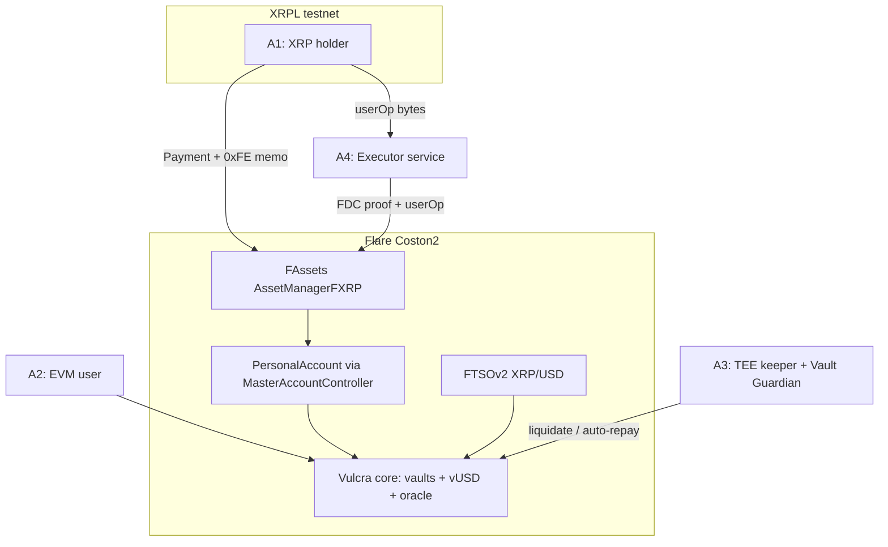

# Vulcra - Plan

## Goal Capsule

- **Objective:** Ship Vulcra — a CDP stablecoin protocol on Flare (lock FXRP, mint vUSD) with XRPL-native minting and a confidential TEE protection layer — as a dual-bounty submission for the Flare Summer Signal hackathon.
- **Product authority:** This document. It supersedes `VULCRA_PRD.md` (draft, untracked) wherever they conflict.
- **Open blockers:** None. All remaining questions are deferred to planning.

---

## Product Contract

### Summary

Vulcra lets XRP holders forge dollars from their XRP: lock FXRP as collateral, mint vUSD, repay to unlock. Three headlines: minting directly from an XRPL wallet in one atomic Payment transaction (Smart Accounts 0xFE), a complete peg story (liquidation + redemption), and Vault Guardian — private liquidation-protection rules that live and execute inside a Flare Confidential Compute TEE. One product, two bounty submissions, every integration real on Coston2.

### Problem Frame

XRP is a $100B+ asset with no native smart contracts. FAssets brings it to Flare as FXRP, but holders who want dollar liquidity must sell or borrow at variable pool rates (Kinetic, Morpho). No CDP system exists on Flare, and the FAssets Incentive Program explicitly lists CDP systems as a funded vertical nobody has shipped. Separately, DeFi users who sail close to liquidation have no private way to protect themselves: on-chain stop-loss intents are visible and front-runnable. Flare's judges score product usefulness, integration depth, technical execution, evidence of new work, and clarity — this product is shaped to score on all five.

### Key Decisions

- **Dual bounty from one product.** Bounty 1 (Interoperable Asset Products) is primary; Bounty 2 (Confidential Compute) is served by the same protocol's keeper + Vault Guardian. One codebase, two submissions.
- **No mocks.** Every integration runs against real infrastructure: FTSOv2 live feeds, real FAssets direct minting on Coston2, real XRPL testnet payments, real FDC attestations, the real FCC indexer DB (credentials received from Flare admin).
- **UUPS upgradeable everywhere** (OpenZeppelin v5.6.1, already pinned as submodules). Patch speed during the program wins; the immutability trust story moves to the roadmap (audit, timelock).
- **Redemption in core scope.** Without the peg floor, "stablecoin" is a weak claim. Consequence: the vault registry must support ordering by collateral ratio from the first design.
- **Vault Guardian is a full feature, not a keeper wrapper.** A TEE keeper alone risks being judged superficial for Bounty 2; private user-facing protection rules are genuinely confidential-compute-shaped.
- **Reown AppKit for wallet connection** (user decision), with `@flarenetwork/flare-wagmi-periphery-package` as the contract layer — both sit on wagmi/viem, which ships `flare` and `flareTestnet` (Coston2) chain definitions. This replaces the PRD's Privy assumption.
- **Backend is deterministic — no LLM.** Executor, indexer, keeper, and Guardian are rule-based. Vault Guardian's value rests on code-hash attestation of deterministic logic; an LLM would weaken verifiability.
- **Maximize meaningful Flare surface, reject gimmicks.** FTSOv2, FAssets/FXRP, Smart Accounts, FDC, FCC, ContractRegistry, wagmi periphery are all load-bearing. Secure Random Numbers is deliberately excluded (no honest use case). FTSO Scaling anchor feeds with Merkle proofs are a candidate for verified liquidation pricing, decided in planning.
- **Gate-driven, not calendar-driven.** Scope is never cut on deadline grounds; sequencing follows gates (core CDP → XRPL mint → confidential layer → polish).

### Actors

- A1. XRP holder — owns XRP in an XRPL wallet (Xaman or any), no EVM wallet, no FLR. Enters via XRPL rails.
- A2. Flare DeFi user — has FXRP on Coston2, uses the web dApp with an EVM wallet.
- A3. Liquidator/keeper — our TEE keeper plus any external actor; liquidates undercollateralized vaults for a bonus.
- A4. Executor service — our backend; turns XRPL payments + FDC proofs into on-chain mint executions.
- A5. Protocol admin — deploys and upgrades contracts (UUPS owner) during the program.

### Requirements

**Core CDP (smartcontract)**

- R1. A user can open one vault per address: deposit FXRP, mint vUSD, adjust collateral/debt, repay, close. Minting keeps the vault at or above the minimum collateral ratio.
- R2. vUSD is an ERC-20 (18 decimals) with EIP-2612 permit and EIP-3009 transferWithAuthorization; mint/burn restricted to the protocol.
- R3. Pricing reads the FTSOv2 block-latency XRP/USD feed with a staleness check and centralized decimal normalization (FXRP 6 decimals, feed decimals dynamic, vUSD 18).
- R4. Any actor can liquidate a vault below the minimum collateral ratio: repay its debt, receive collateral worth debt plus a liquidation bonus; any remainder returns to the vault owner.
- R5. Any holder can redeem vUSD at face value for FXRP against the riskiest vaults (lowest collateral ratio first).
- R6. Borrowing charges a one-time minting fee and no ongoing interest.
- R7. Protocol parameters (MCR 130%, minimum debt 100 vUSD, minting fee 0.5%, liquidation bonus 10%) are set at deploy and adjustable by the admin; final values are sanity-checked against live Kinetic/Morpho FXRP terms during planning.
- R8. All contracts are UUPS upgradeable; every Flare system address (FTSOv2, AssetManagerFXRP, FXRP token, MasterAccountController) is resolved at runtime via FlareContractRegistry — nothing hardcoded.
- R9. `forge test` passes with fuzz coverage on price normalization and liquidation math; contracts are deployed to Coston2 and source-verified on the Coston2 explorer.

**XRPL-native minting (smartcontract + backend)**

- R10. An XRPL user mints vUSD in one XRPL Payment via the 0xFE custom instruction: FXRP mint, vault open, and vUSD delivery execute atomically in a single Flare transaction; if any step reverts, no FXRP is minted.
- R11. The executor service accepts the user's PackedUserOperation, obtains the FDC XRPPayment attestation, calls the direct-minting execution, handles rate-limit delays by retrying with the same proof at `executionAllowedAt`, and supports stuck-mint recovery (0xE0 skip, 0xE1 nonce fast-forward).
- R12. Before the user sends XRP, the app pre-flights the mint: hourly/daily/large-mint limits, minimum fee, and address validation — because sub-minimum payments and wrong recipients are unrecoverable by design.
- R13. Frontend XRPL mode: enter an r-address, see the personal account and vault status, get the Payment as QR / Xaman deep link with the memo prebuilt, and track mint status end to end.

**Confidential layer (backend/TEE)**

- R14. The liquidation keeper runs as an FCC TEE extension (fce-extension-scaffold pattern), reading vault state via the FCC indexer DB and prices via FTSO; `SIMULATED_TEE` against live Coston2 is acceptable during development, with real registration pursued for the demo.
- R15. Vault Guardian: a user registers private protection rules (e.g., auto-repay when the collateral ratio falls below a chosen trigger); rule parameters are stored and evaluated only inside the TEE and are not observable on-chain before execution.
- R16. The confidential story is verifiable: reproducible build and code-hash attestation evidence are part of the Bounty 2 submission.

**Frontend (EVM mode)**

- R17. Wallet connection via Reown AppKit on Coston2, with the Flare wagmi periphery package for contract interactions.
- R18. Vault dashboard: collateral ratio gauge, liquidation price, live FTSO price, a what-if price simulator, and open/adjust/repay/close actions.
- R19. Liquidations page: list of at-risk vaults with one-click liquidation.
- R20. Guardian page: create and manage protection rules, submitted privately to the TEE.

**Landing page + submission**

- R21. Landing page (vulcra.xyz): product story, how-it-works, live links to the app, demo video, and repo; forge/ember visual identity.
- R22. Traction is built during the program, not after: progressive build-log posts in the hackathon Telegram, and a final DoraHacks submission covering both bounties with contract addresses, demo video, and a clear newly-built-during-program statement.

### Key Flows

- F1. XRPL-native mint
  - **Trigger:** A1 confirms a mint in XRPL mode (R13).
  - **Steps:** App pre-flights limits and fees (R12); A1 signs one XRPL Payment carrying the 0xFE memo; A1's userOp reaches the executor; executor obtains the FDC proof and submits execution (R11); on Flare, FXRP mints to the personal account, the vault opens, vUSD transfers to the destination — atomically (R10).
  - **Outcome:** A1 holds vUSD without ever touching an EVM wallet or FLR.
- F2. Keeper liquidation
  - **Trigger:** A vault's collateral ratio drops below MCR (FTSO price move).
  - **Steps:** TEE keeper detects via indexer + FTSO (R14), submits liquidation (R4).
  - **Outcome:** Debt cleared, liquidator earns the bonus, owner receives the remainder.
- F3. Guardian auto-repay
  - **Trigger:** A vault crosses its owner's private protection trigger, above MCR.
  - **Steps:** TEE evaluates the private rule (R15), executes auto-repay before liquidation territory.
  - **Outcome:** The vault is protected; the rule's parameters were never publicly visible beforehand.
- F4. Redemption
  - **Trigger:** vUSD trades below face value; any holder redeems (R5).
  - **Steps:** Protocol takes vUSD at $1, releases FXRP from the lowest-CR vaults.
  - **Outcome:** Peg floor enforced by arbitrage.

### Acceptance Examples

- AE1. **Covers R11, R13.** Given direct-minting hourly limits are partially consumed, when a mint exceeds remaining headroom, then the first execution emits a delayed event with `executionAllowedAt`, the UI shows a delayed-not-failed status, and the executor retries the same proof after that time until the mint executes.
- AE2. **Covers R12.** Given a user enters a mint amount below the minimum minting fee, when they attempt to proceed, then the app blocks before any XRP is sent (a sub-minimum payment would be forfeited irrecoverably).
- AE3. **Covers R15.** Given a vault with a private auto-repay rule at CR 150%, when the FTSO price pushes the vault's CR below 150% but above MCR, then the TEE executes the repay and the vault returns above its trigger without ever having exposed the rule on-chain beforehand.
- AE4. **Covers R10.** Given a userOp whose vault-open call would revert (e.g., requested debt below minimum), when the executor submits the direct-minting execution, then no FXRP is minted, the XRP remains recoverable at the Core Vault, and the 0xE0 recovery path returns it.
- AE5. **Covers R4, R5.** Given three vaults at CR 135%, 180%, 300% and MCR 130%, when a holder redeems vUSD, then redemption draws from the 135% vault first; and if that vault instead falls to 129%, any actor can liquidate it.

### Scope Boundaries

**Deferred for later (roadmap):** stability pool, multi-collateral (FBTC), governance/token, cross-chain vUSD via LayerZero OFT, savings rate, mainnet deployment.

**Outside this product's identity:** LLM-driven backend logic (conflicts with attestable determinism), Secure Random Numbers integration (no honest use case), Privy (replaced by Reown AppKit).

### Dependencies / Assumptions

- FCC indexer DB credentials: received 2026-07-20 from Flare admin via Telegram; stored locally only, never committed.
- Coston2 direct minting with 0xFE and our own executor works end to end today — documented, verified in practice at Gate 0 before protocol code depends on it.
- FTSOv2 block-latency reads on Coston2 are free or negligible — verified at Gate 0 via FeeCalculator.
- DevHub guides are mid-update (admin statement; old direct-minting URLs already 404). Re-verify doc-sourced details at build time; the Flare skills + MCP server are installed for this.
- vulcra.xyz was available at last check; register before public posts.
- Scaffold gaps confirmed by repo verification: `smartcontract/foundry.toml` lacks `evm_version = "cancun"`; no Flare periphery dependency anywhere; `frontend/` and `landingpage/` have no web3 dependencies; `backend/` is empty. All are set up during planning/build.

### Outstanding Questions

**Deferred to Planning:**

- Vault Guardian funding source: pre-funded vUSD escrow vs wallet allowance pulled at execution time (UX vs custody trade-off).
- Final parameter values (R7) after checking live Kinetic/Morpho FXRP terms.
- vUSD ticker collision check; fallback ticker if a live conflict matters.
- Redemption ordering mechanism (sorted structure vs bounded iteration) at testnet scale.
- Whether FTSO Scaling anchor feeds + Merkle proofs join block-latency feeds for liquidation-grade pricing.

### Sources / Research

- `VULCRA_PRD.md` — superseded draft PRD; richest single input.
- Flare skills (installed): flare-general, flare-ftso, flare-fassets, flare-smart-accounts, flare-fdc, flare-fcc.
- FAssets minting guides: dev.flare.network/fassets/developer-guides/fassets-mint, fassets-mint-limits (rate-limit mechanics, unrecoverable-payment warnings), smart-accounts/custom-instruction (0xFE).
- Reference repos: flare-foundation/flare-viem-starter (direct mint, limits, 0xE0/0xE1 recovery), flare-foundation/fassets-demo-dapp (Next.js + wagmi periphery), flare-foundation/fce-extension-scaffold (TEE extension), flare-foundation/smart-accounts-cli.
- Judging criteria and submission requirements: Flare Summer Signal brief (in conversation record).
