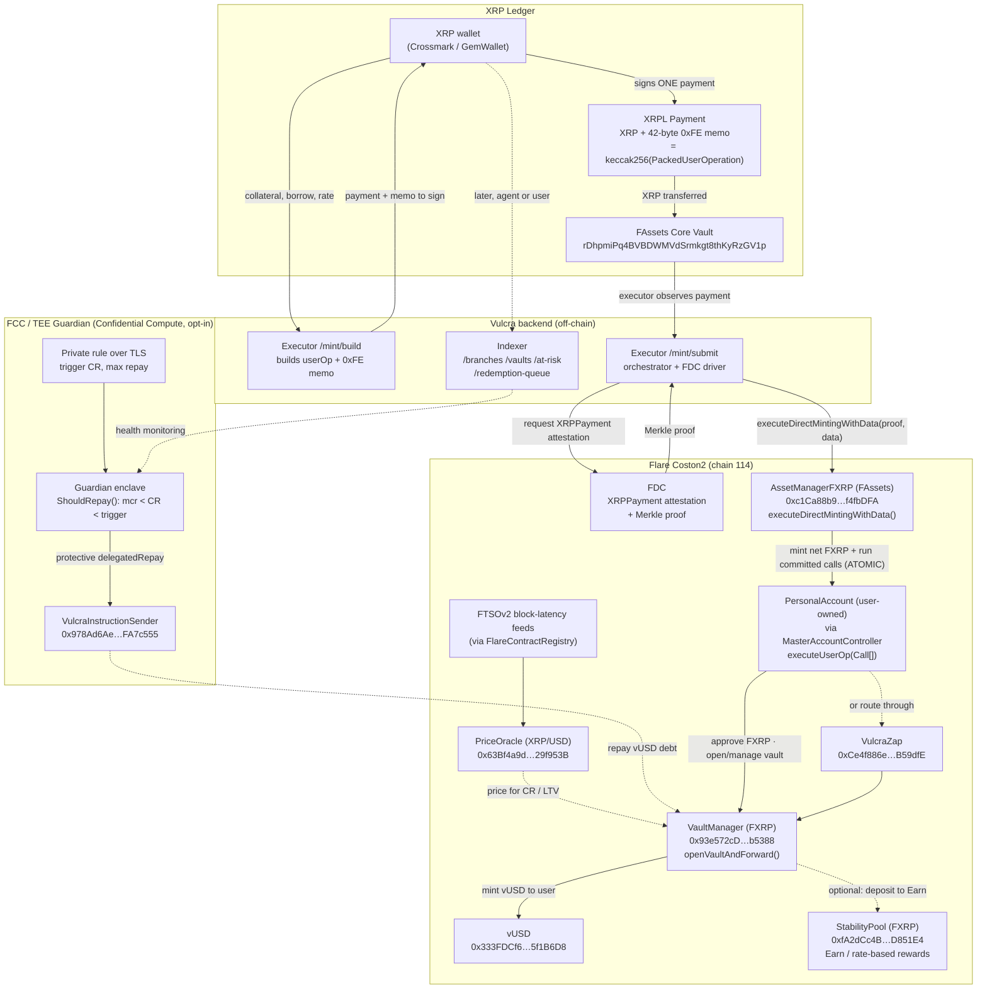

# Vulcra — architecture

The full flow: an XRP holder signs **one** XRPL Payment; Flare's FDC proves it, the executor settles
a FAssets direct-mint-with-data, and — in the **same atomic transaction** — FXRP is minted to the
user's `PersonalAccount` and the committed vault calls run against the `VaultManager` (mint vUSD) and
optionally the `StabilityPool` (Earn). FTSOv2 prices every collateral decision; the FCC/TEE Guardian
sits on the signing/monitoring side as an opt-in confidential keeper.

## End-to-end flow

## Component description

**XRP Ledger side**
- **XRP wallet (Crossmark / GemWallet):** signs one raw `Payment` in-browser; the 0xFE memo is
  preserved verbatim. No server-side key, no Flare wallet.
- **XRPL Payment + 0xFE memo:** the 42-byte memo carries opcode, wallet id, executor fee, and
  `keccak256(PackedUserOperation)` — the commitment that binds the payment to a specific set of
  on-chain calls.
- **FAssets Core Vault:** the XRPL address the user pays; the entry point of FXRP direct-minting.

**Vulcra backend (off-chain, `backend/`)**
- **Executor (`apps/executor`, Fastify + viem):** `/mint/build` constructs the `PackedUserOperation`
  and the payment+memo to sign; the orchestrator observes the settled XRPL payment, requests the FDC
  attestation (retrying through XRPL indexing lag), and submits `executeDirectMintingWithData`.
  `/manage/build` produces the `Call[]` for repay / close / adjust-rate / mint-more / add- and
  withdraw-collateral / spDeposit. `/mint/status/:id` powers the frontend mint tracker.
- **Indexer (`apps/indexer`, SQLite):** serves read-only position data — `/branches`,
  `/vaults/:branch/:owner`, `/vaults/at-risk`, `/vaults/redemption-queue`. Consumed by the frontend,
  by AI agents (MCP), and by the Guardian for health monitoring.

**Flare Coston2 (on-chain)**
- **FDC:** attests the `XRPPayment` and returns a Merkle proof; the executor verifies proof before
  settling — trust-minimized cross-chain.
- **AssetManagerFXRP (FAssets):** `executeDirectMintingWithData(proof, data)` mints net FXRP to the
  `PersonalAccount` **and** invokes `executeUserOp(Call[])` atomically.
- **PersonalAccount + MasterAccountController (Flare Smart Accounts):** the user's XRPL key controls
  this account; it runs the committed calls, so the user needs no EVM wallet and no FLR gas.
- **VaultManager / VulcraZap:** per-collateral CDP — opens/manages the vault, accrues user-set
  interest on-chain, mints **vUSD**, enforces MCR/LTV using the oracle. `VulcraZap` does the atomic
  open+forward.
- **StabilityPool (Earn):** per-branch UUPS pool that streams rate-based vUSD rewards and backstops
  liquidations.
- **PriceOracle + FTSOv2:** collateral ratio, LTV, and redemption math settle on FTSOv2 block-latency
  feeds (`XRP/USD`, `FLR/USD`); stale prices don't settle.

**FCC / TEE Guardian (`backend/tee-extension`, Bounty 2)**
- **Private rule over TLS:** the user's protection thresholds (trigger CR, max repay) are submitted
  once into the enclave, never to a public on-chain source — so they can't be front-run.
- **Guardian enclave:** `ShouldRepay()` acts only inside the protection window `mcr < CR < trigger`
  (above the trigger there's nothing to do; at/below MCR the liquidation keeper owns the vault). Repay
  amount = `min(maxRepay, neededToRestore)`.
- **VulcraInstructionSender:** the on-chain contract through which the enclave's protective
  `delegatedRepay` reaches the `VaultManager`. The TEE machine is registered to **PRODUCTION** status
  on the Coston2 `FlareTeeManager`.

## Two settlement shapes (one mechanism)

| Shape | XRPL payment | On-chain effect | Vault actions |
|---|---|---|---|
| **net-mint > 0** | carries collateral | FXRP minted, then calls run | Open / Supply |
| **net-mint = 0** | fees-only ("memo-only") | no FXRP minted, calls still run | Borrow-more / Repay / Withdraw / Adjust-rate / Close |
