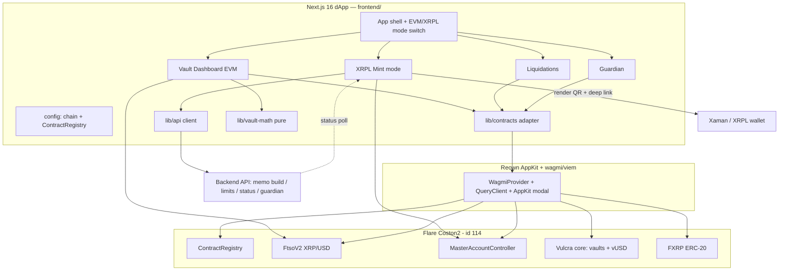
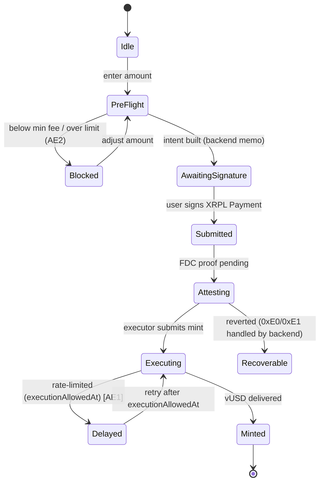

# Vulcra Frontend (dApp) — Plan

> **Target directory:** `frontend/` (Next.js package inside the Vulcra monorepo). Unless noted, every file path below is relative to `frontend/` (e.g., `src/app/layout.tsx` means `frontend/src/app/layout.tsx`).
>
> **Origin / Product authority:** `docs/plans/2026-07-20-001-feat-vulcra-cdp-flare-plan.md` (the master requirements-only unified plan). That document is authoritative for product scope. This plan enriches only the **frontend slice** (master requirements R13, R17–R20, plus acceptance examples AE1, AE2 and flow F1) into implementation-ready HOW.
>
> **Product Contract preservation:** Master plan **unchanged**. This is a scoped derivative artifact created per the frontend planning directive; it does not modify the root master plan and invents no product behavior. Where the frontend needs detail the master defers (contract ABIs, backend API shapes), it records explicit **Assumptions** rather than resolving product scope.

---

## Goal Capsule

- **Objective:** Ship the Vulcra web dApp on Coston2 — a dual-mode interface (EVM vault dashboard + XRPL-native mint) plus Liquidations and Guardian surfaces — that lets an EVM DeFi user manage a CDP vault and an XRP holder mint vUSD from an XRPL wallet, all against real Coston2 infrastructure.
- **Surfaces:** Wallet + provider foundation → EVM vault dashboard (CR gauge, liquidation price, live FTSO price, what-if simulator, open/adjust/repay/close) → XRPL mint mode (r-address → PersonalAccount + vault status → pre-flight → Payment QR/Xaman deep link → end-to-end tracking) → Liquidations page → Guardian page.
- **Brand:** forge / ember — dark canvas, molten-orange accent, industrial "forge dollars from XRP" story. Deliberately distinct from Flare's own brand.
- **Open blockers:** None that stop planning. Two upstream interfaces are **draft and owned elsewhere** (Vulcra contract ABIs → smartcontract plan; backend API → backend plan). This plan isolates both behind thin typed adapter layers so their finalization is a localized change, not a rewrite. See **Assumptions** and **Open Questions**.

---

## Problem Frame

The scaffold is a bare `create-next-app` (Next.js 16.2.10, React 19.2.4, Tailwind v4, bun) with **zero web3 dependencies** and a default landing page. Every capability in R13/R17–R20 must be built from that baseline. Two distinct users must be served by one app:

- **A2 — Flare DeFi user:** has FXRP on Coston2 and an EVM wallet. Wants to open a vault, mint vUSD, watch collateral ratio against a live price, simulate a price drop, and adjust/repay/close. (R17, R18)
- **A1 — XRP holder:** owns XRP in an XRPL wallet (e.g., Xaman), has **no EVM wallet and no FLR**. Enters through XRPL rails: types an r-address, sees their derived PersonalAccount + vault status, and signs a single XRPL Payment (with a backend-built `0xFE` memo) to mint vUSD atomically. Sub-minimum payments and rate-limit delays are the two sharp edges the UI must handle safely. (R13, AE1, AE2, F1)

Plus two protocol-operations surfaces: **Liquidations** (list at-risk vaults, one-click liquidate — R19) and **Guardian** (create/manage *private* protection rules submitted to a TEE via backend — R20).

The frontend's hard constraints: **resolve every Flare system address at runtime** via `ContractRegistry` (never hardcode), **never build the `0xFE` memo client-side** (backend owns it), **never expose Guardian rule parameters** beyond the privacy-preserving submission, and treat a rate-limit **delay as a status, not a failure**.

---

## Requirements Traceability

This plan owns the frontend requirements from the master plan. IDs below are the master's; new frontend-local refinements are called out per unit.

| Master ID | Requirement (frontend slice) | Covered by |
|-----------|------------------------------|------------|
| R17 | Wallet connection via Reown AppKit on Coston2 + Flare wagmi periphery for contract calls | U1, U2 |
| R18 | Vault dashboard: CR gauge, liquidation price, live FTSO price, what-if simulator, open/adjust/repay/close | U4, U5, U6, U7 |
| R13 | XRPL mode: r-address → PersonalAccount + vault status → Payment (QR + Xaman deep link, backend memo) → end-to-end tracking | U8, U9, U10 |
| R19 | Liquidations page: at-risk vault list + one-click liquidate | U11 |
| R20 | Guardian page: create/manage private protection rules submitted privately to TEE | U12 |
| AE1 | Rate-limited mint shows **delayed-not-failed** with `executionAllowedAt`; UI reflects retry | U10 |
| AE2 | Sub-minimum mint is **blocked before any XRP is sent** | U9 |
| F1 | XRPL-native mint flow end to end | U8→U9→U10 |
| A1, A2 | Two-user model drives the EVM/XRPL mode split | U3 (mode switch), U5, U8 |

Cross-cutting design/quality requirements (from `frontend-design-guidelines` + `page-load-animations`) apply to every feature unit and are hardened in U13.

---

## Key Technical Decisions

**KTD1 — Reown AppKit over wagmi/viem, with Next.js App Router SSR cookie hydration.**
AppKit is the user's wallet decision. Use the Wagmi adapter (`@reown/appkit-adapter-wagmi`) — never Ethers alongside it. Setup follows the canonical Next.js pattern (verified against docs.reown.com): `ssr: true` and `storage: createStorage({ storage: cookieStorage })` on `WagmiAdapter`, `createAppKit()` at module scope (never inside a component), a `'use client'` context provider using `cookieToInitialState`, cookies read from `next/headers` in the root layout, and `next.config.ts` webpack externals for `pino-pretty`, `lokijs`, `encoding`. All `@reown/appkit*` packages pinned to one identical version. **Note:** `flare-foundation/fassets-demo-dapp` is **not** an SSR/Reown reference — it uses a plain `injected()` connector and ethers-based address lookup; the Reown SSR pattern here comes from Reown's docs, not that repo.

**KTD2 — Flare wagmi periphery package as the system-contract ABI + address layer; resolve everything at runtime.**
Use `@flarenetwork/flare-wagmi-periphery-package` (latest **3.6.0**; `fassets-demo-dapp` pins `^3.1.0`) for Coston2 chain constants and network-scoped typed ABIs — verified exports include the `coston2` namespace with `iFlareContractRegistryAbi`, `ftsoV2InterfaceAbi`, and `iAssetManagerAbi` (also available as per-contract subpath imports, e.g. `.../contracts/coston2/FtsoV2Interface`). Resolve `FtsoV2`, `AssetManagerFXRP`, FXRP token, and `MasterAccountController` at runtime via `getContractAddressByName` against `FlareContractRegistry` (**verified, same address on every network: `0xaD67FE66660Fb8dFE9d6b1b4240d8650e30F6019`**) — nothing hardcoded (master R8 carried into the client). The package also ships **generated wagmi hooks** (`useReadIAssetManager`, …), but see KTD2b: consume the package's **ABIs/constants** (version-agnostic `as const`) through wagmi's own `useReadContract`/`useWriteContract` rather than those generated hooks, to avoid coupling to the package's wagmi major.

**KTD2b — Resolve the wagmi major-version conflict (Reown wagmi 2 vs periphery wagmi 3).** *(load-bearing risk)*
Reown AppKit's current Next.js docs pin **wagmi 2.x**, while `@flarenetwork/flare-wagmi-periphery-package@3.6.0` bundles **wagmi ^3.6.4 / viem ^2.48.4** as direct deps and `fassets-demo-dapp` runs on wagmi 3. Mixing AppKit-adapter-wagmi (wagmi 2) with the periphery's *generated hooks* (wagmi 3) is unverified and likely breaks. **Decision:** pin **one** wagmi major across the app (the version AppKit's adapter supports), and consume the periphery package only for its **typed ABI constants, chain objects, registry address, and feed IDs** — all wagmi-version-agnostic — calling them through wagmi's own `useReadContract`/`useWriteContract`. **Gate-0 verify (⚠):** confirm the installed `@reown/appkit-adapter-wagmi` version's supported wagmi major (newer AppKit releases may support wagmi 3); if AppKit supports wagmi 3, align everything on wagmi 3 and the generated hooks become usable too. This check gates U1's dependency pin.

**KTD3 — Network object reconciliation (AppKit vs periphery).**
AppKit requires networks imported from `@reown/appkit/networks`; the periphery package exports its own `coston2` chain (id 114). The AppKit `networks` array must use an AppKit-compatible network for Coston2. **Assumption (verify at build):** `@reown/appkit/networks` exports `flareTestnet` (viem ships the Coston2 definition). If it does, use it; if not, wrap the viem Coston2 chain with `defineChain` from `@reown/appkit/networks` (a documented export). Contract reads still use addresses resolved via `ContractRegistry`, independent of which network object AppKit holds. Isolate this in `src/config/`.

**KTD4 — Live FTSO pricing, polled, staleness-aware.**
Read the XRP/USD block-latency feed on an interval (`query.refetchInterval ≈ 1800–2000ms`) to track the ~1.8s block time, and display via `viem`'s `formatUnits`. **Read-method nuance (⚠ verify at Gate 0):** the production `FtsoV2Interface` methods are `payable`, so the reference implementation reads them with viem `simulateContract` (`value: 0n`) — plain `readContract`/`useReadContract` may revert against a payable method. Block-latency *view* reads are documented as free on Coston2, and a `TestFtsoV2Interface` (all-view) exists. Abstract the read inside `useFtsoPrice` so the concrete path — `useReadContract` vs `useSimulateContract` (value `0n`), and `getFeedById` vs `getFeedByIdInWei` — is chosen in **one** place after verifying which works free on Coston2 (master Gate-0 fee check). Track the returned `timestamp` for a **staleness indicator**. XRP/USD feed ID `0x015852502f55534400000000000000000000000000` (verified value; still confirm against dev.flare.network/ftso/feeds before pinning). Coston2 `FtsoV2` resolves to `0xC4e9c78EA53db782E28f28Fdf80BaF59336B304d` today — prefer registry resolution over hardcoding.

**KTD5 — Backend API is the boundary for memo, pre-flight, tracking, and Guardian.**
The frontend never constructs the `0xFE` memo, never computes FAssets rate limits itself, and never holds Guardian rule plaintext beyond submission. A thin typed API client (`src/lib/api/`) wraps four backend responsibilities: (a) build the XRPL Payment intent (destination, amount, `0xFE` memo, Xaman deep link + QR payload, tracking id); (b) return pre-flight mint limits + minimum fee; (c) report mint status end-to-end (incl. `delayed` + `executionAllowedAt`); (d) accept Guardian rule submissions privately. Endpoint shapes are **assumed** and typed in one place so backend finalization is localized.

**KTD6 — Draft contract ABIs isolated behind a typed contract adapter.**
Vulcra core (vault registry, vUSD, oracle wrapper) ABIs are draft (owned by the smartcontract plan). Code against `src/lib/contracts/` — a module exposing typed read/write hooks and placeholder ABIs (`vulcraVaultAbi`, etc.) with TODO markers keyed to the smartcontract plan. Swapping in final ABIs/addresses is a one-module change; no feature component imports a raw ABI directly.

**KTD7 — What-if simulator is pure, client-side, and shares the dashboard's math.**
Collateral-ratio and liquidation-price math lives in one pure, unit-tested module (`src/lib/vault-math.ts`). The dashboard renders it with the live FTSO price; the simulator renders it with a user-scrubbed hypothetical XRP price. No chain writes, no extra RPC. Guarantees the simulated number and the live number can never diverge in formula.

**KTD8 — Consistent transaction UX for every write action.**
All writes (open/adjust/repay/close, liquidate, and any Guardian on-chain step) go through one `useVaultAction`-style pattern built on `useWriteContract` + `useWaitForTransactionReceipt`: pre-check → (ERC-20 approval when spending FXRP) → submit → pending → confirmed/failed, surfaced with a shared toast + inline status component and explorer links. FXRP is ERC-20, 6 decimals; approvals are explicit.

**KTD9 — Motion is stage-driven, spring-first, and reduced-motion-safe.**
Page entrances use `page-load-animations` recipes: an ASCII storyboard + named `TIMING` constants + a single integer `stage` with the `stage >= N` reveal pattern; list/grid staggers use index-based `delay`; live price uses the rolling-number recipe; filter/tab height changes use `AnimatedHeight` (ResizeObserver), never `layout` on both parent and children. Every animation degrades under `prefers-reduced-motion`.

**KTD10 — Design tokens from a forge/ember `brand.md`, not magic values.**
Establish the palette/typography/voice once (via the `brand-design` skill or a hand-authored `brand.md` at repo root) and drive Tailwind v4 `@theme` tokens + shadcn CSS variables from it. Dark-first. All color/spacing from tokens; contrast AA. Do not reuse Flare's brand colors.

---

## Assumptions

Headless planning bets and draft-interface assumptions. Each is isolated so finalization is localized. Verify the ⚠ items at build time (Gate 0 in the master plan).

- **A-1 (contracts):** Vulcra core exposes reads for a vault by owner address (collateral, debt, CR, liquidation price inputs) and writes for open/adjust/repay/close/liquidate. Exact ABI/addresses are draft → `src/lib/contracts/` placeholders. ⚠
- **A-2 (backend API):** A backend base URL (`NEXT_PUBLIC_API_BASE_URL`) serves JSON for: `POST /mint/intent` (returns payment + `0xFE` memo + Xaman deep link + QR + trackingId), `GET /mint/limits` (pre-flight limits + min fee), `GET /mint/status/:trackingId` (incl. `delayed` + `executionAllowedAt`), `POST /guardian/rules` + `GET /guardian/rules`. Shapes typed in `src/lib/api/types.ts`. ⚠
- **A-3 (MasterAccountController):** `getPersonalAccount(rAddress)` and `getNonce(...)` are reachable client-side pre-deployment; ABI available via the periphery package (or `@flarenetwork/flare-periphery-contract-artifacts`). Fixed address `0x434936d47503353f06750Db1A444DBDC5F0Ad37c` exists on all networks but is still resolved via `ContractRegistry`. ⚠
- **A-4 (Xaman/XRPL delivery):** The backend returns both a Xaman deep link (`xumm.app` / `xumm://` request) and QR payload data; the frontend renders and tracks, and does not talk to the Xaman API directly. If the backend instead returns a raw XRPL Payment URI, U10 renders that behind the same interface. ⚠
- **A-5 (pre-flight source):** Rate-limit/min-fee data comes from the backend (`GET /mint/limits`), not a direct client read of `AssetManagerFXRP`. If sourced on-chain instead, U9 swaps the data source behind the same hook.
- **A-6 (Reown networks):** `@reown/appkit/networks` exports `flareTestnet` for Coston2; else wrap the viem chain with `defineChain` from `@reown/appkit/networks` (KTD3). ⚠
- **A-7 (Guardian privacy):** "Private" for the frontend means: rule parameters are POSTed once to the backend/TEE over TLS and never rendered back from a public on-chain source; the frontend makes no claim of on-chain confidentiality beyond that submission.
- **A-8 (projectId):** A Reown Cloud `projectId` will be provisioned (`NEXT_PUBLIC_PROJECT_ID`); the public localhost id is used only for local dev.
- **A-9 (wagmi major):** one wagmi major is pinned app-wide per KTD2b; periphery ABIs/constants are consumed version-agnostically via wagmi's own hooks. Whether the installed AppKit adapter supports wagmi 3 is ⚠ verified at Gate 0 and determines the pin. ⚠

---

## High-Level Technical Design

### System context



### Route map

| Route | Mode | Purpose | Requirements |
|-------|------|---------|--------------|
| `/` | EVM | Vault dashboard: gauge, liq price, live price, simulator, actions | R17, R18 |
| `/xrpl` | XRPL | r-address → account/vault status → pre-flight → payment → tracking | R13, AE1, AE2, F1 |
| `/liquidations` | EVM | At-risk vault list + one-click liquidate | R19 |
| `/guardian` | EVM | Create/manage private protection rules | R20 |

Header hosts the primary **EVM ⇄ XRPL** segmented switch (routes `/` and `/xrpl`), secondary links to Liquidations/Guardian, the AppKit connect button, and a wrong-network guard.

### XRPL mint status machine (U10 / AE1)



`Delayed` is a first-class non-error state with a countdown to `executionAllowedAt`. `Recoverable` explains that XRP is safe at the Core Vault and recovery is in progress (backend-driven); the frontend surfaces status, it does not run recovery.

---

## Output Structure

New/added structure under `frontend/` (existing scaffold files marked *mod*):

```
frontend/
  next.config.ts                      # mod: webpack externals (KTD1)
  .env.local.example                  # new: projectId, RPC, contract + API env
  src/
    app/
      layout.tsx                      # mod: fonts + ContextProvider + cookies
      globals.css                     # mod: forge/ember tokens (Tailwind v4 @theme)
      page.tsx                        # mod: EVM vault dashboard (route /)
      xrpl/page.tsx                   # new: XRPL mint mode
      liquidations/page.tsx           # new: liquidations
      guardian/page.tsx               # new: guardian rules
    config/
      index.tsx                       # new: wagmiAdapter, networks, metadata (KTD1/3)
      contracts.ts                    # new: feed IDs, contract-name constants
    context/
      index.tsx                       # new: 'use client' provider (KTD1)
    lib/
      contracts/                      # new: typed read/write hooks + draft ABIs (KTD6)
      api/                            # new: backend client + types (KTD5)
      vault-math.ts                   # new: pure CR/liq-price math (KTD7)
      format.ts                       # new: number/address/USD formatting
    hooks/
      useFtsoPrice.ts                 # new: polled live price (KTD4)
      useVaultAction.ts               # new: shared write-tx lifecycle (KTD8)
      usePersonalAccount.ts           # new: MAC reads (A-3)
    components/
      ui/                             # new: shadcn primitives (button, card, dialog, input…)
      shell/                          # new: header, mode switch, network guard, footer
      vault/                          # new: CR gauge, position card, action forms, simulator
      xrpl/                           # new: r-address form, preflight, payment QR, status tracker
      liquidations/ , guardian/       # new: page-specific components
      motion/                         # new: Stagger, AnimatedHeight, RollingNumber, PageStage
```

---

## Implementation Units

### Phase A — Foundation (wallet, config, design system)

### U1. Web3 provider foundation (Reown AppKit + wagmi + SSR)

- **Goal:** Turn the bare scaffold into a wallet-enabled Next.js 16 App Router app that connects to Coston2 without hydration errors.
- **Requirements:** R17.
- **Dependencies:** none.
- **Files:** `package.json` (add deps), `next.config.ts` (mod), `src/config/index.tsx` (new), `src/context/index.tsx` (new), `src/app/layout.tsx` (mod), `.env.local.example` (new).
- **Approach:** Install `@reown/appkit @reown/appkit-adapter-wagmi wagmi viem @tanstack/react-query @flarenetwork/flare-wagmi-periphery-package` (all `@reown/appkit*` pinned identical) with bun. **Pin the wagmi major per KTD2b** — resolve the AppKit↔wagmi-3 question before locking versions; if AppKit needs wagmi 2, keep periphery usage to version-agnostic ABIs/constants only. `src/config/index.tsx`: `WagmiAdapter({ networks, projectId, ssr: true, storage: createStorage({ storage: cookieStorage }) })` at module scope, Coston2 network (KTD3), metadata. `src/context/index.tsx`: `'use client'`, `createAppKit(...)` at module scope, `WagmiProvider` + `QueryClientProvider` with `cookieToInitialState`. `layout.tsx`: read cookies via `next/headers`, wrap children. Add webpack externals to `next.config.ts`. Config file has **no** `'use client'`.
- **Patterns to follow:** `appkit` skill → `references/nextjs-wagmi.md`; `flare-foundation/fassets-demo-dapp` provider layout.
- **Execution note:** Before writing code, read the relevant Next.js 16 guide in `node_modules/next/dist/docs/` (per `frontend/AGENTS.md` — this Next.js has breaking changes; do not assume App Router APIs from memory).
- **Test scenarios:**
  - App boots and renders `<appkit-button />`; clicking opens the AppKit modal (manual/e2e smoke).
  - Connecting a wallet on the wrong network then switching to Coston2 updates `useAppKitNetwork().caipNetwork` to id 114.
  - No React hydration-mismatch warning in console on first load (SSR cookie path works).
  - `Test expectation: none for pure config` on the webpack-externals change beyond a successful `next build`.
- **Verification:** `bun run build` succeeds; wallet connects to Coston2; no hydration warnings.

### U2. Chain + contract-resolution config layer

- **Goal:** One place that resolves Flare system addresses at runtime and exposes feed IDs and env, so no component hardcodes an address.
- **Requirements:** R17 (master R8 carried into client).
- **Dependencies:** U1.
- **Files:** `src/config/contracts.ts` (new), `src/lib/contracts/registry.ts` (new), `src/lib/contracts/index.ts` (new).
- **Approach:** Re-export the verified `FlareContractRegistry` address (`0xaD67FE66660Fb8dFE9d6b1b4240d8650e30F6019`) and `coston2.iFlareContractRegistryAbi` from the periphery package; a `useContractAddress(name)` hook wrapping `useReadContract` → `getContractAddressByName` (cached via react-query) for `FtsoV2`, `AssetManagerFXRP`, `MasterAccountController`, and the FXRP token (resolved from AssetManager per master). Feed-ID constants (XRP/USD, ⚠ verify) and env accessors (`NEXT_PUBLIC_API_BASE_URL`, contract override envs) live here. Never export a hardcoded system address (the registry address itself is the one stable, documented exception).
- **Patterns to follow:** `flare-ftso` skill "Resolving the FtsoV2 Contract Address"; `flare-general` ContractRegistry guidance.
- **Test scenarios:**
  - `useContractAddress('FtsoV2')` returns a non-zero address on Coston2 (integration against live RPC or mocked read).
  - Feed-ID constant for XRP/USD is exactly 21 bytes and matches the documented value.
  - Missing `NEXT_PUBLIC_API_BASE_URL` surfaces a clear dev-time error, not a silent `undefined` fetch.
- **Verification:** All four system addresses resolve at runtime; grep shows no hardcoded system address in feature code.

### U3. Forge/ember design system + app shell + mode switch

- **Goal:** Establish brand tokens, base UI primitives, the responsive app shell (header with EVM⇄XRPL switch, nav, connect button, network guard), and the motion scaffolding — so feature units compose from a consistent system.
- **Requirements:** A1/A2 mode split; cross-cutting design guidelines.
- **Dependencies:** U1.
- **Files:** `brand.md` (repo root, new), `src/app/globals.css` (mod), `src/app/layout.tsx` (mod: fonts), `src/components/ui/*` (new), `src/components/shell/*` (new: `Header`, `ModeSwitch`, `NetworkGuard`, `Footer`), `src/components/motion/*` (new: `PageStage`, `Stagger`, `AnimatedHeight`, `RollingNumber`), `src/lib/format.ts` (new).
- **Approach:** Generate `brand.md` (forge/ember, dark-first, molten-orange accent — **not** Flare's palette) via the `brand-design` skill or hand-authored, then drive Tailwind v4 `@theme` tokens + shadcn CSS variables from it. Install shadcn primitives per component (`button`, `card`, `dialog`, `input`, `tabs`, `tooltip`, `skeleton`, `sonner`). `next/font` sans (UI) + mono (numbers). `ModeSwitch` = segmented control routing `/` ⇄ `/xrpl`. `NetworkGuard` prompts a switch to Coston2 when connected elsewhere. Motion primitives implement the `page-load-animations` recipes with named `TIMING` constants and reduced-motion guards. `format.ts` centralizes token-amount / USD / CR% / address formatting (see `number-formatting`).
- **Patterns to follow:** `frontend-design-guidelines` (non-negotiables + checklist), `page-load-animations` non-negotiables, `brand-design`.
- **Test scenarios:**
  - Header renders real `<button>`/`<a>` elements with visible `focus-visible` rings; Tab order is logical; Escape closes any open overlay.
  - `ModeSwitch` reflects the active route and moves focus correctly; hit targets ≥ 40×40px on mobile.
  - Dark mode renders from tokens only — grep finds no hardcoded `#hex` or `bg-white`/`text-black` in shell components.
  - `RollingNumber` and any entrance animation render statically (no motion) under `prefers-reduced-motion: reduce`.
  - Shell is correct at 375 / 768 / 1280px; no horizontal body scroll.
  - `format.ts`: token amount with 6-decimal FXRP, USD value, and CR percentage format to expected strings incl. zero/edge inputs.
- **Verification:** Design-guidelines final-review checklist passes on the shell; brand tokens are the single source of color/spacing.

### Phase B — EVM mode (R17, R18)

### U4. Live FTSO price hook + display

- **Goal:** A polled, staleness-aware XRP/USD price used across the dashboard and simulator.
- **Requirements:** R18 (live FTSO price).
- **Dependencies:** U2, U3.
- **Files:** `src/hooks/useFtsoPrice.ts` (new), `src/components/vault/LivePrice.tsx` (new).
- **Approach:** `useFtsoPrice` resolves `FtsoV2` (U2), performs the FTSO read (`useReadContract`, or `useSimulateContract` with `value: 0n` if the payable interface requires it — KTD4) for the XRP/USD feed with `query.refetchInterval ≈ 1800ms`; returns `{ price: bigint, priceFloat, timestamp, isStale, isLoading, isError }`. Staleness = now − `timestamp` beyond a threshold (a few block times). `LivePrice` renders via `formatUnits` + `RollingNumber`, with a subtle "live"/"stale" indicator and a last-updated tooltip.
- **Patterns to follow:** `flare-ftso` "Reading a Feed with useReadContract" + "Display Conversion"; `page-load-animations` rolling-number recipe.
- **Test scenarios:**
  - Given a feed read returning `(value, timestamp)`, price displays `formatUnits(value,18)` correctly (e.g., a known value → expected string).
  - `refetchInterval` re-reads on interval; a changed value rolls to the new number (mount vs update: update animation is subtle).
  - Stale timestamp (old) flips `isStale` true and shows the stale indicator.
  - Read error surfaces `isError` without crashing the dashboard (feeds the shared error state).
  - Reduced-motion: number updates without the slot animation.
- **Verification:** Price updates ~every 2s against live Coston2; stale + error states observable.

### U5. Vault dashboard: CR gauge, liquidation price, position

- **Goal:** Render the connected user's vault: collateral, debt, live collateral ratio (gauge), and liquidation price.
- **Requirements:** R18.
- **Dependencies:** U3, U4, KTD6 adapter, KTD7 math.
- **Files:** `src/lib/vault-math.ts` (new), `src/lib/contracts/vault.ts` (new, draft ABI adapter), `src/hooks/useVault.ts` (new), `src/app/page.tsx` (mod), `src/components/vault/CrGauge.tsx`, `src/components/vault/PositionCard.tsx`, `src/components/vault/LiquidationPrice.tsx` (new).
- **Approach:** `useVault` reads the connected address's vault via the contract adapter (draft ABI, A-1). `vault-math.ts` (pure) computes CR and liquidation price from collateral, debt, price, and MCR — the shared source for U6. `CrGauge` maps CR to a color band (healthy → warning → danger relative to MCR 130%). Dashboard composes LivePrice (U4) + gauge + liquidation price + position, with a stage-driven entrance (KTD9). Handle "no vault yet" as an explicit empty state that routes to Open (U7).
- **Patterns to follow:** `page-load-animations` page-choreography; `frontend-design-guidelines` states.
- **Test scenarios:**
  - `vault-math`: CR = collateral·price / debt across normal, zero-debt (∞/undefined handling), and dust values; liquidation price = price at which CR hits MCR — verified against hand-computed cases (unit tests). *Covers R18 pricing intent.*
  - Decimal normalization: FXRP 6-decimals + 18-decimal price + 18-decimal vUSD produce a correct ratio (fuzz-style multiple magnitudes).
  - Gauge color band flips at the MCR boundary (e.g., 131% healthy-ish vs 129% danger).
  - Empty state (no vault) shows a clear "Open a vault" CTA, not a spinner or zeros.
  - Loading renders skeletons (layout stable); read error shows retry.
- **Verification:** Dashboard shows a live, correct CR + liquidation price for a funded test vault; empty/loading/error all implemented.

### U6. What-if price simulator

- **Goal:** Let the user scrub a hypothetical XRP price and see CR + liquidation headroom update instantly, with no chain interaction.
- **Requirements:** R18 (what-if simulator).
- **Dependencies:** U5 (reuses `vault-math`).
- **Files:** `src/components/vault/PriceSimulator.tsx` (new).
- **Approach:** A slider/input seeded at the live price; feed the hypothetical price into `vault-math` (KTD7) to recompute CR, liquidation price, and a "liquidatable at −X%" readout. Pure client compute; a "reset to live" control. Clearly labeled as a simulation (no funds move).
- **Patterns to follow:** `page-load-animations` live-data (value morph on scrub, but subtle/update-tier); `frontend-design-guidelines` forms/interactions (slider is keyboard-operable).
- **Test scenarios:**
  - Scrubbing price down crosses the MCR threshold and the readout flips to "would be liquidated" at the correct price.
  - Simulator uses the identical `vault-math` output as the dashboard for the same inputs (no divergence).
  - Slider is keyboard-operable (arrow keys) with a visible focus ring and `aria` value text.
  - "Reset to live" returns to the current FTSO price.
- **Verification:** Simulated numbers match the dashboard formula; interaction is instant and keyboard-accessible.

### U7. Vault actions: open / adjust / repay / close

- **Goal:** The four write flows, with FXRP approval, MCR guardrails, and a consistent transaction lifecycle.
- **Requirements:** R18 (actions).
- **Dependencies:** U5, KTD8.
- **Files:** `src/hooks/useVaultAction.ts` (new), `src/lib/contracts/vault.ts` (mod: write fns), `src/components/vault/actions/*` (new: `OpenVaultForm`, `AdjustForm`, `RepayForm`, `CloseVaultButton`), dialog wiring in `src/app/page.tsx`.
- **Approach:** `useVaultAction` centralizes `useWriteContract` + `useWaitForTransactionReceipt` → states pre-check → approval (ERC-20 `approve` when depositing FXRP; 6 decimals) → submit → pending → confirmed/failed, with toasts + inline status + explorer link (KTD8). Forms validate against MCR and minimum debt (master R7: MCR 130%, min debt 100 vUSD) **client-side before submit**, mirroring on-chain checks so the user sees the guardrail early. Close requires full repay; surface required vUSD.
- **Patterns to follow:** `frontend-design-guidelines` forms (labels, inline errors, disabled-until-valid) + `references/solana-ui-patterns.md` analogues for tx confirm; `wagmi` write patterns.
- **Test scenarios:**
  - Open with collateral/debt that violate MCR is blocked before submit with an inline message; a valid pair enables submit.
  - Deposit path requests FXRP `approve` first when allowance is insufficient, then the vault write; sufficient allowance skips approval.
  - Debt below minimum (100 vUSD) is rejected client-side.
  - Tx lifecycle: pending shows a spinner + explorer link; confirmed refreshes the vault read; user-rejected and reverted both show recoverable error states (retry), not a dead UI.
  - Close is disabled unless debt is fully repayable; after close, dashboard returns to the empty state.
  - Amount inputs handle 6-decimal FXRP precision without float drift.
- **Verification:** All four actions execute on Coston2 against a test vault; approvals and guardrails behave; every terminal state is handled.

### Phase C — XRPL mode (R13, AE1, AE2, F1)

### U8. XRPL mode entry: r-address → PersonalAccount + vault status

- **Goal:** From an XRPL r-address, resolve the derived PersonalAccount and show any existing vault status — before any payment.
- **Requirements:** R13 (enter r-address, see personal account + vault status), A1.
- **Dependencies:** U2, U3, KTD6.
- **Files:** `src/app/xrpl/page.tsx` (new), `src/hooks/usePersonalAccount.ts` (new), `src/lib/contracts/masterAccount.ts` (new), `src/components/xrpl/RAddressForm.tsx`, `src/components/xrpl/AccountStatus.tsx` (new).
- **Approach:** `RAddressForm` validates XRPL classic r-address format client-side (base58 checksum) before any read. `usePersonalAccount` resolves `MasterAccountController` (U2) and calls `getPersonalAccount(rAddress)` + `getNonce(...)` (A-3). `AccountStatus` shows the derived EVM PersonalAccount address and, via the vault adapter, that account's vault status (or "no vault yet"). No EVM wallet connection required for this read path (A1 has none).
- **Patterns to follow:** `flare-smart-accounts` reference (MAC reads); grounding dossier §Smart Accounts; `frontend-design-guidelines` forms + states.
- **Test scenarios:**
  - Invalid r-address (bad checksum/format) is rejected inline before any RPC call.
  - Valid r-address resolves a non-zero PersonalAccount address (integration/mocked).
  - Account with no vault shows an explicit "no vault yet — mint to create one" empty state.
  - Account with a vault shows its collateral/debt/CR (reuses `vault-math`).
  - Read failure shows retry; the page never requires an EVM wallet to reach this state.
- **Verification:** A known test r-address resolves its PersonalAccount + vault status with no wallet connected.

### U9. Mint pre-flight (AE2): limits + minimum-fee gate

- **Goal:** Before generating a payment, validate the mint amount against FAssets limits and the minimum fee, and **block** anything that would be irrecoverable.
- **Requirements:** R13 (pre-flight), **AE2**, R12 (master, frontend portion).
- **Dependencies:** U8, KTD5.
- **Files:** `src/hooks/useMintLimits.ts` (new), `src/lib/api/mint.ts` (new), `src/components/xrpl/PreflightPanel.tsx` (new).
- **Approach:** `useMintLimits` fetches `GET /mint/limits` (A-2/A-5): hourly/daily/large-mint headroom + minimum fee. `PreflightPanel` shows remaining headroom and validates the entered amount: **below minimum fee → hard block with an explicit "a sub-minimum XRP payment would be forfeited" warning; the Generate-Payment action stays disabled** (AE2). Over-limit shows how much headroom remains and blocks. Only a valid amount unlocks U10.
- **Patterns to follow:** `frontend-design-guidelines` forms (disabled-until-valid, destructive-action clarity); master AE2.
- **Test scenarios:**
  - *Covers AE2.* Amount below the minimum fee disables Generate-Payment and shows the forfeiture warning — no intent is requested.
  - Amount above hourly/daily/large headroom is blocked with the remaining-headroom shown.
  - A valid in-range amount enables Generate-Payment.
  - Limits fetch failure blocks minting (fail-closed) with a retry, never allows an unvalidated payment.
  - Boundary: exactly at the minimum fee and exactly at a limit behave per spec (inclusive/exclusive stated in tests).
- **Verification:** No payment can be generated for a sub-minimum or over-limit amount; fail-closed on limits error.

### U10. Payment generation + end-to-end mint tracking (AE1)

- **Goal:** Turn a validated intent into a signable XRPL Payment (QR + Xaman deep link, backend-built `0xFE` memo) and track mint status end to end, treating rate-limit delay as a status.
- **Requirements:** R13 (payment + tracking), **AE1**, F1.
- **Dependencies:** U9, KTD5.
- **Files:** `src/lib/api/mint.ts` (mod), `src/components/xrpl/PaymentPanel.tsx` (new: QR + deep link), `src/components/xrpl/MintStatusTracker.tsx` (new), `src/hooks/useMintStatus.ts` (new).
- **Approach:** On confirm, `POST /mint/intent` returns `{ xrplPayment, xamanDeepLink, qr, trackingId }` (A-2/A-4) — the `0xFE` memo is **built by the backend**; the client renders only. `PaymentPanel` shows a QR (from backend payload) + a "Open in Xaman" deep-link button + copyable raw Payment details. `useMintStatus` polls `GET /mint/status/:trackingId` and drives the `MintStatusTracker` state machine (see HTD): idle → awaiting-signature → submitted → attesting → executing → **delayed(executionAllowedAt)** → minted, plus **recoverable**. `Delayed` renders a countdown and "delayed, not failed" copy (AE1); `recoverable` explains XRP is safe at the Core Vault and recovery is backend-driven. On `minted`, offer a link to the (PersonalAccount) vault view.
- **Patterns to follow:** `page-load-animations` (status-step reveal, `stage >= N`); `frontend-design-guidelines` states; master AE1/AE4.
- **Test scenarios:**
  - *Covers AE1.* Status `delayed` with `executionAllowedAt` renders a delayed-not-failed state + countdown; a later `executing`/`minted` advances the tracker without any error UI.
  - Intent response renders a scannable QR and a Xaman deep link that opens the request; raw Payment details are copyable.
  - Status polling advances through each state; terminal `minted` shows success + a link to the vault.
  - `recoverable` status shows the XRP-safe messaging and does not present the mint as a plain failure.
  - Intent-request failure shows retry and does not leave a half-rendered payment.
  - Reduced-motion: status steps appear without motion; polling still works.
- **Verification:** End-to-end on Coston2: a valid XRPL testnet Payment mints vUSD and the tracker reaches `minted`; a rate-limited mint shows `delayed` then completes.

### Phase D — Liquidations & Guardian (R19, R20)

### U11. Liquidations page: at-risk list + one-click liquidate

- **Goal:** List vaults below/near MCR (riskiest first) and let any actor liquidate one in a click.
- **Requirements:** R19; master R4/R5 (ordering by CR).
- **Dependencies:** U4, U5, U7 (tx pattern), KTD6.
- **Files:** `src/app/liquidations/page.tsx` (new), `src/hooks/useAtRiskVaults.ts` (new), `src/components/liquidations/VaultRiskTable.tsx`, `src/components/liquidations/LiquidateButton.tsx` (new).
- **Approach:** `useAtRiskVaults` reads the vault registry (draft adapter, A-1) ordered by collateral ratio ascending, joins the live FTSO price to compute current CR and a liquidatable flag. `VaultRiskTable` renders sorted rows with CR, debt, collateral, and a per-row Liquidate action (enabled only when below MCR) using `useVaultAction` (KTD8). Row/height changes on refresh use `AnimatedHeight`, list mount uses index-based stagger.
- **Patterns to follow:** `page-load-animations` list-stagger + filter-transitions; `frontend-design-guidelines` states/tables.
- **Test scenarios:**
  - Vaults render sorted by CR ascending (riskiest first); a vault at 129% (MCR 130%) is flagged liquidatable, one at 180% is not.
  - Liquidate is disabled for above-MCR rows and enabled for below-MCR rows.
  - Executing a liquidation runs the shared tx lifecycle; on confirm the row updates/removes without a full-page flash.
  - Empty state ("no at-risk vaults") is explicit; loading uses skeleton rows.
  - Live price change re-evaluates the liquidatable flag without a jarring re-sort jump.
- **Verification:** At-risk vaults list correctly against live price; a below-MCR vault can be liquidated on Coston2.

### U12. Guardian page: create/manage private protection rules

- **Goal:** Let a user create and manage private protection rules (e.g., auto-repay when CR falls below a chosen trigger), submitted privately to the TEE via backend.
- **Requirements:** R20; master R15 (privacy), A-7.
- **Dependencies:** U3, U5, KTD5.
- **Files:** `src/app/guardian/page.tsx` (new), `src/lib/api/guardian.ts` (new), `src/hooks/useGuardianRules.ts` (new), `src/components/guardian/RuleForm.tsx`, `src/components/guardian/RuleList.tsx` (new).
- **Approach:** `RuleForm` collects a rule (trigger CR, action=auto-repay, amount/source) with client validation (trigger must sit above MCR to be useful — mirrors master AE3's 150%>130% shape). Submit via `POST /guardian/rules` (A-2) over TLS; the frontend renders privacy-clear copy: parameters go to the TEE via backend and are **not** posted to a public on-chain source (A-7). `RuleList` shows the user's existing rules (from `GET /guardian/rules`) with edit/disable. Surface the Guardian-funding-source question (escrow vs allowance) as a labeled choice deferred to backend contract (master Open Question) — the form adapts once resolved.
- **Patterns to follow:** `frontend-design-guidelines` forms + trust/clarity copy; master R15/AE3.
- **Test scenarios:**
  - A trigger CR at/below MCR is rejected with guidance ("trigger must be above the 130% liquidation threshold to protect you").
  - Submitting a valid rule calls `POST /guardian/rules` and, on success, shows it in the list; the UI never echoes rule parameters from a public on-chain read.
  - Privacy messaging is present and accurate (no overclaim of on-chain confidentiality — A-7).
  - Submission failure shows retry; no partial rule appears in the list.
  - Empty state ("no protection rules yet") with a clear create CTA.
- **Verification:** A rule can be created, listed, and disabled through the backend; privacy copy matches A-7.

### Phase E — Cross-cutting hardening

### U13. States, accessibility, responsiveness, and motion pass

- **Goal:** Bring every surface to the design-guidelines bar: loading/empty/error coverage, keyboard + screen-reader access, contrast, responsive breakpoints, and coherent page-load choreography.
- **Requirements:** cross-cutting (all frontend R's), design-guidelines + page-load-animations non-negotiables.
- **Dependencies:** U3–U12.
- **Files:** touch-ups across `src/components/**`, `src/app/**/loading.tsx` + `error.tsx` where useful, shared `EmptyState`/`ErrorState` in `src/components/ui/`.
- **Approach:** Audit each route against the `frontend-design-guidelines` final-review checklist and the `page-load-animations` non-negotiables. Add route-level `loading.tsx`/`error.tsx` (App Router) where a network read gates the view. Ensure wrong-network and disconnected states are handled globally. Verify one coherent entrance choreography per page (single `stage`, `stage >= N`), reduced-motion everywhere.
- **Patterns to follow:** `frontend-design-guidelines` checklist; `page-load-animations` review mode (grep for `transition-all`, `staggerChildren` + `AnimatePresence`, double `layout`).
- **Test scenarios:**
  - Every data-backed view has loading (skeleton), empty (with next action), and error (with retry) states.
  - Keyboard-only pass on each route: logical Tab order, Enter/Space activate, Escape closes overlays, visible focus throughout.
  - Contrast AA holds for text + meaningful icons in dark theme (spot-check token pairs).
  - Each page renders correctly at 375 / 768 / 1280px with no horizontal body scroll.
  - Anti-pattern grep is clean (no `transition-all`, no `staggerChildren`+`AnimatePresence`, no parent+child `layout`).
  - All motion is inert under `prefers-reduced-motion`.
- **Verification:** The design-guidelines checklist passes on all four routes; anti-pattern greps are clean.

---

## Verification Contract

An implementer knows the frontend is done when:

1. **Build & connect:** `bun run build` passes; wallet connects to Coston2 via AppKit with no hydration warnings (U1).
2. **No hardcoded system addresses:** all Flare system contracts resolve via `ContractRegistry` at runtime (U2).
3. **Live pricing:** the XRP/USD FTSO feed updates ~every 2s with a working staleness indicator (U4).
4. **EVM mode:** dashboard shows correct CR + liquidation price; the what-if simulator matches the dashboard formula; open/adjust/repay/close execute on Coston2 with approvals and MCR guardrails (U5–U7).
5. **XRPL mode:** an r-address resolves its PersonalAccount + vault status; pre-flight **blocks** sub-minimum/over-limit amounts (AE2); a valid Payment renders a QR + Xaman deep link and mints vUSD; a rate-limited mint shows **delayed-not-failed** with a countdown and then completes (AE1); F1 works end to end.
6. **Liquidations:** at-risk vaults list riskiest-first and a below-MCR vault liquidates in one click (R19).
7. **Guardian:** a private protection rule can be created/listed/disabled via the backend, with accurate privacy copy (R20, A-7).
8. **Quality bar:** the `frontend-design-guidelines` final-review checklist passes on every route; all animations respect reduced motion (U13).

### Definition of Done

- All 13 units implemented and their test scenarios covered.
- `vault-math` and `format` have unit tests (pure logic); feature flows have at least smoke/integration coverage where a test harness exists.
- Draft-interface seams (`src/lib/contracts/`, `src/lib/api/`) carry TODO markers linking to the smartcontract/backend plans, so ABI/endpoint finalization is a localized swap.
- No hardcoded Flare system address, no client-built `0xFE` memo, no Guardian rule echoed from a public source.
- App builds and runs against Coston2; the master plan's Gate-0 ⚠ assumptions are verified before the units that depend on them land.

---

## Scope Boundaries

**In scope:** the four routes (EVM dashboard, XRPL mint, liquidations, guardian), the wallet/provider/config/design foundation, and the thin contract + API adapter seams — everything in R13, R17–R20, AE1, AE2, F1.

**Deferred for later (from master roadmap — not this frontend):** stability-pool UI, multi-collateral (FBTC) UI, governance/token UI, cross-chain vUSD (LayerZero) UI, savings-rate UI, mainnet config. Carried verbatim as product-level deferrals.

**Outside this product's identity (from master):** LLM-driven UI logic; Privy (replaced by Reown AppKit); mimicking Flare's own brand.

**Deferred to follow-up work (plan-local, implementation sequencing):**
- The landing page (`vulcra.xyz`, master R21) lives in `landingpage/`, not this app — separate effort.
- Direct Xaman-API integration in the client (if the backend ever stops returning ready-to-render payloads) — currently backend-owned (A-4).
- Real-time status via WebSocket/subscription instead of polling — start with polling (U10); upgrade only if latency requires it.
- Direct on-chain read of FAssets limits (if backend pre-flight is dropped) — U9 seam supports the swap (A-5).

---

## Open Questions

**Resolved into assumptions (see Assumptions):** contract ABI/address shape (A-1), backend API shape (A-2), MAC reachability (A-3), Xaman delivery shape (A-4), pre-flight source (A-5), Reown network export (A-6), Guardian privacy meaning (A-7).

**Still genuinely open (need upstream answers before the dependent unit lands):**
- **Guardian funding source (master Open Question):** pre-funded vUSD escrow vs wallet allowance pulled at execution. Changes `RuleForm` fields and any approval step in U12. Owned by backend/smartcontract.
- **Redemption UI:** master R5 (redemption) has no dedicated frontend requirement in R17–R20. Confirm whether redemption gets a frontend surface this cycle or stays contract/keeper-only. If yes, it becomes a new unit (likely alongside Liquidations).
- **XRP/USD feed ID (⚠):** confirm the exact `bytes21` value against dev.flare.network/ftso/feeds at build time before pinning (U2/U4).
- **Guardian on-chain step:** whether rule *activation* requires any client-side on-chain tx (e.g., approving an allowance) or is purely a backend/TEE submission — affects whether U12 needs `useVaultAction`.

---

## Risks & Dependencies

| Risk | Impact | Mitigation |
|------|--------|------------|
| Draft contract ABIs change | Rework across dashboard/actions | Isolated in `src/lib/contracts/` (KTD6); no feature imports a raw ABI |
| Backend API shape changes | Rework across XRPL/guardian | Isolated in `src/lib/api/` with typed contracts (KTD5) |
| Next.js 16 breaking changes vs training data | Wrong App Router APIs | Read `node_modules/next/dist/docs/` before coding (per `AGENTS.md`); U1 execution note |
| AppKit ↔ periphery network mismatch | Wallet on wrong/undefined chain | KTD3 reconciliation isolated in `src/config/`; verify A-6 early |
| **wagmi major mismatch** (Reown docs pin v2; periphery ships v3) | Wallet/contract hooks break | Pin one wagmi major; consume periphery as version-agnostic ABIs via wagmi's own hooks (KTD2b); verify AppKit↔wagmi-3 at Gate 0 (A-9) |
| Production `FtsoV2Interface` is payable | `useReadContract` reverts; no live price | Abstract read in `useFtsoPrice`; use `simulateContract`/`useSimulateContract` value `0n` if needed (KTD4); confirm free view path at Gate 0 |
| Sub-minimum XRPL payment = irrecoverable loss | User funds lost | AE2 hard block, fail-closed on limits error (U9) |
| Rate-limit delay misread as failure | User re-pays / panics | AE1 delayed-not-failed status + countdown (U10) |
| FTSO polling load / stale reads | Wrong CR shown | Free view calls, ~2s interval, explicit staleness indicator (U4) |
| Overclaiming Guardian on-chain privacy | Trust/accuracy risk | A-7 scoped copy: TLS submission to TEE, no on-chain confidentiality claim |

**External dependencies:** Reown Cloud `projectId`; backend API deployed with the four endpoint groups; smartcontract deployment on Coston2 with final ABIs/addresses; Coston2 RPC + faucet (C2FLR + FXRP + USDT0); a funded XRPL testnet account for XRPL-mode e2e.

---

## Sources & Research

- **Origin (authoritative product scope):** `docs/plans/2026-07-20-001-feat-vulcra-cdp-flare-plan.md` (master requirements-only unified plan; R13, R17–R20, AE1, AE2, F1, A1, A2).
- **Grounding dossier:** `/tmp/compound-engineering/ce-brainstorm/vulcra-god-01/grounding.md` (verified facts: MasterAccountController address, `0xFE` memo format, FXRP 6-decimals, FTSO feed-id verify note, Coston2 chain/RPC/faucet).
- **Skills consulted:** `appkit` (+ `references/nextjs-wagmi.md` — SSR cookie pattern), `flare-ftso` (frontend FTSO reads via `@flarenetwork/flare-wagmi-periphery-package`; polling + `formatUnits`), `flare-general` (Coston2 config, ContractRegistry, FCC), `frontend-design-guidelines` (non-negotiables + final-review checklist), `page-load-animations` (stage-driven choreography, spring-first, reduced-motion), and `number-formatting` (referenced for amount/USD/CR formatting).
- **Reference repos:** `flare-foundation/fassets-demo-dapp` (Next.js 16 + wagmi 3 + periphery package + `xrpl`/`react-hook-form`/`zod` — App Router layout, generated hooks, FTSO read via `simulateContract`; **injected-wallet, non-SSR, ethers-based address resolution** — not a Reown reference), `flare-foundation/flare-viem-starter` (direct-mint + limits + 0xE0/0xE1 recovery, backend-side context).
- **Docs to re-verify at build (⚠):** dev.flare.network/ftso/feeds (feed id), docs.reown.com (AppKit Next.js SSR + `@reown/appkit/networks` Coston2 export + supported wagmi major), npmjs.com `@flarenetwork/flare-wagmi-periphery-package` (exact exports/version). DevHub guides are mid-update (master note) — re-verify doc-sourced details when coding.

*Verified via a live research pass (2026-07-20) against the reference repo source, the npm registry, and Flare/Reown docs — folded into KTD1–KTD4, KTD2b, and the ⚠ assumptions. Key confirmations: `@flarenetwork/flare-wagmi-periphery-package@3.6.0` exports the `coston2` namespace with `iFlareContractRegistryAbi` / `ftsoV2InterfaceAbi` / `iAssetManagerAbi` plus generated wagmi hooks; `FlareContractRegistry` = `0xaD67FE66660Fb8dFE9d6b1b4240d8650e30F6019` on all networks; the production `FtsoV2Interface` is payable (read via `simulateContract`, value `0n`); the demo dapp is an injected-wallet, non-SSR, ethers-based reference, so the Reown SSR pattern comes from docs.reown.com. Two Gate-0 checks remain open: AppKit↔wagmi-3 compatibility, and the `@reown/appkit/networks` Coston2 export.*
