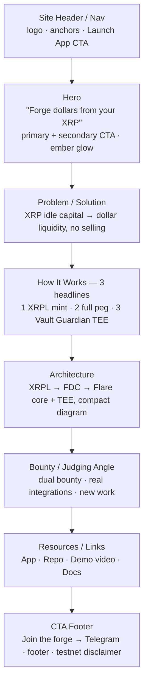
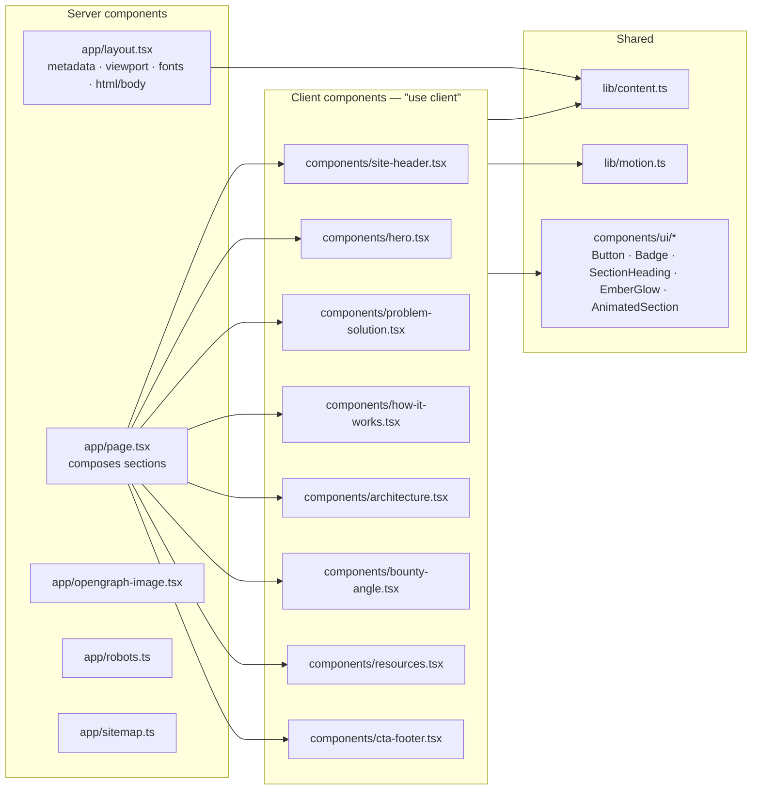

# Vulcra Landing Page - Plan

> **Target repo:** `vulcra` (this repo). All paths are repo-relative from the repo root; landing page files live under `landingpage/`.
>
> **Origin document:** `docs/plans/2026-07-20-001-feat-vulcra-cdp-flare-plan.md` (master requirements, authoritative). This plan enriches **only the landing-page + submission slice** of that document — requirements **R21** (landing page) and **R22** (traction + DoraHacks submission). The master plan is not modified.
>
> **Product Contract preservation:** Product Contract unchanged. This plan does not alter any master-plan requirement; it decomposes R21–R22 into implementation units and adds landing-page-specific technical decisions.

---

## Summary

Ship the Vulcra landing page at **vulcra.xyz**: a dark, forge/ember-themed single page that tells the product story ("Forge dollars from your XRP"), explains the three headline capabilities (one-payment XRPL minting, a full peg with liquidation + redemption, and a private TEE Vault Guardian), sketches the architecture, states the Flare Summer Signal bounty/judging angle, and drives visitors to the app, repo, demo video, and the hackathon Telegram. The page is built on the existing scaffold — Next.js 16.2.10 (App Router) + React 19 + Tailwind v4, package manager `bun` — with choreographed page-load entrance animations, responsive layout, and OG/SEO metadata. The plan also carries the **DoraHacks submission content checklist** (R22) as a first-class deliverable section so the submission can be assembled during the program, not scrambled at the deadline.

This is a **Deep** plan: one page, but with a full brand system, an animation choreography layer, SEO/OG surface, and a submission content deliverable — eight implementation units plus a submission-content section.

---

## Problem Frame

Vulcra is a dual-bounty hackathon submission (Flare Summer Signal). Judges score product usefulness, integration depth, technical execution, evidence of new work, and clarity. The landing page is the **clarity and first-impression surface**: it is often the first artifact a judge, a Flare team member, or a prospective XRP holder opens. It must, in under a minute, make three things legible:

1. **What Vulcra is** — a CDP stablecoin on Flare: lock FXRP, mint vUSD, repay to unlock. The one-liner "Forge dollars from your XRP" carries the whole mental model.
2. **Why it is technically credible** — real Flare integrations (FTSOv2, FAssets/FXRP, Smart Accounts 0xFE, FDC, FCC/TEE), no mocks, newly built during the program.
3. **Where to go next** — launch the app, read the code, watch the demo, join the Telegram.

The current `landingpage/` is a stock `create-next-app` scaffold (default Next.js template copy, Geist fonts, no brand, no content). Everything visible must be replaced. There is no brand system yet, no `brand.md`, and the scaffold's `AGENTS.md` warns that this Next.js version (16.2.10) has breaking changes versus training data — implementation must verify App Router / metadata conventions against the installed docs.

The landing page does **not** need wallet connection, live contract reads, or any web3 dependency — it is a static marketing/story page. It links out to the app (a separate Next.js project in `frontend/`) rather than embedding app functionality.

---

## Requirements

Traceability to the master plan (origin: `docs/plans/2026-07-20-001-feat-vulcra-cdp-flare-plan.md`).

- **R21 (origin).** Landing page (vulcra.xyz): product story, how-it-works, live links to the app, demo video, and repo; forge/ember visual identity.
  - **LP1.** Single responsive page with the section sequence: header/nav → hero → problem/solution → how-it-works (3 headlines) → architecture → bounty/judging angle → resources/links → CTA footer.
  - **LP2.** Forge/ember brand identity: dark base + molten-orange (ember) accent, warm-family adjacency to Flare without copying Flare's coral/magenta. Encoded as Tailwind v4 theme tokens and documented in `brand.md`.
  - **LP3.** Choreographed page-load entrance animations (stage-driven, spring-first) per the `page-load-animations` discipline, with `prefers-reduced-motion` fallback.
  - **LP4.** OG/SEO metadata: title, description, canonical, Open Graph + Twitter card, favicon/app icons, `robots`, `sitemap`, `metadataBase` = vulcra.xyz.
  - **LP5.** Live outbound links: Launch App, GitHub repo, demo video (placeholder until recorded), docs; CTA to the Flare Summer Signal hackathon Telegram.
  - **LP6.** WCAG AA contrast, keyboard-navigable, real semantic elements, dark-mode-correct — per `frontend-design-guidelines` non-negotiables.
- **R22 (origin).** Traction is built during the program: progressive build-log posts in the hackathon Telegram, and a final DoraHacks submission covering both bounties with contract addresses, demo video, and a clear newly-built-during-program statement.
  - **LP7.** A living **DoraHacks submission content plan** (checklist + draft copy) maintained in the repo, covering both bounties, contract addresses, demo video, and the newly-built statement. (This is the "§8" submission checklist referenced in the dispatch; it maps to origin R22.)

**Out of scope for this plan (belongs to other workers / master plan):** the app dashboard (R17–R20, `frontend/`), smart contracts (R1–R9), XRPL minting backend (R10–R13), TEE/Guardian (R14–R16), domain registration and DNS, actually recording the demo video, and writing the Telegram build-log posts (the plan defines the submission *scaffold and copy*, not the act of posting).

---

## Key Technical Decisions

### KTD1. Keep the existing stack; add only `motion` for animation

The scaffold is Next.js 16.2.10 (App Router) + React 19 + Tailwind v4 + `bun`, with the React Compiler already enabled (`next.config.ts` → `reactCompiler: true`). Build on it as-is. The **only** new runtime dependency is the animation library: use the **`motion`** package (`import { motion, useReducedMotion } from "motion/react"`), which is the current name for framer-motion and is React-19/Next-16 compatible. The `page-load-animations` skill references the `framer-motion` import path; `motion` re-exports the same API. Install with `bun add motion`.

- **Rationale:** No web3, no shadcn/ui runtime is required for a static story page — Tailwind v4 tokens + a handful of hand-built primitives are lighter and fully controllable. The React Compiler means no manual `memo`/`useCallback` is needed.
- **Alternative rejected:** shadcn/ui — overkill for ~8 bespoke marketing sections; adds a component pipeline the page doesn't need. Its design *principles* (tokens, focus rings, semantic elements) are still followed by hand.
- **Alternative rejected:** CSS-only animation for everything — viable and dependency-free for in-view fades, but the hero's multi-stage choreography is materially cleaner as a stage-driven `motion` sequence (spring-first, interruptible). Compromise: `motion` for the hero and staggered card grids; lower sections may use in-view fade variants from the same system.

### KTD2. Server-rendered shell, client-rendered animated sections

`layout.tsx` and `page.tsx` stay **server components** so `metadata`/`viewport` exports work and the content HTML is server-rendered for crawlers. Animated sections are **client components** (`"use client"`); Next still server-renders their markup on first load, so SEO is unaffected — `"use client"` only adds hydration/interactivity. Metadata exports live only in server modules (`layout.tsx`, and page-level `page.tsx`).

- **Consequence:** `page.tsx` must not carry `"use client"`; it imports and composes client section components. Copy/content is passed as data (see KTD4), not hardcoded inside client components, so the server tree owns the text.

### KTD3. Forge/Ember brand system in OKLCH, dark-first, documented in `brand.md`

Define the palette in **OKLCH** (perceptually uniform; hex is display-only), dark theme canonical, light theme derived from the same seeds. Base the ember family on the `brand-design` "Sunset Trade" recipe (warm/bold, orange primary) pushed hotter toward a molten-ember hue (H≈47). Write the full token set into `landingpage/src/app/globals.css` (Tailwind v4 `@theme`) and document seeds, tokens, gradients, typography, and voice in `landingpage/brand.md` as the source of truth future `frontend-design-guidelines` sessions read. Full values in **Appendix A — Brand tokens**.

- **Flare adjacency without copying:** Vulcra owns **amber/ember** (hue ≈ 45–55, molten orange→gold). Flare's brand lives in the **coral/magenta/pink** warm range. Sharing the "warm/energetic" family signals ecosystem adjacency; the distinct hue lane avoids imitation. (Verify Flare's exact brand hues at build time before finalizing — recorded as an assumption, not a fabricated value.)
- **Rationale:** OKLCH + same-seed light/dark keeps the two themes feeling like one brand and lets contrast be tuned by lightness. `brand.md` is the durable artifact.

### KTD4. Content as data, not inline JSX

Copy, nav items, feature headlines, resource links, and the architecture node labels live in a typed content module (`landingpage/src/lib/content.ts`). Sections import from it.

- **Rationale:** Keeps the server tree as the text owner (KTD2), makes copy edits a one-file change, keeps placeholder links (demo video, Telegram) in one visible place to swap when real URLs land, and keeps components focused on layout/motion.

### KTD5. Placeholders are explicit and centralized

The demo video URL and possibly the Telegram invite / app URL are not final at plan time. Represent each as a named constant in `content.ts` with a clearly-marked placeholder value and a visible "coming soon" affordance in the UI where a link is not yet live (e.g., the demo CTA renders as a disabled-styled "Demo — coming soon" until the URL is set). No dead `href="#"` links shipped silently.

### KTD6. Motion system centralized; `prefers-reduced-motion` first-class

All timing constants, spring presets, and shared variants live in `landingpage/src/lib/motion.ts` (TIMING object, no magic numbers — per `page-load-animations` non-negotiables). Every animated component reads `useReducedMotion()` and degrades to opacity-only or instant reveal. The hero uses a single integer **stage** state driving `stage >= N` reveals; card grids use index-based `delay: i * STAGGER` (never `staggerChildren` with `AnimatePresence`).

---

## High-Level Technical Design

### Page section flow (top to bottom)



### Component & file architecture



### Hero entrance choreography (stage-driven)

```text
Hero mount timeline (absolute ms from mount; spring reveals):
  t=0     stage→1   eyebrow badge ("CDP stablecoin on Flare")   fade+riseY
  t=120   stage→2   H1 "Forge dollars from your XRP"            fade+riseY
  t=240   stage→3   subhead paragraph                            fade+riseY
  t=360   stage→4   CTA row (Launch App / Watch demo)            fade+riseY
  t=480   stage→5   ember glow + supporting visual               scale+fade
  reduced-motion: all reveal at t=0, opacity-only, no transform
```

---

## Output Structure

Expected layout the plan produces under `landingpage/` (per-unit `**Files:**` are authoritative):

```text
landingpage/
  brand.md                          # brand source of truth (U1)
  src/
    app/
      layout.tsx                    # metadata/viewport/fonts shell (U3, replaces scaffold)
      page.tsx                      # section composition (U5–U8 wire in)
      globals.css                   # Tailwind v4 @theme forge/ember tokens (U1, replaces scaffold)
      opengraph-image.tsx           # OG image (U3)
      icon.svg                      # app icon (U3, replaces default favicon)
      robots.ts                     # (U3)
      sitemap.ts                    # (U3)
    components/
      site-header.tsx               # (U5)
      hero.tsx                      # (U5)
      problem-solution.tsx          # (U6)
      how-it-works.tsx              # (U6)
      architecture.tsx              # (U7)
      bounty-angle.tsx              # (U7)
      resources.tsx                 # (U8)
      cta-footer.tsx                # (U8)
      ui/
        button.tsx                  # (U4)
        badge.tsx                   # (U4)
        section-heading.tsx         # (U4)
        ember-glow.tsx              # (U4)
        animated-section.tsx        # (U4)
    lib/
      content.ts                    # copy + links as data (U2)
      motion.ts                     # TIMING, springs, variants (U4)
  docs/
    submission/
      dorahacks-submission.md       # living submission checklist (U9 / R22)
    plans/
      2026-07-20-001-feat-vulcra-landingpage-plan.md   # this document
```

---

## Implementation Units

Dependency order. U-IDs are stable.

### U1. Brand foundation — forge/ember tokens + `brand.md`

- **Goal:** Replace the scaffold's neutral theme with the forge/ember token system and document it.
- **Requirements:** R21 / LP2, LP6.
- **Dependencies:** none.
- **Files:**
  - `landingpage/src/app/globals.css` (replace token block; keep `@import "tailwindcss"`)
  - `landingpage/brand.md` (create)
- **Approach:** Write the full OKLCH token set from **Appendix A** into `globals.css` under a Tailwind v4 `@theme` block plus `:root` (dark canonical) and a light-mode selector. Define semantic shadcn-style tokens (`--background`, `--foreground`, `--card`, `--primary`, `--muted`, `--accent`, `--border`, `--ring`, `--destructive`) and the extra **signal** tokens (`--safe`, `--at-risk`, `--warn`) and **gradients** (`--gradient-forge`, `--gradient-ambient`). Wire Geist Sans/Mono variables (already imported in the scaffold layout) to `--font-sans`/`--font-mono`. Write `brand.md` documenting seeds, tokens (light+dark), gradients, typography, and voice (see **Appendix A** + **Voice** notes).
- **Patterns to follow:** `brand-design` skill `shadcn-integration.md` derivation tables; existing `globals.css` `@theme inline` structure.
- **Test scenarios:** `Test expectation: none — pure design tokens / documentation, no behavior.` Manual verification: every foreground/background pair passes WCAG AA (4.5:1 body, 3:1 large/icon) using the `brand-design` contrast rule; dark and light both render.
- **Verification:** `bun run dev` shows the new background/foreground; `brand.md` exists at `landingpage/brand.md` with the full token table.

### U2. Content module — copy + links as data

- **Goal:** Centralize all page copy, nav, feature headlines, architecture labels, resource links, and placeholders in one typed module.
- **Requirements:** R21 / LP1, LP5; KTD4, KTD5.
- **Dependencies:** none (parallelizable with U1).
- **Files:** `landingpage/src/lib/content.ts` (create)
- **Approach:** Export typed constants: `SITE` (name, tagline, description, url), `NAV` (anchor items + Launch App), `HERO`, `PROBLEM_SOLUTION`, `HOW_IT_WORKS` (array of 3 headline objects), `ARCHITECTURE` (nodes + caption), `BOUNTY` (dual-bounty + 5 judging-criteria angle), `RESOURCES` (app/repo/demo/docs with `isPlaceholder` flags), `CTA` (Telegram + disclaimer). Draft copy is provided in **Appendix B — Copy drafts**; transcribe it here. Placeholder URLs (demo video, Telegram, app) use named constants with an `isPlaceholder: true` marker per KTD5.
- **Patterns to follow:** plain typed object exports; no framework coupling.
- **Test scenarios:** `Test expectation: none — static data module.` (If a light type-guard/util is added, e.g., `hasLiveUrl(link)`, add one unit test asserting placeholder vs live detection.)
- **Verification:** Imports resolve; TypeScript compiles; all draft copy from Appendix B is present.

### U3. App shell + SEO/metadata surface

- **Goal:** Rebuild `layout.tsx` with real metadata, add the OG image, icons, robots, and sitemap.
- **Requirements:** R21 / LP4, LP6.
- **Dependencies:** U1 (tokens/fonts), U2 (SITE constants).
- **Files:**
  - `landingpage/src/app/layout.tsx` (rewrite metadata; keep font wiring, set `<html lang>`, dark-first `<body>`)
  - `landingpage/src/app/opengraph-image.tsx` (create — dynamic OG via `ImageResponse`, or a static `opengraph-image.png` fallback)
  - `landingpage/src/app/icon.svg` (create — ember mark; replaces default `favicon.ico`)
  - `landingpage/src/app/robots.ts` (create)
  - `landingpage/src/app/sitemap.ts` (create)
- **Approach:** Export `metadata: Metadata` with `metadataBase: new URL("https://vulcra.xyz")`, `title` (+ template), `description`, `alternates.canonical`, `openGraph` (title/description/url/siteName/images/type=website), `twitter` (card=summary_large_image), `icons`. Export `viewport: Viewport` separately (Next split viewport out of metadata) with `themeColor` = ember dark. OG image renders the tagline on the forge gradient. `robots.ts` allows all + points to sitemap; `sitemap.ts` lists the single route.
- **Execution note:** Next.js 16.2.10 has breaking changes vs training data (`AGENTS.md`). Before writing, run `bun install` and read the metadata + file-conventions guides under `landingpage/node_modules/next/dist/docs/`; confirm the `metadata`/`viewport`/`ImageResponse`/`robots`/`sitemap` APIs match this version. Adjust to the installed API if it differs.
- **Patterns to follow:** current `layout.tsx` font-variable wiring; Next App Router metadata file conventions (as verified against installed docs).
- **Test scenarios:**
  - Happy path: page `<head>` includes title, description, canonical `https://vulcra.xyz`, `og:image`, `twitter:card`.
  - Edge: OG route returns a 1200×630 image response without runtime error.
  - Edge: `/robots.txt` and `/sitemap.xml` resolve and reference vulcra.xyz.
  - `Covers LP4.`
- **Verification:** View source shows populated meta tags; `curl`-equivalent of `/robots.txt` and `/sitemap.xml` return expected content; OG image renders in a link-preview validator or by opening the OG route.

### U4. Motion system + UI primitives

- **Goal:** Build the shared animation system and the reusable presentation primitives.
- **Requirements:** R21 / LP3, LP6; KTD6.
- **Dependencies:** U1 (tokens).
- **Files:**
  - `landingpage/src/lib/motion.ts` (create — TIMING constants, spring presets, shared `variants`, a `useEntrance` helper or exported variant factories)
  - `landingpage/src/components/ui/button.tsx` (create — real `<a>`/`<button>`, variants: primary/secondary/ghost, focus-visible ring)
  - `landingpage/src/components/ui/badge.tsx` (create — eyebrow/pill)
  - `landingpage/src/components/ui/section-heading.tsx` (create — eyebrow + h2 + optional lede)
  - `landingpage/src/components/ui/ember-glow.tsx` (create — decorative radial-gradient glow, `aria-hidden`, respects reduced-motion)
  - `landingpage/src/components/ui/animated-section.tsx` (create — `"use client"` in-view fade/rise wrapper using `motion` + `useReducedMotion`)
- **Approach:** `motion.ts` holds a `TIMING` object (mount stagger, section-in-view offset, durations) and named springs (`SPRING_ENTRANCE = { type: "spring", stiffness: 260, damping: 30 }`, gentler for cards). `AnimatedSection` wraps children, animates on `whileInView` (once, with a margin) via opacity+translateY, and short-circuits to a static render when `useReducedMotion()` is true. `Button` uses tokens only (`bg-primary text-primary-foreground`, `focus-visible:ring-2 ring-ring ring-offset-2`), min 40×40 hit target, and a primary variant that can wear `--gradient-forge`. Install `motion` first: `bun add motion`.
- **Patterns to follow:** `page-load-animations` — `references/page-choreography.md` (stage pattern), `references/spring-presets.md` (configs), `references/list-stagger.md` (index delays); `frontend-design-guidelines` non-negotiables (focus rings, hit targets, real elements).
- **Test scenarios:**
  - Happy path: `Button` renders as `<a>` when `href` is set, `<button>` otherwise; primary/secondary/ghost variants apply token classes.
  - Edge: with `prefers-reduced-motion: reduce`, `AnimatedSection` renders content visible with no transform (assert no initial hidden/opacity-0 state persists).
  - A11y: `EmberGlow` is `aria-hidden`; `Button` exposes a focus-visible ring class.
  - `Covers LP3, LP6.`
- **Verification:** Primitives compile and render in isolation on the page; toggling OS reduced-motion removes transforms.

### U5. Site header + Hero

- **Goal:** Build the top-of-page nav and the choreographed hero.
- **Requirements:** R21 / LP1, LP3, LP5.
- **Dependencies:** U2, U4.
- **Files:**
  - `landingpage/src/components/site-header.tsx` (create — `"use client"`; logo, anchor nav, Launch App CTA, mobile menu)
  - `landingpage/src/components/hero.tsx` (create — `"use client"`; stage-driven entrance)
  - `landingpage/src/app/page.tsx` (start composition: header + hero)
- **Approach:** Header: sticky, backdrop blur on scroll, wordmark "Vulcra" with an ember mark, anchor links (How it works, Architecture, Bounty), primary "Launch App" button; collapses to a menu under `md`. Hero: single integer `stage` state incremented via `setTimeout` using `TIMING`; sections reveal with `stage >= N`; eyebrow badge → H1 (`content.HERO.headline`) → subhead → CTA row (Launch App primary, "Watch demo" secondary — placeholder-aware per KTD5) → `EmberGlow`. Reduced-motion path reveals everything immediately.
- **Patterns to follow:** `page-load-animations` stage-driven choreography and TIMING discipline; header pattern from `frontend-design-guidelines/references/layout-and-design.md`.
- **Test scenarios:**
  - Happy path: hero reveals eyebrow→H1→subhead→CTA→glow in order; final state shows all elements visible.
  - Edge: reduced-motion → all hero elements visible at mount, no transforms.
  - Interaction: "Launch App" links to the app URL; anchor links scroll to the correct section id; mobile menu opens/closes via keyboard (Enter/Escape) and traps nothing (simple disclosure).
  - Edge: "Watch demo" while demo URL is a placeholder renders the coming-soon affordance, not a dead link.
  - A11y: nav is a real `<nav>` with `<a>`s; menu toggle is a `<button>` with `aria-expanded`.
  - `Covers LP3.`
- **Verification:** Hero animates once on load and is fully visible after; header is sticky and responsive at 375/768/1280 px; keyboard tab order is logical.

### U6. Problem/Solution + How It Works (3 headlines)

- **Goal:** The narrative core — the problem, the solution, and the three product headlines.
- **Requirements:** R21 / LP1, LP3.
- **Dependencies:** U2, U4.
- **Files:**
  - `landingpage/src/components/problem-solution.tsx` (create)
  - `landingpage/src/components/how-it-works.tsx` (create — 3 staggered headline cards)
  - `landingpage/src/app/page.tsx` (wire in)
- **Approach:** Problem/Solution: two-column-on-desktop, stacked-on-mobile contrast block — "XRP is $100B+ of idle capital" (problem) vs "Forge dollar liquidity without selling" (solution), using `content.PROBLEM_SOLUTION`. How It Works: `content.HOW_IT_WORKS.map(...)` into three cards, index-based stagger `delay: i * TIMING.stagger`, each card = number + headline + one-paragraph explainer + a small status/detail chip:
  1. **Mint from XRPL in one payment** — one atomic XRPL Payment (Smart Accounts 0xFE); no EVM wallet, no FLR.
  2. **A stablecoin with a real peg** — liquidation floors risk, redemption floors price; not an IOU.
  3. **Vault Guardian, private in a TEE** — protection rules live and execute inside a Flare Confidential Compute TEE; unobservable and un-front-runnable before execution.
- **Patterns to follow:** `page-load-animations` `references/list-stagger.md` (index delays, `StaggerItem`); card layout from `frontend-design-guidelines`.
- **Test scenarios:**
  - Happy path: exactly three headline cards render from data, in order, with correct headlines.
  - Edge: cards stagger on scroll-into-view; reduced-motion reveals all at once.
  - A11y: each card headline is a heading; the safe/at-risk chips meet 3:1 contrast; icons `aria-hidden` or labeled.
  - Responsive: 3-up on desktop, 1-up on mobile, no horizontal scroll at 375 px.
  - `Covers LP1, LP3.`
- **Verification:** Section renders three headlines matching the master plan; staggered entrance; responsive.

### U7. Architecture + Bounty/Judging angle

- **Goal:** A compact architecture sketch and the Flare Summer Signal bounty/judging framing.
- **Requirements:** R21 / LP1.
- **Dependencies:** U2, U4.
- **Files:**
  - `landingpage/src/components/architecture.tsx` (create — compact diagram + caption)
  - `landingpage/src/components/bounty-angle.tsx` (create)
  - `landingpage/src/app/page.tsx` (wire in)
- **Approach:** Architecture: a lightweight, hand-built SVG/flex diagram (not a heavy diagram lib) showing the load-bearing Flare surface: **XRPL Payment → FDC attestation → Flare Coston2 (FAssets/FXRP, Smart Accounts, FTSOv2, Vulcra core: vaults + vUSD) → TEE keeper + Vault Guardian**, with a one-line caption naming the real integrations ("FTSOv2 · FAssets · Smart Accounts 0xFE · FDC · FCC/TEE · ContractRegistry — all real on Coston2, no mocks"). Bounty angle: a labeled block — "Built for Flare Summer Signal" — stating the dual-bounty story (Bounty 1 Interoperable Asset Products primary; Bounty 2 Confidential Compute via keeper + Guardian) and a compact mapping to the five judging criteria (usefulness, integration depth, technical execution, evidence of new work, clarity), using `content.BOUNTY`.
- **Patterns to follow:** master plan "Key Flows" mermaid as the architecture reference (translate to the on-page diagram); `frontend-design-guidelines` layout/contrast rules.
- **Test scenarios:**
  - Happy path: architecture nodes render with correct labels and reading order; bounty block lists both bounties and the five criteria.
  - Edge: diagram is legible and scrollable-if-needed at 375 px (wrap or `overflow-x` container, page body never scrolls horizontally).
  - A11y: diagram has a text alternative / the caption conveys the flow for screen readers; decorative SVG parts `aria-hidden`.
  - `Covers LP1.`
- **Verification:** Architecture reads the same flow as the master plan; bounty angle names both bounties and the five criteria; responsive.

### U8. Resources/links + CTA footer + final pass

- **Goal:** Outbound resources, the Telegram CTA footer, and the responsive/a11y/cleanup pass.
- **Requirements:** R21 / LP1, LP5, LP6; R22 (Telegram CTA).
- **Dependencies:** U2, U4, U5–U7.
- **Files:**
  - `landingpage/src/components/resources.tsx` (create — App / Repo / Demo video / Docs cards, placeholder-aware)
  - `landingpage/src/components/cta-footer.tsx` (create — "Join the forge" → Telegram; footer links; testnet/Coston2 disclaimer)
  - `landingpage/src/app/page.tsx` (finalize composition + section ids for anchors)
  - Remove unused scaffold assets: `landingpage/public/{next,vercel,file,globe,window}.svg`; ensure no leftover default template copy anywhere.
- **Approach:** Resources: a row of link cards; the demo-video card shows a "coming soon" state until its URL is set (KTD5). CTA footer: a full-bleed forge-gradient band with the Telegram CTA, secondary repo/app links, a short newly-built-during-program line, and a testnet disclaimer ("Coston2 testnet — not financial advice"). Final pass: verify all `frontend-design-guidelines` non-negotiables across the page, test at 375/768/1280, confirm reduced-motion, confirm no dead links, run `bun run lint`.
- **Patterns to follow:** `frontend-design-guidelines` final review checklist; `page-load-animations` in-view reveal for the footer band.
- **Test scenarios:**
  - Happy path: all resource links point to the correct targets; live links open, placeholders render coming-soon.
  - Interaction: Telegram CTA is a real `<a>` to the hackathon Telegram (or coming-soon if URL not yet set); keyboard-activatable.
  - A11y/quality: full-page keyboard tab order logical; every interactive element has a focus ring; contrast AA across the page; images have `alt`, icons labeled/hidden.
  - Responsive: no horizontal overflow at 375 px anywhere; sections reflow cleanly at 768/1280.
  - `Covers LP1, LP5, LP6.`
- **Verification:** `bun run build` and `bun run lint` pass; manual pass of the `frontend-design-guidelines` final checklist; no default create-next-app copy or assets remain.

### U9. DoraHacks submission content scaffold (R22)

- **Goal:** Create the living submission checklist + draft copy in the repo so the DoraHacks submission is assembled progressively.
- **Requirements:** R22 / LP7.
- **Dependencies:** none (content deliverable; can start anytime).
- **Files:** `landingpage/docs/submission/dorahacks-submission.md` (create)
- **Approach:** Transcribe the **DoraHacks Submission Content Plan** section below into a standalone living checklist file. It covers both bounties, a slots-to-fill table (contract addresses, demo video URL, app URL, repo URL, deployed networks), the newly-built-during-program statement, and draft submission prose. Keep placeholders explicit and update as artifacts land.
- **Test scenarios:** `Test expectation: none — content/checklist deliverable.`
- **Verification:** File exists with all checklist items and clearly-marked TODO slots.

---

## DoraHacks Submission Content Plan (R22 / LP7)

This is the "§8 submission checklist" the dispatch asked for, grounded in master-plan **R22**. It is a **content deliverable** (authored in `landingpage/docs/submission/dorahacks-submission.md` via U9), not code. It exists so the submission is built during the program.

### Slots to fill (update as artifacts land)

| Slot | Value at plan time | Owner unit / source |
|---|---|---|
| Project name | Vulcra | fixed |
| One-liner | "Forge dollars from your XRP — a CDP stablecoin on Flare." | fixed |
| App URL | _placeholder_ | frontend worker / deploy |
| Landing page URL | https://vulcra.xyz | this plan (deploy) |
| Repo URL | https://github.com/Lexirieru/vulcra | fixed |
| Demo video URL | _placeholder — record near end_ | R22 |
| Deployed network | Coston2 (Flare testnet) | smartcontract worker |
| Contract addresses | _placeholder — vUSD, VaultManager, Oracle, Executor, etc._ | smartcontract worker |
| Bounty 1 submission | Interoperable Asset Products (primary) | this checklist |
| Bounty 2 submission | Confidential Compute (keeper + Vault Guardian) | this checklist |

### Submission narrative — draft copy

- **What it is:** Vulcra is a CDP stablecoin protocol on Flare. XRP holders lock FXRP as collateral, mint vUSD, and repay to unlock — the first CDP system shipped on Flare, a vertical the FAssets Incentive Program explicitly funds.
- **Bounty 1 — Interoperable Asset Products (primary):** Real FAssets/FXRP direct minting on Coston2, FTSOv2 live XRP/USD pricing, a complete peg (liquidation + redemption), and XRPL-native minting in one atomic Payment via Smart Accounts custom instruction 0xFE — an XRP holder mints vUSD without ever touching an EVM wallet or holding FLR.
- **Bounty 2 — Confidential Compute:** A liquidation keeper and, critically, **Vault Guardian** — user-defined private protection rules that live and execute only inside a Flare Confidential Compute TEE, verifiable via reproducible build and code-hash attestation. Rules are unobservable and un-front-runnable before execution.
- **Evidence of new work (newly-built-during-program statement):** State plainly that all contracts, executor/keeper/Guardian services, and both frontends were built during the Flare Summer Signal program. Link the repo and its commit history; reference the progressive build-log posts in the hackathon Telegram.
- **Integration depth callout:** FTSOv2, FAssets/FXRP, Smart Accounts (0xFE), FDC attestations, FCC/TEE, ContractRegistry, and the Flare wagmi periphery — all real on Coston2, no mocks.

### Checklist

- [ ] DoraHacks project created; title, one-liner, cover image (reuse OG image) set.
- [ ] Bounty 1 submission written and both-bounty linkage stated.
- [ ] Bounty 2 submission written with attestation/reproducible-build evidence linked.
- [ ] Contract addresses table filled (all Coston2 deploys, explorer-verified).
- [ ] Demo video recorded, uploaded, and URL propagated to `content.ts` (LP5) + submission.
- [ ] App URL + landing page URL live and linked.
- [ ] Newly-built-during-program statement included with repo + commit history link.
- [ ] Progressive build-log posts made in the hackathon Telegram (R22 traction).
- [ ] Final proofread against the five judging criteria (usefulness, integration depth, technical execution, evidence of new work, clarity).

---

## Scope Boundaries

**In scope:** the eight landing-page implementation units (U1–U8) + the submission content scaffold (U9); brand system + `brand.md`; SEO/OG; entrance animations; responsive/a11y.

**Deferred to Follow-Up Work (landing-page-local, later PRs):**
- Actual demo-video recording and URL wiring (swap the KTD5 placeholder).
- Real Telegram invite / app URL wiring once known.
- Deploy to vulcra.xyz (Vercel or chosen host) + domain/DNS — a deploy task, not this build.
- Optional enhancements: a dedicated display typeface for the hero, a subtle animated forge/particle background, i18n.

**Outside this product's identity (from origin master plan, carried verbatim in spirit):** LLM-driven logic, Secure Random Numbers, Privy. Not relevant to the landing page but noted so the page copy never implies them.

**Belongs to other workers (not this plan):** app dashboard (R17–R20), contracts (R1–R9), XRPL backend (R10–R13), TEE/Guardian implementation (R14–R16).

---

## Risks & Dependencies

- **Next.js 16.2.10 breaking changes (medium).** `AGENTS.md` warns the App Router / metadata APIs may differ from training data. **Mitigation:** U3 execution note — read `landingpage/node_modules/next/dist/docs/` after `bun install` and match the installed API.
- **Placeholder links shipping as dead links (low, high-visibility).** **Mitigation:** KTD5 — centralized, marked placeholders with visible coming-soon affordances; U8 final pass asserts no dead links.
- **Brand contrast failing AA (low).** **Mitigation:** U1 verifies every pair against the `brand-design` contrast rule; OKLCH lets lightness be tuned without changing hue.
- **Flare brand-adjacency accidentally copying Flare (low).** **Mitigation:** KTD3 — Vulcra owns the amber/ember hue lane; verify Flare's actual brand hues at build time before finalizing.
- **Dependency:** app URL, Telegram invite, demo video, and contract addresses are owned by other workers / later; the page and submission are built placeholder-first and updated when those land.

---

## Assumptions

- **Headless planning posture.** This plan was produced by a dispatched worker with no synchronous user; ce-plan's interactive scoping-confirmation gates were skipped and inferred decisions are recorded here and in Key Technical Decisions rather than confirmed live.
- **Separate scoped artifact by instruction.** The dispatch explicitly required a **new** plan under `landingpage/docs/plans/` and forbade modifying the master plan; hence the master plan is treated as origin, not enriched in place (a deviation from ce-plan's default in-place enrichment, taken per explicit instruction).
- **"§8 master plan" = origin R22.** The dispatch's "ceklis §8" maps to the master plan's R22 (traction + DoraHacks submission); the master plan uses R-IDs, not numbered sections.
- **Flare brand hues.** Flare's brand is assumed to sit in the coral/magenta/pink warm range; exact hex to be verified at build time. The ember/amber hue lane (H≈45–55) is chosen to be adjacent-but-distinct.
- **`motion` package availability.** Assumed installable via `bun add motion` for React 19 / Next 16. If a conflict arises, fall back to the `framer-motion` package (same API) or CSS-only choreography.
- **vulcra.xyz** is the canonical URL (from origin R21) and is used as `metadataBase`.
- **Repo URL** `https://github.com/Lexirieru/vulcra` (from the git remote).

---

## Verification Contract

- `bun install` succeeds; `bun run build` and `bun run lint` pass with no errors.
- Every implementation unit's test scenarios are satisfied (feature-bearing units U3–U8 have behavioral coverage; U1/U2/U9 are non-behavioral per their annotations).
- The page renders all eight sections in order with correct copy from `content.ts`.
- Entrance animations play once on load and the page is fully visible afterward; `prefers-reduced-motion` degrades to static.
- `frontend-design-guidelines` final review checklist passes end-to-end (keyboard nav, focus rings, real elements, hit targets, AA contrast, dark-mode-correct, responsive at 375/768/1280).
- SEO surface present: populated `<head>` meta, working `/robots.txt`, `/sitemap.xml`, and OG image.
- No default create-next-app copy or assets remain; no dead links.
- `brand.md` and `landingpage/docs/submission/dorahacks-submission.md` exist and are complete.

---

## Definition of Done

- U1–U9 implemented and verified against the Verification Contract.
- Landing page builds and lints clean, is responsive and accessible, and tells the R21 story with the forge/ember identity.
- OG/SEO metadata complete; brand documented in `brand.md`.
- DoraHacks submission scaffold in place with explicit TODO slots (R22).
- All placeholders (demo video, Telegram, app URL, contract addresses) clearly marked and centralized for later swap.
- Not required for done (deferred): live deploy to vulcra.xyz, recorded demo, real Telegram/app URLs, contract addresses.

---

## Appendix A — Brand tokens (Forge / Ember)

OKLCH is authoritative; **hex is an approximate display aid — verify on render** and re-check WCAG AA. Dark is the canonical theme (dark-first product). Values seeded from `brand-design`'s "Sunset Trade" recipe, pushed toward molten ember (H≈47).

**Seeds (dark):**

| Role | OKLCH | Hex (approx) |
|---|---|---|
| bg-base | `oklch(0.145 0.012 47)` | `#17120D` |
| bg-elevated | `oklch(0.195 0.016 47)` | `#221A12` |
| primary (ember) | `oklch(0.70 0.19 47)` | `#F07C2A` |
| primary-soft | `oklch(0.82 0.13 55)` | `#F7B074` |
| fg-base | `oklch(0.96 0.008 60)` | `#F4F1EA` |

**Derived semantic tokens (dark canonical):**

| Token | OKLCH | Note |
|---|---|---|
| `--background` | `oklch(0.145 0.012 47)` | bg-base |
| `--foreground` | `oklch(0.96 0.008 60)` | fg-base |
| `--card` / `--popover` | `oklch(0.195 0.016 47)` | popover +0.02 L |
| `--card-foreground` | `oklch(0.96 0.008 60)` | |
| `--primary` | `oklch(0.70 0.19 47)` | ember |
| `--primary-foreground` | `oklch(0.16 0.02 47)` | dark (primary L≥0.70) |
| `--secondary` | `oklch(0.235 0.026 47)` | |
| `--muted` | `oklch(0.215 0.016 47)` | |
| `--muted-foreground` | `oklch(0.66 0.02 55)` | dimmed, ≥AA on card |
| `--accent` | `oklch(0.255 0.03 50)` | hover highlight |
| `--border` | `oklch(0.275 0.018 47)` | |
| `--input` | `oklch(0.195 0.016 47)` | |
| `--ring` | `oklch(0.70 0.19 47)` | primary |
| `--destructive` | `oklch(0.62 0.21 25)` | fixed red |
| `--radius` | `0.75rem` | warm/crafted feel |

**Signal tokens (custom, beyond shadcn — for status chips/gauges in copy):**

| Token | OKLCH | Meaning |
|---|---|---|
| `--safe` | `oklch(0.74 0.13 162)` | healthy collateral |
| `--at-risk` | `oklch(0.62 0.21 25)` | near liquidation (== destructive) |
| `--warn` | `oklch(0.80 0.15 75)` | caution / amber |

**Gradients:**

- `--gradient-forge` (accent, ember→molten gold): `linear-gradient(135deg, oklch(0.70 0.19 47) 0%, oklch(0.80 0.16 78) 100%)`
- `--gradient-ambient` (hero forge glow): `radial-gradient(ellipse at 50% -10%, oklch(0.30 0.10 47 / 0.55) 0%, transparent 60%)`

**Light mode (derived, secondary):** `--background` `oklch(0.98 0.006 70)` (#FAF7F2 warm paper), `--foreground` `oklch(0.20 0.02 45)`, `--card` `oklch(1 0 0)`, `--primary` `oklch(0.58 0.19 45)` (darker ember for contrast), `--primary-foreground` `oklch(0.98 0 0)`. Derive the rest per `brand-design` light-mode table; verify AA.

**Typography:** Keep the scaffold's **Geist Sans** (display + body) + **Geist Mono** (numbers, addresses, code) — `brand-design` Pair B (technical · minimal · serious · premium), zero new dependency, already wired via `next/font`. Hero H1 uses heavy weight + tight tracking for a forged, industrial feel. (Deferred option: a condensed display face for the hero.)

**Voice:** Confident, concrete, a little molten. Verbs of making — *forge, mint, lock, unlock*. No hype words, no "revolutionary." Short declaratives. Numbers where they earn trust ("$100B+", "one payment", "no FLR"). Testnet honesty in the footer.

---

## Appendix B — Copy drafts (per section)

Transcribe into `landingpage/src/lib/content.ts` (U2). Tighten at implementation; these are the authoritative first drafts.

**Header / nav:** Wordmark `Vulcra` · links: `How it works`, `Architecture`, `Bounty` · CTA: `Launch App`.

**Hero:**
- Eyebrow badge: `CDP stablecoin on Flare`
- H1: `Forge dollars from your XRP.`
- Subhead: `Lock FXRP as collateral, mint vUSD, repay to unlock. Dollar liquidity from your XRP — without selling a single token.`
- Primary CTA: `Launch App` · Secondary CTA: `Watch demo` (coming-soon-aware)

**Problem / Solution:**
- Problem (eyebrow `The problem`): `XRP is a $100B+ asset with no native smart contracts. To get dollar liquidity, holders sell — or borrow at variable pool rates. No CDP system exists on Flare.`
- Solution (eyebrow `Vulcra`): `Vulcra turns FXRP into a collateralized dollar. Lock it, mint vUSD at a safe ratio, spend or trade, then repay to reclaim your FXRP. You keep your XRP exposure and get dollars on top.`

**How it works — 3 headlines:**
1. Headline: `Mint from XRPL in one payment.` — Body: `An XRP holder mints vUSD in a single atomic XRPL Payment via Smart Accounts (custom instruction 0xFE). No EVM wallet. No FLR. FXRP mint, vault open, and vUSD delivery execute together — or not at all.` — Chip: `Smart Accounts · 0xFE`
2. Headline: `A stablecoin with a real peg.` — Body: `Not an IOU. Liquidation clears under-collateralized vaults for a bonus; redemption lets anyone swap vUSD for FXRP at face value against the riskiest vaults first. Both floors, both real.` — Chip: `Liquidation + redemption`
3. Headline: `Vault Guardian, private in a TEE.` — Body: `Set protection rules — like auto-repay before liquidation — that live and execute only inside a Flare Confidential Compute TEE. Your rules aren't visible on-chain and can't be front-run before they fire.` — Chip: `FCC · code-hash attested`

**Architecture (caption):** `XRPL Payment → FDC attestation → Flare Coston2: FAssets/FXRP, Smart Accounts, FTSOv2, Vulcra core (vaults + vUSD) → TEE keeper + Vault Guardian.` Sub-caption: `FTSOv2 · FAssets · Smart Accounts 0xFE · FDC · FCC/TEE · ContractRegistry — all real on Coston2, no mocks.`

**Bounty / judging angle:**
- Eyebrow: `Built for Flare Summer Signal`
- Body: `One product, two bounties. Bounty 1 — Interoperable Asset Products: real FXRP CDP, live FTSO pricing, full peg, XRPL-native minting. Bounty 2 — Confidential Compute: a TEE liquidation keeper and Vault Guardian's private protection rules. Every integration is real on Coston2, and everything here was built during the program.`
- Criteria chips: `Useful · Deep integration · Real execution · New work · Clear`

**Resources:** `Launch App` (app URL) · `View the code` (github.com/Lexirieru/vulcra) · `Watch the demo` (coming soon) · `Read the docs` (docs/repo).

**CTA footer:**
- Headline: `Join us in the forge.`
- Body: `Follow the build and talk to us in the Flare Summer Signal Telegram.`
- CTA: `Open Telegram` (coming-soon-aware)
- Footer links: `App` · `GitHub` · `Demo` · `Docs`
- Disclaimer: `Vulcra runs on Coston2 (Flare testnet). Nothing here is financial advice.`

---

## Sources / Research

- **Origin:** `docs/plans/2026-07-20-001-feat-vulcra-cdp-flare-plan.md` (master requirements; R21, R22, Problem Frame, Key Flows, judging criteria).
- **Design skills (principles applied):** `frontend-design-guidelines` (non-negotiables, final review checklist), `page-load-animations` (stage-driven choreography, TIMING discipline, spring presets, reduced-motion), `brand-design` (OKLCH palette recipes — "Sunset Trade" seed, shadcn token derivation, gradient + typography recipes, `brand.md` artifact).
- **Scaffold facts (verified in repo):** `landingpage/package.json` (Next 16.2.10, React 19.2.4, Tailwind v4, bun), `landingpage/next.config.ts` (React Compiler on), `landingpage/AGENTS.md` (Next 16 breaking-change warning), `landingpage/src/app/{layout,page,globals.css}` (stock template to replace), `node_modules` not yet installed.
- **Git:** remote `https://github.com/Lexirieru/vulcra.git`, branch `Lexirieru/vulcra-lp-plan`; `landingpage/` tracked by the root repo.
