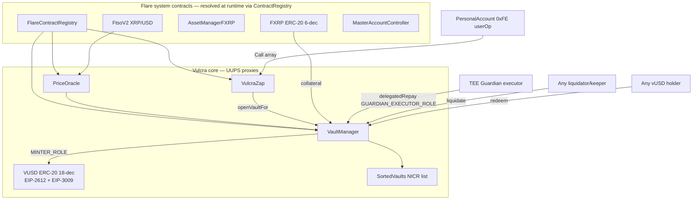
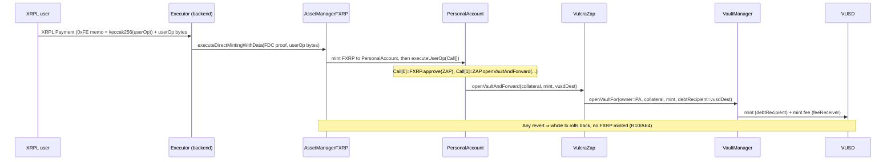
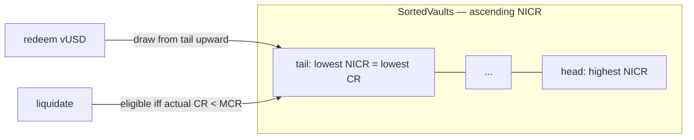

# Vulcra Smart Contracts — Implementation Plan

> **Target subtree / Foundry root:** `smartcontract/`. All paths below are repo-root-relative (e.g. `smartcontract/src/VaultManager.sol`). This plan covers **only the smart-contract scope** of the master plan; backend/TEE, frontend, and landing page are separate workstreams.
>
> **Origin:** `docs/plans/2026-07-20-001-feat-vulcra-cdp-flare-plan.md` (master requirements — authoritative). This plan enriches the contract-side requirements (R1–R12 contract portions, R8, R9) into implementation units. It does **not** modify the master.
>
> **Product Contract preservation:** Product Contract unchanged. No R-ID scope was altered; planning-owned decisions (redemption ordering, Guardian funding path, oracle interface choice) resolve Outstanding Questions the master explicitly deferred to planning.

---

## Goal Capsule

- **Objective:** Ship the on-chain core of Vulcra — a single-collateral CDP that locks FXRP and mints vUSD on Flare Coston2 — with a complete peg story (liquidation + redemption), an XRPL-native atomic-mint helper, and a delegated-repay hook for the confidential Vault Guardian. Every Flare integration is real (FTSOv2 live feeds, FAssets FXRP, Smart Accounts), zero mocks in production paths.
- **Deliverable of this workstream:** Four UUPS-upgradeable contracts (`VaultManager`, `VUSD`, `PriceOracle`, `VulcraZap`) plus a sorted-vault registry, a green `forge test` suite (unit + fuzz + invariant), and deploy+verify scripts targeting Coston2 (chain 114).
- **Definition of ready-to-hand-off:** An implementer can build each unit in dependency order without inventing architecture or test coverage.

---

## Problem Frame

XRP has no native smart contracts; FAssets brings it to Flare as FXRP but offers no CDP. Vulcra lets an FXRP holder lock collateral and mint vUSD, a USD-pegged ERC-20, then repay to unlock. The contract layer must:

1. Enforce overcollateralization on every user action against a live oracle price.
2. Hold the peg from below (redemption against the riskiest vaults) and from above the liquidation line (any actor liquidates undercollateralized vaults for a bonus).
3. Expose an atomic path so an XRPL user can mint FXRP → open a vault → receive vUSD in one Flare transaction (Smart Accounts `0xFE` custom instruction).
4. Expose a delegated, non-custodial repay hook the TEE Vault Guardian can call to protect a vault before liquidation.
5. Resolve every Flare system address at runtime via `FlareContractRegistry` — nothing hardcoded — and be UUPS-upgradeable for patch speed during the program.

This is security-sensitive financial code: liquidation math, redemption ordering, decimal normalization, and mint/burn access control are the high-risk surfaces and carry the heaviest test matrices.

---

## Requirements Trace (contract-side, carried from origin)

| ID | Requirement (contract portion) | Units |
|----|-------------------------------|-------|
| R1 | One vault per address: open/adjust/repay/close; mint keeps CR ≥ MCR | U5 |
| R2 | vUSD ERC-20 (18 dec) + EIP-2612 permit + EIP-3009 transferWithAuthorization; mint/burn protocol-only | U3 |
| R3 | FTSOv2 block-latency XRP/USD, staleness check, centralized decimal normalization (FXRP 6, feed dynamic, vUSD 18) | U2 |
| R4 | Any actor liquidates a vault below MCR: repay debt, receive collateral = debt + bonus, remainder to owner | U6 |
| R5 | Any holder redeems vUSD at face value for FXRP against lowest-CR vaults first | U4, U7 |
| R6 | One-time minting fee, no ongoing interest | U5 |
| R7 | Params (MCR 130%, min debt 100 vUSD, mint fee 0.5%, liq bonus 10%) set at deploy, admin-adjustable | U5, U10 |
| R8 | All contracts UUPS upgradeable; every Flare system address resolved at runtime via registry | U1–U9 |
| R9 | `forge test` green with fuzz on price normalization + liquidation math; deployed + source-verified on Coston2 | U2, U6, U7, U10 |
| R10 | XRPL user mints vUSD atomically via `0xFE`: FXRP mint + vault open + vUSD delivery in one tx; revert ⇒ no mint | U9 |
| R11 | (backend-owned) executor obtains FDC proof, calls `executeDirectMintingWithData`, handles delays/recovery | U9 (contract must be revert-clean & idempotent-safe) |
| R12 | (backend/frontend-owned) pre-flight limits/fee/address | — (contract exposes views needed for pre-flight) |
| R15 | Vault Guardian delegated auto-repay executes without exposing the rule on-chain beforehand | U8 |

Backend/TEE requirements (R11, R12, R14, R16) and frontend (R17–R20) are out of this workstream except where a contract surface must support them (noted per unit).

---

## Key Technical Decisions

### KTD1 — Redemption ordering: sorted doubly-linked list keyed by nominal CR (Liquity `SortedTroves` pattern)

**Decision.** Maintain an on-chain doubly-linked list of vaults ordered ascending by **nominal collateral ratio** `NICR = collateral · 1e18 / debt` (price-free). Redemption and liquidation-target selection read the list **tail** (lowest NICR = lowest actual CR). Insertion/re-insertion on every debt/collateral change uses caller-supplied `(prevHint, nextHint)` computed off-chain, re-validated on-chain with a bounded local walk.

**Rationale.** With a single collateral type and a single XRP/USD feed, actual `CR = collateral · price / debt` is a strictly monotonic function of `NICR` across all vaults — the same price multiplies every vault. So a list sorted by the price-free `NICR` is *always* sorted by actual CR, and ordering changes only on vault operations, **never on a price tick**. This is exactly Liquity's insight and it is the canonical, battle-tested CDP pattern:

- R5 ("redeem against the riskiest vaults, lowest CR first") becomes a deterministic O(1) tail read instead of an unbounded scan.
- No re-sorting on price moves — the expensive failure mode of naive designs.
- Reference implementation (Liquity `SortedTroves.sol`) exists to mirror, lowering hackathon bug risk.

**Rejected alternative — bounded on-chain iteration / off-chain hinted array.** Simpler to write, but pushing fairness ("truly the lowest CR") on-chain requires either an unbounded scan (gas-unsafe as vaults grow) or trusting a caller-supplied ordering that the contract cannot cheaply prove is globally minimal. The sorted list makes correctness structural. This aligns with the GOD-MODE posture (don't cut correctness for deadline). See Alternatives Considered.

### KTD2 — Vault Guardian funding: allowance-based delegated repay (non-custodial), escrow deferred

**Decision.** The Guardian executes protection via `delegatedRepay(vault, maxRepayAmount)`, callable **only** by an address holding `GUARDIAN_EXECUTOR_ROLE`. It pulls vUSD via a standard ERC-20 allowance from a **user-nominated funding address** (default: the vault owner's own wallet) and can **only reduce debt** (strictly CR-improving). No user funds are ever held by the protocol.

**Rationale (resolves the master's "escrow vs allowance" Outstanding Question).**

- **Non-custodial** — the protocol never custodies user vUSD, shrinking attack surface and audit scope, and telling a cleaner trust story for the confidential-compute bounty.
- **Confidentiality-compatible** — a generic vUSD allowance reveals nothing about the private trigger; only the repay execution is ever visible, satisfying R15/AE3 (rule never observable on-chain beforehand).
- **Safety-bounded** — `delegatedRepay` can only decrease debt and is capped at `maxRepayAmount`, so a compromised Guardian executor cannot grief beyond repaying debt the user already owes.
- **UX** — no locked capital; the user keeps working vUSD until the moment of protection.

**Known limitation & mitigation.** Allowance-based repay fails if the funding wallet lacks vUSD at trigger time. Accepted for the hackathon (demo funds a wallet); **optional pre-funded escrow is deferred** (Scope Boundaries → Deferred to Follow-Up) as an opt-in for users who want guaranteed execution with an empty wallet. Approvals may be set via EIP-2612 permit or EIP-3009 (U3) to keep the grant gasless/XRPL-friendly.

### KTD3 — Oracle interface: `FtsoV2Interface.getFeedById` via `ContractRegistry`, full (value, decimals, timestamp)

**Decision.** `PriceOracle` resolves FtsoV2 at runtime via `ContractRegistry` and reads XRP/USD with `getFeedById(feedId)` returning `(uint256 value, int8 decimals, uint64 timestamp)`. It does **not** use `getFeedByIdInWei` (which hides `decimals` and gives no explicit control over normalization). On Coston2 block-latency view reads are free (no fee path needed); the design keeps a fee-calculation seam (`IFeeCalculator`) commented for the mainnet migration.

**Rationale.** We need `decimals` for centralized normalization and `timestamp` for the staleness check — `getFeedById` gives both. Feed ID for XRP/USD is `0x015852502f55534400000000000000000000000000` (category `0x01` crypto), **verified against the live feed list at Gate 0** before it is embedded as a constant. Registry resolution satisfies R8 (zero hardcoded system addresses).

### KTD4 — Decimal normalization centralized in `PriceOracle` (18-dec USD math everywhere)

**Decision.** All USD math runs in 18 decimals (vUSD native). `PriceOracle` is the single source of truth and exposes:
- `xrpUsdPrice18() → uint256` — XRP price in 18-dec USD (`value · 10^(18 − feedDecimals)`).
- `collateralValueUsd18(uint256 fxrpAmount6) → uint256` — value of an FXRP amount (6-dec) in 18-dec USD: `fxrpAmount6 · value · 10^(18 − 6 − feedDecimals)` with the exponent handled sign-safely (feed decimals can exceed 12).

No other contract manipulates feed decimals or FXRP's 6-dec convention. This concentrates the single most error-prone surface into one fuzz-tested module (R3).

### KTD5 — Mint fee capitalized into debt so `totalSupply(vUSD) == Σ vault.debt` holds exactly

**Decision.** On mint of `M` vUSD: `fee = M · mintFeeBps / 10000`; `M` vUSD is minted to the debt recipient and `fee` vUSD to the fee receiver; recorded `debt += M + fee`. Repay/close burns the full `M + fee`. Thus every vUSD in existence is backed 1:1 by recorded debt, making **`totalSupply == totalDebt` a hard, fuzzable invariant** (Liquity-style). No ongoing interest (R6).

### KTD6 — Access control via `AccessControlUpgradeable`; UUPS gated to an upgrader role

**Decision.** Use `AccessControlUpgradeable` (not plain `Ownable`) because the protocol has several distinct privileges. Roles: `DEFAULT_ADMIN_ROLE` (role admin), `PARAM_ADMIN_ROLE` (R7 parameter changes), `PAUSER_ROLE`, `UPGRADER_ROLE` (`_authorizeUpgrade`), and on `VUSD` a `MINTER_ROLE` granted **only** to `VaultManager` (R2), plus `GUARDIAN_EXECUTOR_ROLE` on `VaultManager` (KTD2). State-changing vault ops use `ReentrancyGuardUpgradeable` + `PausableUpgradeable`.

### KTD7 — Toolchain: solc 0.8.28, `evm_version = "cancun"`, flare-periphery via npm + remappings

**Decision.** `foundry.toml`: `solc = "0.8.28"`, `evm_version = "cancun"` (R8/Flare requirement), optimizer on (runs 200), `via_ir = true` as the escape hatch for stack-too-deep in `VaultManager`. Add `@flarenetwork/flare-periphery-contracts` via **npm** and wire `remappings.txt`; import the **`coston2/`** namespace (`@flarenetwork/flare-periphery-contracts/coston2/ContractRegistry.sol`). OZ upgradeable + OZ contracts stay as the already-pinned git submodules (v5.6.1, `foundry.lock`).

**Rationale.** The periphery is officially an npm package and is per-network; npm+remappings is the least-friction, most-current path and matches `flare-foundry-starter`. Exact package layout is **verified at Gate 0** (U1) against a live `forge build`; git-submodule install is the documented fallback if npm layout differs.

---

## High-Level Technical Design

### Component & trust boundaries



### XRPL-native atomic mint (F1 / R10) — sequence



### Redemption & liquidation ordering (KTD1)



---

## Output Structure

```text
smartcontract/
├── foundry.toml                 # evm_version=cancun, solc 0.8.28, via_ir, optimizer
├── remappings.txt               # OZ upgradeable + flare-periphery coston2
├── package.json                 # @flarenetwork/flare-periphery-contracts (npm)
├── .gitignore                   # add node_modules/
├── src/
│   ├── VUSD.sol                 # ERC-20 18-dec + permit + EIP-3009 (UUPS)
│   ├── PriceOracle.sol          # FTSOv2 XRP/USD + normalization (UUPS)
│   ├── VaultManager.sol         # CDP core: open/adjust/close/liquidate/redeem (UUPS)
│   ├── VulcraZap.sol            # 0xFE atomic-mint helper (UUPS)
│   ├── libraries/
│   │   ├── SortedVaults.sol     # NICR doubly-linked list
│   │   └── VulcraMath.sol       # shared CR / fee / normalization helpers
│   ├── modules/
│   │   └── EIP3009Upgradeable.sol  # transferWithAuthorization / receiveWithAuthorization / cancel
│   └── interfaces/
│       ├── IVaultManager.sol
│       ├── IVUSD.sol
│       ├── IPriceOracle.sol
│       └── IVulcraZap.sol
├── script/
│   ├── Deploy.s.sol             # ERC1967 proxies for all 4, wire roles + params
│   └── config/Coston2.s.sol     # params, feed id, registry usage
└── test/
    ├── unit/                    # per-contract unit tests
    ├── fuzz/                    # normalization, liquidation, redemption math
    ├── invariant/               # supply==debt, sorted order, overcollateralization
    └── helpers/                 # FTSO/FXRP fork or lightweight test doubles for pure-math paths
```

> The tree is a scope declaration, not a constraint; the per-unit `**Files:**` sections are authoritative.

---

## Implementation Units

### Phase A — Foundation

### U1. Toolchain, dependencies, and Gate-0 build verification

- **Goal:** Compile the empty project against Flare periphery + OZ upgradeable with the correct EVM target, and remove the Counter scaffolding.
- **Requirements:** R8 (registry imports available), R9 (build is the base of the green suite).
- **Dependencies:** none.
- **Files:** `smartcontract/foundry.toml`, `smartcontract/remappings.txt` (new), `smartcontract/package.json` (new), `smartcontract/.gitignore`, delete `smartcontract/src/Counter.sol`, `smartcontract/test/Counter.t.sol`, `smartcontract/script/Counter.s.sol`; `smartcontract/test/build/RegistryImport.t.sol` (new, trivial import-compiles check).
- **Approach:** Set `solc = "0.8.28"`, `evm_version = "cancun"`, `optimizer = true`, `optimizer_runs = 200`, `via_ir = true`. Install `@flarenetwork/flare-periphery-contracts` via npm (pin an explicit version) and add `remappings.txt`: `@flarenetwork/flare-periphery-contracts/=node_modules/@flarenetwork/flare-periphery-contracts/`, `@openzeppelin/contracts-upgradeable/=lib/openzeppelin-contracts-upgradeable/contracts/`, `@openzeppelin/contracts/=lib/openzeppelin-contracts/contracts/`, `forge-std/=lib/forge-std/src/`. Gitignore `node_modules/`. **Before any forge command run `git submodule update --init --recursive`.** Verify the periphery `coston2/ContractRegistry.sol` import resolves with a one-line test contract; if the npm layout differs, fall back to `forge install` of the periphery artifacts repo and re-map (documented in Risks).
- **Patterns to follow:** `flare-foundry-starter` `foundry.toml` + `remappings.txt`.
- **Test scenarios:** Build-only — `Test expectation: none (config/scaffolding)` beyond `RegistryImport.t.sol` which asserts a contract importing `ContractRegistry` compiles and its bytecode is non-empty. **Verification:** `forge build` succeeds; `forge test` runs (empty) green; no `Counter` artifacts remain.

### U2. `PriceOracle.sol` — FTSOv2 XRP/USD with staleness + centralized normalization

- **Goal:** A UUPS oracle that returns XRP/USD and normalized collateral value, rejecting stale data.
- **Requirements:** R3, R8, R9 (fuzz on normalization).
- **Dependencies:** U1.
- **Files:** `smartcontract/src/PriceOracle.sol`, `smartcontract/src/interfaces/IPriceOracle.sol`, `smartcontract/src/libraries/VulcraMath.sol` (normalization helper), `smartcontract/test/unit/PriceOracle.t.sol`, `smartcontract/test/fuzz/PriceNormalization.t.sol`.
- **Approach (KTD3/KTD4):** Initializer stores the XRP/USD feed ID (constant, Gate-0 verified) and `maxStalenessSeconds` (configurable, `PARAM_ADMIN_ROLE`). Resolve FtsoV2 via `ContractRegistry` on each read (or cache with a refresh function — decision deferred to U2 impl, see Open Questions). `xrpUsdPrice18()` and `collateralValueUsd18(fxrpAmount6)` compute in 18-dec with sign-safe exponent handling for `18 − 6 − feedDecimals`. Revert `StalePrice` when `block.timestamp − timestamp > maxStalenessSeconds`; revert `ZeroPrice` on `value == 0`. UUPS `_authorizeUpgrade` gated to `UPGRADER_ROLE`.
- **Patterns to follow:** flare-ftso skill `consume-feeds` example; OZ `UUPSUpgradeable` + `Initializable` + `AccessControlUpgradeable`.
- **Test scenarios:**
  - Happy: given feed `(value, decimals, ts=now)`, `xrpUsdPrice18()` equals `value·10^(18−decimals)`; `collateralValueUsd18(1e6)` equals the XRP price for 1 FXRP.
  - Covers R3. Fuzz: over `value ∈ [1, 1e30]`, `decimals ∈ [0, 24]` (span below and above 12), `fxrpAmount6 ∈ [0, 1e18]` — normalization never reverts on valid ranges, never overflows, and round-trips within expected precision; the `18−6−decimals` branch is exercised on both signs.
  - Edge: `decimals == 18`, `decimals == 0`, `fxrpAmount6 == 0` (→ 0), max feed value.
  - Error: `timestamp` older than staleness bound ⇒ `StalePrice`; `value == 0` ⇒ `ZeroPrice`.
  - Access: non-`PARAM_ADMIN` cannot change `maxStalenessSeconds`; non-`UPGRADER` cannot upgrade.
  - **Verification:** fuzz suite green at ≥256 runs; oracle deployed behind a proxy returns a plausible XRP price on a Coston2 fork/live read.

### U3. `VUSD.sol` — ERC-20 (18-dec) + EIP-2612 permit + EIP-3009, protocol-only mint/burn

- **Goal:** The stablecoin token with gasless-approval and gasless-transfer authorization surfaces, minting restricted to `VaultManager`.
- **Requirements:** R2, R8.
- **Dependencies:** U1.
- **Files:** `smartcontract/src/VUSD.sol`, `smartcontract/src/modules/EIP3009Upgradeable.sol` (new — not in OZ), `smartcontract/src/interfaces/IVUSD.sol`, `smartcontract/test/unit/VUSD.t.sol`, `smartcontract/test/unit/VUSDAuthorization.t.sol`.
- **Approach:** Extend `ERC20Upgradeable` + `ERC20PermitUpgradeable` (EIP-2612, gives EIP-712 domain + incrementing `Nonces`) + custom `EIP3009Upgradeable` + `AccessControlUpgradeable` + `UUPSUpgradeable`. EIP-3009 module implements `transferWithAuthorization`, `receiveWithAuthorization`, `cancelAuthorization`, and an `authorizationState(authorizer, nonce)` mapping keyed by **random 32-byte nonces** (distinct from permit's sequential nonce), validating `validAfter`/`validBefore` and signature against the shared EIP-712 domain separator. `mint`/`burn` gated to `MINTER_ROLE` (granted only to `VaultManager` at deploy). `_authorizeUpgrade` gated to `UPGRADER_ROLE`.
- **Execution note:** Implement the EIP-3009 module test-first — authorization replay and expiry are the correctness-critical paths.
- **Patterns to follow:** OZ `ERC20PermitUpgradeable`; the canonical USDC EIP-3009 (FiatTokenV2) authorization semantics; reuse the EIP-712 domain from the permit base (do not create a second domain).
- **Test scenarios:**
  - Happy: `permit` sets allowance from a signed message; `transferWithAuthorization` moves tokens on a valid sig; `receiveWithAuthorization` requires `msg.sender == to`.
  - Edge: `validAfter` in the future ⇒ revert; `validBefore` in the past ⇒ revert; boundary at exactly `validAfter`/`validBefore`.
  - Error/replay: reusing a consumed authorization nonce ⇒ revert; `cancelAuthorization` then use ⇒ revert; wrong signer ⇒ revert; permit with expired deadline ⇒ revert.
  - Access: non-`MINTER_ROLE` `mint`/`burn` ⇒ revert; `VaultManager` holding `MINTER_ROLE` succeeds.
  - Integration: EIP-2612 and EIP-3009 nonces are independent (advancing one does not consume the other).
  - **Verification:** authorization suite green; `DOMAIN_SEPARATOR` stable across the two auth surfaces.

### Phase B — Core CDP

### U4. `SortedVaults` — NICR-ordered doubly-linked list

- **Goal:** The registry substrate that makes "riskiest vault first" an O(1) tail read (KTD1).
- **Requirements:** R5 (ordering), R9 (invariant on ordering).
- **Dependencies:** U1.
- **Files:** `smartcontract/src/libraries/SortedVaults.sol`, `smartcontract/test/unit/SortedVaults.t.sol`, `smartcontract/test/invariant/SortedVaultsOrder.t.sol`.
- **Approach:** Doubly-linked list of vault owner addresses keyed by `NICR = collateral·1e18/debt`. Operations: `insert(id, nicr, prevHint, nextHint)`, `remove(id)`, `reInsert(id, newNicr, hints)`, `getLast()` (lowest NICR), `getFirst()`, `contains(id)`. Hints are validated with a bounded local walk; if invalid, fall back to a bounded descent from head/tail (cap iterations, revert `BadHint` past the cap so callers refresh hints off-chain). Store as a struct-of-mappings; expose as an internal library consumed by `VaultManager` (keeps a single storage owner). Ordering is price-free so it is only touched on vault mutations.
- **Patterns to follow:** Liquity `SortedTroves.sol` (structure, hint validation), adapted to a library over `VaultManager` storage.
- **Test scenarios:**
  - Happy: inserting vaults in random NICR order yields an ascending list; `getLast()` is always the minimum NICR.
  - Edge: single element (head==tail); duplicate NICR values (stable tie-break by insertion); re-insert to new position (both directions); remove head/tail/middle.
  - Error: `insert` an existing id ⇒ revert; `remove`/`reInsert` a missing id ⇒ revert; hint past iteration cap ⇒ `BadHint`.
  - Invariant: after any random sequence of insert/remove/reInsert, the list is fully ascending by NICR and `contains` matches membership.
  - **Verification:** invariant suite green (≥256 runs, depth ≥15); ordering holds under adversarial hint inputs.

### U5. `VaultManager.sol` — CDP core (open/adjust/repay/close, mint accounting, fee, params)

- **Goal:** The heart of the protocol: one vault per address, CR-checked mint/burn against the oracle, mint fee capitalized into debt, admin params, and an on-behalf open for the Zap.
- **Requirements:** R1, R5 (wiring list), R6, R7, R8.
- **Dependencies:** U2, U3, U4.
- **Files:** `smartcontract/src/VaultManager.sol`, `smartcontract/src/interfaces/IVaultManager.sol`, `smartcontract/test/unit/VaultManager.t.sol`, `smartcontract/test/fuzz/VaultAccounting.t.sol`, `smartcontract/test/invariant/SupplyEqualsDebt.t.sol`.
- **Approach (KTD4/KTD5/KTD6):** Struct `Vault { uint256 collateral6; uint256 debt18; bool active; }`, one per address. Resolve FXRP via `AssetManagerFXRP.fAsset()` at init (registry). Ops:
  - `openVault(collateral, mint, hints)` — pull FXRP from `msg.sender`, mint `mint` vUSD (+fee), record `debt = mint + fee`, require `debt ≥ minDebt` and post-op `CR ≥ MCR`, insert into `SortedVaults`.
  - `openVaultFor(owner, collateral, mint, debtRecipient, hints)` — same but pulls collateral from `msg.sender` (the Zap), assigns the vault to `owner`, mints vUSD to `debtRecipient`; enables U9. Restricted so it cannot silently overwrite an existing vault (one-vault-per-address enforced on `owner`).
  - `adjustVault(collateralDelta, debtDelta, hints)` — add/remove collateral, mint/repay debt in one call; re-insert into list; enforce `CR ≥ MCR` and `minDebt`.
  - `repay(amount)` / `closeVault(hints)` — burn vUSD (incl. capitalized fee), release collateral, remove from list.
  - Params (`mcrBps`, `minDebt18`, `mintFeeBps`, `liqBonusBps`) settable by `PARAM_ADMIN_ROLE` with sane bounds (e.g. `mcrBps ≥ 10000`, `liqBonusBps ≤ 5000`). `PausableUpgradeable` on mutating ops; `ReentrancyGuardUpgradeable` around token transfers. UUPS `_authorizeUpgrade` → `UPGRADER_ROLE`.
- **Technical design (directional, not spec):** CR check reads `oracle.collateralValueUsd18(collateral6)·10000 / debt18 ≥ mcrBps`. Emit `VaultOpened/Adjusted/Closed` with post-op collateral/debt/NICR for indexers (backend R14 reads these).
- **Patterns to follow:** Liquity `BorrowerOperations` + `TroveManager` split, collapsed here into one manager for hackathon scope; OZ upgradeable base set.
- **Test scenarios:**
  - Happy: open at exactly MCR succeeds; mint less than max keeps CR>MCR; repay reduces debt and burns fee-inclusive amount; close returns all collateral.
  - Covers R1/R6. Edge: open at `debt == minDebt` (ok) and `debt < minDebt` (revert `DebtBelowMin`); second `openVault` from same address ⇒ `VaultExists`; adjust to exactly MCR ok, one wei below ⇒ `CRTooLow`; zero-collateral / zero-mint guards.
  - Covers R7. Fuzz: over random `(collateral, mint, feeBps, price)`, recorded `debt == mint + mint·feeBps/10000` and post-op CR computed from the oracle equals the on-chain check; params outside bounds ⇒ revert.
  - Error: mint that would breach MCR ⇒ revert with no state change (no dangling list entry, no minted vUSD); paused ⇒ ops revert; reentrancy attempt via malicious token hook is blocked.
  - Integration: `openVaultFor` assigns ownership to `owner` (not the Zap caller) and delivers vUSD to `debtRecipient`; list membership + NICR match after every op.
  - Invariant: `VUSD.totalSupply() == Σ active vault.debt` after any op sequence (KTD5).
  - **Verification:** fuzz + invariant suites green; `SupplyEqualsDebt` holds at depth ≥15.

### U6. Liquidation — `liquidate(vault)` with bonus, remainder to owner, bad-debt edge

- **Goal:** Any actor clears an undercollateralized vault, earning collateral worth debt + bonus; surplus returns to the owner (R4).
- **Requirements:** R4, R8, R9 (fuzz on liquidation math).
- **Dependencies:** U5.
- **Files:** `smartcontract/src/VaultManager.sol` (extend), `smartcontract/test/unit/Liquidation.t.sol`, `smartcontract/test/fuzz/LiquidationMath.t.sol`.
- **Approach:** `liquidate(address vault)` requires actual `CR < mcrBps` (oracle price). Liquidator burns the vault's full `debt` vUSD; receives collateral worth `debt·(1+liqBonus)` at current price, capped at the vault's collateral; any remainder FXRP returns to the vault owner; vault closed and removed from list. **Bad-debt edge** (`collateralValue < debt`, CR<100%): liquidator receives *all* collateral, debt fully cleared — liquidator absorbs the shortfall, so it only acts when profitable (naturally true for `100% < CR < MCR` with a 10% bonus). Emit `VaultLiquidated(vault, liquidator, debtCleared, collateralToLiquidator, collateralToOwner)`.
- **Technical design (directional):** `seize = min(collateral6, debtValueToCollateral(debt·(10000+bonus)/10000))`; `toOwner = collateral6 − seize`.
- **Patterns to follow:** CDP full-liquidation semantics; reuse `VulcraMath` for the collateral-from-USD conversion.
- **Test scenarios:**
  - Covers R4/AE5. Happy: vault at CR 129% (MCR 130%) is liquidatable; liquidator receives debt+10%; remainder to owner; debt cleared; list entry removed.
  - Edge: CR exactly MCR ⇒ **not** liquidatable (`NotLiquidatable`); CR just below MCR ⇒ liquidatable; vault whose collateral is worth *exactly* debt+bonus ⇒ owner remainder is 0; smallest liquidatable vault (`minDebt`).
  - Bad debt: CR between 100% and MCR (partial bonus feasible) and CR below 100% (liquidator takes all collateral, absorbs loss, debt still cleared) — no underflow, remainder never negative.
  - Fuzz: over `(collateral, debt, price)` with `CR<MCR`, seized ≤ collateral, `toLiquidator + toOwner == collateral`, `totalSupply` drops by exactly `debt`.
  - Error: liquidate a healthy vault ⇒ revert; liquidate a non-existent/closed vault ⇒ revert; liquidator without sufficient vUSD ⇒ revert (transfer/burn fails atomically).
  - **Verification:** fuzz green; invariant `supply==debt` still holds post-liquidation; no path leaves collateral stranded.

### U7. Redemption — `redeem(vUSDAmount)` against lowest-NICR vaults at face value

- **Goal:** Any holder swaps vUSD for FXRP at $1, drawing from the riskiest vaults first, enforcing the peg floor (R5).
- **Requirements:** R5, R8, R9 (fuzz on redemption math).
- **Dependencies:** U5 (and U4 ordering).
- **Files:** `smartcontract/src/VaultManager.sol` (extend), `smartcontract/test/unit/Redemption.t.sol`, `smartcontract/test/fuzz/RedemptionMath.t.sol`, `smartcontract/test/invariant/PegAndOrder.t.sol`.
- **Approach:** `redeem(uint256 vusdAmount, hints...)` walks the sorted list from the **tail** (lowest NICR). For each vault it applies `redeemPortion = min(remaining, vault.debt)`: burn that vUSD, reduce the vault's debt by it and its collateral by `redeemPortion / price` (FXRP to the redeemer), re-insert the vault at its new NICR (or remove if debt hits 0). Continue until `vusdAmount` consumed or list exhausted. Optional `redemptionFeeBps` param (default 0 for face value per R5; seam kept for a future Liquity-style dynamic fee). A vault's collateral is never driven negative; a fully-redeemed vault closes with any residual collateral returned to its owner.
- **Technical design (directional):** redemption reduces collateral and debt by equal USD value, so a redeemed vault's CR *rises* (good for remaining borrowers); the redeemer captures the peg arbitrage.
- **Patterns to follow:** Liquity `redeemCollateral` loop (from lowest CR), simplified to single collateral.
- **Test scenarios:**
  - Covers R5/AE5. Happy: three vaults at CR 135/180/300%, MCR 130% — redemption draws the 135% vault first; redeeming more than its debt spills to the 180% vault next.
  - Edge: redeem exactly one vault's debt (closes it, residual collateral to owner); redeem partial (vault stays, debt/collateral reduced, re-inserted correctly); redeem more than total system debt (redeems all, returns leftover vUSD un-burned / reverts `ExceedsSystemDebt` — pick one, see Open Questions).
  - Fuzz: over vault sets and amounts, total FXRP paid out equals `vusdRedeemed / price` (within rounding), `totalSupply` drops by exactly `vusdRedeemed`, and no vault CR decreases due to redemption.
  - Error: redeem 0 ⇒ revert; redeemer lacking vUSD ⇒ revert atomically; empty system ⇒ revert.
  - Invariant: after redemption the list remains ascending by NICR; the tail is still the lowest-CR active vault.
  - **Verification:** fuzz + `PegAndOrder` invariant green; redemption always hits the true lowest-CR vault.

### U8. Delegated repay for Vault Guardian — `delegatedRepay(vault, maxAmount)`

- **Goal:** A non-custodial, role-gated hook the TEE Guardian calls to repay a vault's debt from a nominated funder, protecting it before liquidation (R15/KTD2).
- **Requirements:** R15 (contract surface), R8.
- **Dependencies:** U5.
- **Files:** `smartcontract/src/VaultManager.sol` (extend), `smartcontract/test/unit/DelegatedRepay.t.sol`.
- **Approach (KTD2):** `delegatedRepay(address vault, uint256 maxAmount)` restricted to `GUARDIAN_EXECUTOR_ROLE`. Repays `min(maxAmount, vault.debt)` by pulling vUSD (via ERC-20 `transferFrom`) from a per-vault-registered **funding address** (default = vault owner; owner may set a different funder via `setGuardianFunder`). Can **only reduce debt** and re-inserts the vault at its improved NICR; never increases debt or moves collateral. If the funder's vUSD/allowance is insufficient, revert cleanly (`FunderInsufficient`) so the Guardian can fall back to no-op (the vault may then liquidate normally). Emits `DelegatedRepay(vault, funder, amount)` only at execution — the trigger itself lives off-chain in the TEE, so the rule is never observable on-chain beforehand.
- **Patterns to follow:** role-gated privileged mutation; reuse the `repay` internal path from U5.
- **Test scenarios:**
  - Covers R15/AE3. Happy: a vault whose owner set an allowance is repaid by the Guardian executor; post-op CR rises above the (off-chain) trigger; debt reduced by the repaid amount.
  - Edge: `maxAmount > debt` repays only `debt`; repay to exactly `minDebt`; repay that would drop debt below `minDebt` but not to zero ⇒ revert `WouldStrandDust` (or clamp — see Open Questions).
  - Access: caller without `GUARDIAN_EXECUTOR_ROLE` ⇒ revert; only the vault owner can `setGuardianFunder`.
  - Error: funder allowance/balance too low ⇒ `FunderInsufficient`, no state change; delegatedRepay on a closed vault ⇒ revert.
  - Confidentiality: no on-chain state or event reveals the trigger before execution (assert only the execution event fires).
  - **Verification:** unit suite green; `supply==debt` invariant preserved; a compromised-executor scenario cannot increase debt or seize collateral.

### Phase C — XRPL atomic mint helper

### U9. `VulcraZap.sol` — single-target helper for the `0xFE` `Call[]` userOp

- **Goal:** Let an XRPL user mint FXRP → open a vault → receive vUSD atomically, with the Zap as the single call target from the PersonalAccount (R10).
- **Requirements:** R10, R8; supports R11 (must be revert-clean so the executor's retry/recovery works) and R12 (exposes pre-flight views).
- **Dependencies:** U5.
- **Files:** `smartcontract/src/VulcraZap.sol`, `smartcontract/src/interfaces/IVulcraZap.sol`, `smartcontract/test/unit/VulcraZap.t.sol`, `smartcontract/test/integration/AtomicMint.t.sol`.
- **Approach:** `openVaultAndForward(uint256 collateral6, uint256 mint18, address vusdDestination, prevHint, nextHint)` designed as `Call[1]` of a 2-call userOp batch executed by the PersonalAccount (`Call[0] = FXRP.approve(zap, collateral6)`). The Zap: `FXRP.transferFrom(msg.sender /*PersonalAccount*/, address(this), collateral6)`, `FXRP.approve(vaultManager, collateral6)`, `vaultManager.openVaultFor(msg.sender, collateral6, mint18, vusdDestination, hints)`. Vault is owned by the PersonalAccount (so the XRPL user controls it via future userOps); vUSD is delivered to `vusdDestination` (PersonalAccount or an EOA). Holds no funds across calls (assert zero FXRP/vUSD balance at end). Any revert bubbles up so the whole `executeDirectMintingWithData` tx rolls back — no FXRP minted (R10/AE4). UUPS `_authorizeUpgrade` → `UPGRADER_ROLE`. Add a `previewOpen(collateral6, mint18)` view returning resulting debt/CR/whether it satisfies MCR & minDebt, for frontend pre-flight (R12).
- **Technical design (directional):** the 42-byte `0xFE` memo commits `keccak256(abi.encode(userOp))`; the Zap does not verify the hash (the controller does) — it only needs to be a clean, atomic target.
- **Patterns to follow:** flare-smart-accounts `executeUserOp(Call[])` custom-instruction example; keep the Zap stateless/holdless.
- **Test scenarios:**
  - Covers R10/AE4. Happy (integration): simulate a PersonalAccount executing `[approve, zap.openVaultAndForward]` — FXRP moves in, vault opens owned by the PersonalAccount, vUSD lands at `vusdDestination`, Zap holds nothing.
  - Edge: `mint18` below `minDebt` ⇒ the inner `openVaultFor` reverts and the whole batch reverts (AE4: no vault, FXRP recoverable at Core Vault off-chain); `vusdDestination == PersonalAccount`.
  - Error: called without prior approval ⇒ `transferFrom` reverts atomically; reentrancy guard on the Zap.
  - Integration: vault ownership is the PersonalAccount, not the Zap; `previewOpen` matches the actual post-op state.
  - **Verification:** integration test green using a test double for the PersonalAccount `executeUserOp` path; Zap balance is zero after every path.

### Phase D — Deploy, verify, and suite hardening

### U10. Deploy + verify scripts (Coston2) and consolidated test suite

- **Goal:** One command deploys all four UUPS proxies wired with roles and params to Coston2, and source-verifies them on the explorer; the full suite (unit+fuzz+invariant) is green (R9).
- **Requirements:** R7 (params at deploy), R8 (registry), R9 (green suite, deploy, verify).
- **Dependencies:** U2, U3, U5, U6, U7, U8, U9.
- **Files:** `smartcontract/script/Deploy.s.sol`, `smartcontract/script/config/Coston2.s.sol`, `smartcontract/test/invariant/ProtocolInvariants.t.sol` (consolidated handler-based invariant harness), `smartcontract/README.md` (deploy+verify runbook).
- **Approach:** Deploy implementations, wrap each in `ERC1967Proxy`, call initializers. Wiring order: `PriceOracle` → `VUSD` → `VaultManager` (grant `VUSD.MINTER_ROLE` to `VaultManager`; set oracle + FXRP resolved from registry; set params MCR 13000, minDebt 100e18, mintFee 50, liqBonus 1000) → `VulcraZap` (point at `VaultManager`). Grant `GUARDIAN_EXECUTOR_ROLE` to the configured keeper address (or leave to admin for later). Config struct holds params + XRP/USD feed ID so mainnet reuse only swaps the config + periphery namespace. Verification uses `forge verify-contract` against the Coston2 explorer (Blockscout) — implementation + proxy. A consolidated handler-based invariant test exercises open/adjust/liquidate/redeem/delegatedRepay against a Coston2 fork (or math-only doubles for pure paths) and asserts: `supply==debt`, list ascending, system overcollateralized when all vaults ≥ MCR.
- **Approach note:** express deploy/verify as outcomes in the runbook, not copy-paste command recipes; keep secrets (deployer key) in env, never committed.
- **Test scenarios:**
  - `Deploy.s.sol` simulation (default run, no `--broadcast`) wires all proxies without revert; post-deploy assertions: `VaultManager` holds `MINTER_ROLE`, params match config, oracle returns a price on a fork.
  - Consolidated invariants green at meaningful depth (≥15) and runs (≥256).
  - **Verification:** `forge test` fully green (unit+fuzz+invariant); simulated deploy succeeds; documented verify step produces verified source on the Coston2 explorer for all four contracts + proxies.

---

## Scope Boundaries

**In scope (this workstream):** the four contracts, sorted-vault registry, EIP-3009 module, shared math library, the full test matrix, and Coston2 deploy+verify scripts.

**Deferred for later (roadmap — carried from origin):** stability pool, multi-collateral (FBTC), governance/token, cross-chain vUSD via LayerZero OFT, savings rate, mainnet deployment, security audit + timelocked upgrades.

**Deferred to follow-up work (plan-local sequencing):**
- Optional **pre-funded Guardian escrow** as an opt-in alternative to the allowance model (KTD2 limitation mitigation).
- Dynamic **redemption fee** (Liquity-style base-rate decay) — seam kept in U7, default 0 for now.
- **FTSO Scaling anchor feeds + Merkle proofs** for liquidation-grade pricing (master Outstanding Question) — block-latency feed is sufficient for v1; revisit if judges/price-manipulation concerns warrant.
- Oracle address **caching vs per-call registry resolution** micro-optimization.

**Outside this product's identity (carried from origin):** LLM-driven on-chain logic; Secure Random Numbers integration; Privy.

---

## Risks & Dependencies

| Risk | Impact | Mitigation |
|------|--------|-----------|
| flare-periphery npm layout differs from assumed `coston2/` import path | U1 blocks all builds | Gate-0 `forge build` check in U1; documented git-submodule fallback; verify against `flare-foundry-starter` |
| XRP/USD feed ID or FTSO decimals differ from assumed constant | Wrong prices, wrong CR | KTD3 verifies feed ID live at Gate 0 before embedding; `decimals` read dynamically per call, never assumed |
| `via_ir`/stack-too-deep in `VaultManager` | Compile failure | `via_ir = true` set in U1; split internal functions if needed |
| Sorted-list hint staleness under concurrent ops | `BadHint` reverts, failed tx | Bounded fallback descent in U4; frontend/backend recompute hints just-in-time |
| Direct-mint atomicity assumptions (0xFE) wrong | R10 flow fails | U9 keeps the Zap holdless & revert-clean; real end-to-end validated at integration Gate (backend workstream); AE4 recovery path is executor-side |
| UUPS storage-layout mistakes on upgrade | Storage corruption | Follow OZ v5 namespaced-storage / gap conventions; consider `openzeppelin-foundry-upgrades` validation in CI (noted, not required) |
| Bad debt below 100% CR | Protocol undercollateralized | v1 relies on prompt liquidation + 10% bonus; stability pool deferred; invariant test documents the boundary |

**External dependencies:** `@flarenetwork/flare-periphery-contracts` (npm, pinned), OZ contracts + upgradeable v5.6.1 (submodules, pinned in `foundry.lock`), forge-std v1.16.2. Live Coston2 registry/FTSO/FAssets for fork tests and deploy. **Run `git submodule update --init --recursive` before any forge command.**

---

## Acceptance Examples (carried from origin, contract-relevant)

- **AE4 (R10)** — a userOp whose vault-open would revert (e.g. debt below minimum) ⇒ `executeDirectMintingWithData` reverts, no FXRP minted, XRP recoverable at Core Vault. Enforced by U9 (Zap bubbles the revert) + U5 (`DebtBelowMin`).
- **AE5 (R4, R5)** — vaults at CR 135/180/300%, MCR 130%: redemption draws the 135% vault first (U7); if it falls to 129%, any actor can liquidate it (U6).
- **AE3 (R15)** — vault with a private auto-repay rule at CR 150%: when price pushes CR below 150% but above MCR, the TEE calls `delegatedRepay` and the vault returns above trigger, with no on-chain exposure of the rule beforehand (U8).

---

## Verification Contract

1. **`forge test` fully green** — unit + fuzz + invariant, with `git submodule update --init --recursive` run first.
2. **Fuzz coverage (R9)** on: price normalization (U2), vault accounting/fee-into-debt (U5), liquidation math (U6), redemption math (U7) — each ≥256 runs.
3. **Invariant coverage:** `VUSD.totalSupply() == Σ active vault.debt`; sorted list always ascending by NICR; system overcollateralized when all vaults ≥ MCR — handler-based, depth ≥15 (U10).
4. **Deploy:** simulated `Deploy.s.sol` wires all four proxies + roles + params without revert; live Coston2 deploy produces addresses for all four.
5. **Source verification (R9):** all four implementations + proxies verified on the Coston2 explorer.
6. **No hardcoded system addresses (R8):** every Flare system contract (FtsoV2, AssetManagerFXRP, FXRP, registry) resolved at runtime; a grep for known addresses finds none in `src/`.

---

## Definition of Done

- All ten units landed in dependency order; `forge build` and `forge test` green locally and in CI (`smartcontract/.github/workflows/test.yml` updated from the Counter scaffold).
- The four contracts deployed to Coston2 (chain 114, RPC `https://coston2-api.flare.network/ext/C/rpc`) as UUPS proxies with params MCR 130% / minDebt 100 vUSD / mintFee 0.5% / liqBonus 10%, and source-verified on the explorer.
- The Verification Contract's six gates all pass.
- Plan document committed to the branch and pushed; no secrets/credentials committed.

---

## Open Questions (deferred to implementation)

- **Oracle resolution:** per-call `ContractRegistry` resolution vs cached FtsoV2 address with an admin `refresh()` — micro gas vs freshness. Resolve in U2 against measured gas.
- **Redemption overshoot:** redeeming more than total system debt — revert `ExceedsSystemDebt` vs redeem-all-and-refund-remainder. Resolve in U7 (leaning revert for simplicity).
- **Delegated-repay dust:** a repay that would leave `0 < debt < minDebt` — revert `WouldStrandDust` vs clamp to full close. Resolve in U8 (leaning clamp-to-`minDebt`-or-full-repay).
- **Exact solc patch (0.8.28 vs 0.8.30)** — pick the latest stable that builds cleanly with periphery + `via_ir` at U1.

---

## Assumptions

- FTSOv2 block-latency XRP/USD reads are free (view) on Coston2 (master Gate-0 assumption; oracle keeps a fee seam regardless).
- `executeDirectMintingWithData` dispatches mint + `executeUserOp(Call[])` atomically to the PersonalAccount (per flare-smart-accounts skill); the Zap is designed to be revert-clean under this contract.
- One collateral type (FXRP) and one price feed, which is what makes NICR ordering equivalent to CR ordering (KTD1). Adding collateral types later breaks this equivalence and is explicitly roadmap.
- vUSD ticker has no blocking on-chain collision (master Outstanding Question, non-contract-blocking).

---

## Sources & Research

- **Origin:** `docs/plans/2026-07-20-001-feat-vulcra-cdp-flare-plan.md` (master requirements).
- **Grounding dossier:** `/tmp/compound-engineering/ce-brainstorm/vulcra-god-01/grounding.md` (PRD-vs-scaffold contradictions, verified Flare constraints).
- **Flare skills (installed, curated reference):** flare-ftso (FtsoV2Interface, feed IDs, ContractRegistry, fee calc), flare-fassets (direct minting, `executeDirectMintingWithData`, FXRP address resolution, 6-dec/UBA), flare-smart-accounts (`0xFE`/`0xFF`, `executeUserOp(Call[])`, `MasterAccountController`, `0xE0`/`0xE1` recovery), flare-general (chain 114, Coston2 RPC/explorer, cancun, registry `0xaD67FE66660Fb8dFE9d6b1b4240d8650e30F6019`).
- **Pinned deps:** `smartcontract/foundry.lock` — OZ contracts + upgradeable v5.6.1, forge-std v1.16.2.
- **Pattern references:** Liquity `SortedTroves` / `TroveManager` / `BorrowerOperations` (sorted-list ordering, redemption/liquidation semantics), USDC FiatTokenV2 (EIP-3009 authorization semantics), OZ upgradeable UUPS + AccessControl + ERC20Permit.
- **To verify at build time (docs mid-update per origin):** live XRP/USD feed ID at dev.flare.network/ftso/feeds; flare-periphery npm package layout/version; Coston2 direct-minting end-to-end (backend Gate).
